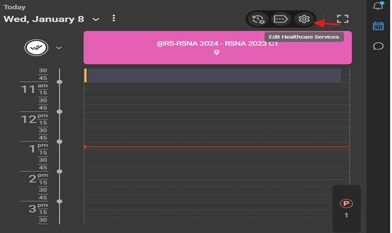

# Blume as an Asset in Breeze

**Introduction**

This manual serves as a comprehensive guide for administrators managing
the Blume asset within Breeze. This guide covers asset features,
licensing configurations, self-scheduling, OmegaAI integration, and
customization options.

## A. Setting Up Organizations in Breeze

**Creating a New Organization**

To set up a new organization in Breeze:

1. Navigate to the **Organizations** tab.

2. Click the **+ (Add Organization)** button.

    

Fill in the mandatory fields:

- **Organization Name**: Enter the exact name as listed.

- **Client ID**: Retrieve the client ID from Salesforce or other
  verified sources.

- **Account Status**: Set to "*Active*".

- **Certificate Status**: Mark as "*Active*".

3. Add optional fields such as local time zone and address if available:

  1.  Example: "Toronto Location, EST Time Zone".

5. Click **Save**.

**Editing Organization Details**

To modify existing organization details:

1. Navigate to the organization in Breeze.

2 Click on the relevant field (e.g., Account Owner, Client ID) to edit.

3. Save the changes.

   

   

**Enabling Assets for an Organization**

To enable assets for an organization:

1. Go to the ***Assets*** section within the organization's settings.

2. Turn on the required assets, such as ***Blume*** or ***AFD***.

3. Verify that the changes reflect accurately across *Blume* and
  *OmegaAI*.

   

## B.Key Features of Blume in Breeze

### 1. No License

Without a *Blume* license, none of the features will be accessible.

This implies that:

- **No self-scheduling setting on OmegaAI**

  - The ***self-scheduling*** option will not be available for the
    organization on OmegaAI. Users will not be able to edit self
    scheduling settings.

- **No forms management on OmegaAI**: Clinical and registration forms
  are unavailable.

  - The ***forms configuration*** section will not be accessible. This
    means users will not have the ability to create or modify custom
    forms for the organization on OmegaAI.

- **No notifications**: Neither in-app nor email notifications will
  work.

- **No study viewing or sharing**: Patients cannot view, download, or
  share their studies.

  - The ***Send Study to Blume*** option will not be visible to the
    organization on OmegaAI. As a result, users will not be able to send
    studies directly to Blume from the interface.

- **No appointment management**: Booking, rescheduling, and canceling
  appointments will be blocked.

**Note:** If a patient attempts to book an appointment with a facility
that has not purchased any license, they will see a message:
*This facility does not support online booking. Please call for more
details and to book an appointment.*

### 2. BPP (Basic Blume License)

The *Basic Blume License (BPP)* provides limited functionality, focusing
primarily on patient email invites and basic study management (view and
share study).

Enabled features include:

- **Email invites**: Patients receive email invitations.

- **Study synchronization**: Ensures that study data is synced between
  Blume and OmegaAI.

**Limitations:**

- Self-scheduling, forms, and notifications remain unavailable.

- Patients can only view, download, and share studies via email but
  cannot book appointments online.

**How to Enable *BPP*:**

1.  Navigate to ***Settings* \> *Asset*** in Breeze.

2.  Turn on the ***Blume* *Patient* *Portal*** option.

AFD license option will be automatically turned off when BPP is enabled.

### 3. AFD (Blume Premium License)

The *Blume Premium License (AFD)* unlocks the full range of features,
providing complete access to all tools and functionalities.

These include:

- **Self-scheduling**: Patients can book appointments online.

- **Forms management**: Clinical and registration forms are available
  for customization.

- **Notifications**: In-app and email notifications are fully enabled.

- **Study management**: Patients can view, download, share, and manage
  their studies.

- **Appointment management**: Patients can book, reschedule, and cancel
  appointments as needed.

**How to Enable AFD:**

1.  Navigate to ***Settings* \> *Asset*** in Breeze.

2.  Turn on the ***Blume Automated Front Desk*** option.

3.  Ensure that other license options (e.g., BPP) are turned off.

**Self-Scheduling Management**

**Self-scheduling** allows patients to book their appointments online
from the patient portal: *Blume*

- **Enabling/Disabling Self-Scheduling**

  - Navigate to ***Scheduler* \> *Settings* \> *Organization*** on
    OmegaAI.

  - Select the *specific modality* (e.g., CT, MRI).

  - Toggle the ***Self*-*Scheduling*** button:

- **On**: Enables self-scheduling via the Blume Portal / Customised URL
  for the modality.

- **Off**: Disables self-scheduling via the Blume Portal / Customised
  URL

- **How to get the Customized URL for self-scheduling? (This URL must be
  published on the customers' website to enable self-scheduling)**

  - Go to ***Organization* \> *Details* \> *RIS* \> *Self* *Scheduling*
    \> *Edit*** on OmegaAI.

- Click the ***Copy Link*** under the Appointment Link for the Website.

- Embed the link on the organizations website for patient or referring
  physician use.

**Booking and Appointment Management**

- **Basic License**

  - Patients can view studies but cannot book appointments online.

  - If a patient tries to book, they will see the following message:
    *This facility does not support online booking. Please call for
    more details and to book an appointment.*

- **Premium License**

  - Patients can view studies, book appointments, and reschedule/cancel
    appointments.

Organizations using Blume with a premium license can configure
whether patients or physicians are allowed to **reschedule** or
**cancel** appointments. This configuration can be managed via
OmegaAI.

- Admins can toggle rescheduling and cancellation options:

1.  **Navigate to the Organization Settings**

- Go to **Organization \> Details \> RIS \> Self-Scheduling** on
  OmegaAI.

2.  **Default Behavior**

- By default, both **Canceling Appointments** and **Rescheduling
  Appointments** are **enabled** for premium licenses.

3.  **Editing the Settings**

- Click the **Edit** button to toggle the options for **Canceling** and
  **Rescheduling** appointments on Blume for patients/physicians.

- **Allowed** *enabled*: The function will be available on Blume, and
  patients/physicians will be able to see and use it.

- ***Turned off***: The function will not be available on Blume, and
  patients/physicians will not see or use it.

**Example Use Case**

- An organization may want patients/physicians to **reschedule**
  appointments on Blume but not **cancel** them.

- To achieve this, they can enable the **Rescheduling** option while
  disabling the **Canceling** option using the toggle buttons on
  OmegaAI.

- As a result, only the **Reschedule** button will be visible on Blume,
  and the **Cancel** button will not appear.

By enabling or disabling these options in OmegaAI, organizations can
selectively control the availability of **Rescheduling** and
**Canceling** functions on Blume. This flexibility allows organizations
to align the functionality with their specific policies and workflow
requirements.

4. **Configuring Self-Scheduling in OmegaAI Scheduler**

- **To enable or disable self-scheduling for specific modalities in
  OmegaAI, follow the steps below**:

  - Steps to Enable/Disable Self-Scheduling

1.  **Navigate to Scheduler Settings**

- Go to **Scheduler \> Settings \> Organization** on OmegaAI. Select the
  organization.

2.  **Select Modality**

- Choose the specific modality (e.g., CT, MRI) for which you want to
  configure self-scheduling.

Please note that the self-scheduling option can be enabled
for multiple modalities simultaneously. However, if self-scheduling
needs to be configured for a specific modality, you must select each
modality individually and toggle the self-scheduling option ON or OFF
as required.

3.  **Edit Modality Settings**

- Click the **Edit** button at the top of the page.

4.  **Toggle the Self-Scheduling Button**

- **On**: Enables public booking/**self-scheduling** for the selected
  modality via the Blume Portal.

- **Off**: Disables public booking/**self-scheduling** for the selected
  modality via the Blume Portal.

**Example Use Case**

Using this functionality, self-scheduling can be selectively enabled or
disabled for different modalities based on the facility's requirements.

For example, if a facility wants to allow **CT** bookings for both
physicians and patients via the Blume Portal but does not want to make
**MRI** bookings publicly available, they can:

- Turn **On** self-scheduling for **CT** following the above-mentioned
  steps.

- Turn **Off** self-scheduling for **MRI** following the above-mentioned
  steps.

This feature offers flexibility by allowing organizations to manage the
public availability of specific modalities, ensuring that only the
desired services are accessible for self-scheduling on the Blume Portal

### 4. Blume Add-On Licenses

To enhance flexibility and user experience, Blume now offers two new Add-On Licenses for BPP users, enabling selective feature expansion without requiring an upgrade to the full Blume Automated Front Desk (AFD) license.

1. **Forms Add-On License**

This license enables organizations with a BPP (Blume Patient Portal)** license to configure and publish forms directly from OmegaAI to Blume. 

Key capabilities include:

- Access to the Forms UI within OmegaAI.
- Ability to create, customize, and publish registration forms, clinical forms, and much more.
- Patients can view, complete, and access submitted forms via the Blume portal.

This add-on is ideal for organizations that want to digitize form workflows without enabling full AFD (Blume Automated Front Desk**)** capabilities.

 2. **Self-Scheduling & Scheduling Portal Add-On License**

Organizations enabling this add-on will have access to the scheduling interface within OmegaAI and the Blume portal. Patients will see scheduling options and receive confirmation when appointments are booked.

This license empowers patients to manage their appointments independently. 

When enabled, it provides:

- Access to the self-scheduling interface on Blume.
- Ability for patients to book, cancel, or reschedule appointments.

This add-on is suitable for organizations that want to offer appointment flexibility without enabling form-related features.

### Important Note on Combined Add-Ons

If both the **Forms Add-On** and the **Self-Scheduling & Scheduling Portal Add-On** are enabled alongside the BPP license, the combined functionality becomes equivalent to the full **Blume Automated Front Desk (AFD) license**.

To ensure clarity and avoid duplication, when an organization activates both add-ons, a confirmation prompt will appear in Breeze:

**Enable Blume Automated Front Desk license?**
If all three add-ons are enabled on the Blume Patient Portal, it is equivalent to enabling the Blume Automated Front Desk license. Would you like to enable the Blume Automated Front Desk license now?”

This ensures clarity and helps organizations make informed decisions about their licensing strategy.

### 5. Troubleshooting and Support

**Common Issues**

- **Features not working**: Verify that the correct license is enabled
  (BPP or AFD).

- **Self-scheduling unavailable**: Ensure the **Self-Scheduling** button
  is toggled on for the relevant modalities.

- **To Check Asset License Access and Changes**

-	Log in to OmegaAI using your admin credentials.

-	Navigate to Logs: 

On the left-side vertical taskbar, click *Logs*.
 

-	To Select Log Type: Navigate to the bottom-right corner and click the blue circle with the default ***DICOM*** option selected.

-	Scroll up in the pop-up menu and select *Audit Log (AL)*.

 
-	Choose Your Organization: Use the organization filter to select your managing organization.

-	Search Details: You can view details such as *Access Date/Time, Username*, and *Login Email*.

-	You can refer to the **Outcome Description** column, which specifies any changes in the license or asset.

 

 

 
 
This process helps in tracking user activity and license modifications for better audit and compliance.

**Note**: 

A) Access to features such as viewing studies, sharing studies, managing appointments, and self-scheduling within Blume depends on the organization's licensing configuration on Breeze as decribed above. The availability of these functionalities may vary based on the specific license   like AFD, BPP, or No License purchased by your healthcare provider.

B) The Blume Basic (BPP) license provides access to Patient Invites and Study Sync, while  the Blume Premium (AFD) license includes all BPP features plus Blume Forms, Blume WFA, App Notifications & Confirmation, and Self-Scheduling. Without a Blume license, users do not have access to any of these features.

C) If you encounter restricted features, please get in touch with your healthcare provider for more information regarding their current Blume license settings.

D) License Transition and Data Accessibility

  1. When an organization enables the AFD license, Blume users gain access to:-
  
      - Self-scheduling
      - Customized clinical and registration forms 
      - In-app and email notifications 
      - Viewing, downloading, sharing, and managing studies 
      - Booking, rescheduling, and canceling appointments

2. Switching Licenses and Data Retention:

    - If the organization switches from AFD to BPP, all previous studies (reports/images) and appointments issued during the AFD license remain accessible. However, for new appointments, only Study Sync and Email Invites (BPP features) will be available.
  
    - If the organization switches back to AFD from BPP, users regain access to all past study details and appointments from both the AFD and BPP license periods.
  
3. No License Period:

    - When an organization has no active license, users do not have access to any features, including email invites, study sync, self-scheduling, or appointment management. 

    - If the organization later enables the BPP license, users can access all past studies and newly synced ones.

    - If the organization enables the AFD license, users can view past studies and appointments from the no-license period along with new ones.  
  
4. Returning to No License:
  
    - If the organization disables AFD/BPP and reverts to No License, past records from the AFD/BPP period remain accessible, but users lose access to all new appointment-related features.

