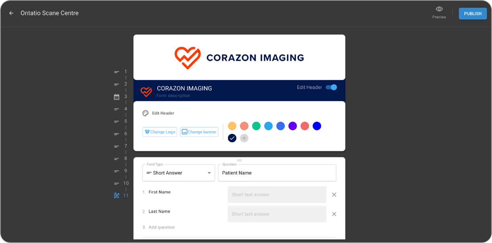
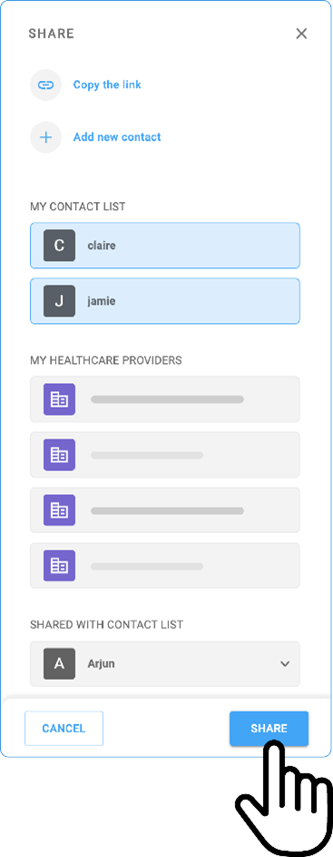

# Power Server Blume Integration

## Prerequisites

Set up the organization on OAI and PS platforms, ensuring that
modalities, study sets, procedure codes, and healthcare services are
accurately created and configured.

## Create Organization in OmegaAI and PowerServer

[**https://ramsoftinc.atlassian.net/wiki/spaces/OA/pages/451182597/Onboard+Customers+with+Shared+PS+Storage**](https://ramsoftinc.atlassian.net/wiki/spaces/OA/pages/451182597/Onboard+Customers+with+Shared+PS+Storage)

## Creating Healthcare Resources in PowerServer

## Create Organization in OmegaAI and Powerserver

 **PowerServer Login**

1.  Go to the PowerServer login page.

2.  Enter your username and password.

3.  Click on the Login button.

**Health Care Creation Note**:

4.  If applicable, complete multi-factor authentication.

5.  After logging in, a tile of the application window appears.

6.  Single-click on Power Reader.

7.  Click on the Power Reader icon and install the RamSoft app launcher
    for the first time. For the next login Double-click on the icon.
8.  Log in to OmegaAI with administrative privileges.

**Navigation Steps.**

1.  Access the "Admin" or "Setup" option of PowerServer.

2.  Go to "Settings".

3.  Click on User and Facilities

4.  Click on Location.

5.  Enter the location details.

6.  Click on Resource.

7.  Fill in the resource details (resource name, modality, default
    duration, working hours).

8.  The parameters used in PowerServer to create a healthcare resource
    should be the same in the OAI while creating a healthcare resource
    for synchronization.

9.  Assign the resource to specific workflows or user groups.

10. Click Close to create the resource.

## Creating Healthcare Resources in OmegaAI

**Notes: Healthcare Resource Creation**

1.  Patient ID Issuer:

    - The issuer of the patient ID used in PowerServer 6.0 must exist
      under the Master Organization in OmegaAI (OAI) for the customer.

2.  Custom Appointment Priority:

## Creating Healthcare Resource in Powerserver

    - Patient appointment requests from Blume will be sent to
      PowerServer 6.0 with a custom priority labeled "SCHEDULED STATUS."

    - This priority must be manually added in PowerServer 6.0 by
      navigating to: Settings \> Server Settings \> Priority

      - Use a PowerReader account with administrator role access to
        complete this configuration.

3.  Facilities and Resources Synchronization:

    - Facilities and resources must be manually synchronized during the
      onboarding process.

    - This step is essential to enable proper data assignment
      propagation between PowerServer 6.0 and OmegaAI.

**Steps to Create a New Healthcare Resource and Sync Between OmegaAI
  and PowerServer**

**In OmegaAI:**

1.  Log in to *OmegaA*I with your admin credentials.

2.  Navigate to **Scheduler** on the right-hand side.

3.  Click on **Edit Healthcare Services**.

4.  Click the **+** icon beside the Healthcare Services header to create
    a *new healthcare resource.*

5.  In the **Organization Search field**, enter your organization.

6.  Use the **Active T**oggle Button to enable or disable the resource.

7.  Beside Resource Name, choose a *color code* for your resource.

8.  Under the **Resource Name** field, enter the desired resource name.

9.  Select the appropriate **Modality** from the dropdown list.

10. Set the Duration (default is 1 hour, format: HH:MM).

11. Customize the **Working Hours** as needed.

12. Enable the **Overbooking Toggle** Button if required.

13. Specify the Days of the Week along with their start and end times
    for the resource.

14. Click **Save** beside the *Active* Toggle Button to save your
    resource.

**In PowerServer:**

1.  Navigate to **Settings** -> **Users & Facilities** in *PowerServer*.

2.  Go to **Imaging Facilities** and click **Location** (found at the
    lower right side below the Resource button).

3.  Click **Location** to create rooms for the resources.

4.  Use the **New** button to create a new department/floor or room.

5.  Save and close.

6.  To create a new healthcare resource:

    - Navigate to **Settings** \> **Users & Facilities** \> **Imaging
      Facilities** \> **Resource** Button.

    - Click the **New** Button to add a resource.

7.  Enter the following details carefully:

    - **Department**

    - Select the **Room Name** from the drop down (as created earlier)

    - **Type**

    - **Modality**

    - **Class**

    - Ensure the Resource Name matches exactly with the entry in
      OmegaAI.

8.  Enter the same Start and End Times as in OmegaAI.

9.  Ensure the Default Duration matches the value in OmegaAI.

10. Click Save & Close once all details are filled in.

**Syncing the Resource:**

1.  Navigate to the Scheduler in PowerServer.

2.  Click the **Refresh Data Button** in the toolbar.

3.  The new healthcare resource created in OmegaAI should now be visible
    in the PowerServer Scheduler.

**Navigation Steps:**

1.  Log In:

- Access OmegaAI using an account with administrative privileges.

2.  Navigate to Resources:

- From the dashboard, click on the Scheduler icon.

- Go to Settings -> Resources.

3.  Edit Healthcare Services:

- Click Edit Healthcare Services.

4.  Click on "Create New Resource."

 5.Enter Resource Details:

- Provide the required information, such as resource name, modality,
  default duration, working hours, etc.

6.Assign the resource to specific departments or users if required.

7. Save and Verify: save the new resource entry and verify its accuracy in the system.

## Form Configuration in OmegaAI

**Creating a New Blume Form**

1.  Start Form Creation:

- Click the 'Create' icon or upload a fillable PDF form.

- This action opens the form editor.

- Supported form types: 1. Normal Form 2. PDF Form

2.  Add Questions:

- In the form editor, click the 'Add Question' button.

- Choose from various question types:

  1.  Short Answer

  2.  Multiple Choice

  3.  Checkboxes

3.  Configure Question Settings:

- Customize settings for each question:

  1.  Mark as mandatory (if required).

  2.  Add subcategories.

  3.  Define answer options.

- Ensure all necessary information is collected.

4.  Preview and Publish:

- Preview the form to confirm it meets your requirements.

- If everything is satisfactory, click 'Publish' to make the form
  available for patients.

 **Accessing Blume Forms**

- Log in to your OmegaAI account.

- Navigate to the 'Apps' section.

- Click on the 'Settings' icon within the Blume application.

**Managing Existing Blume Forms**

1.  Go to the Blume Settings screen.

2.  Locate the form you wish to manage.

3.  Use the three dots menu next to the form to:

- View

- Edit

- Unpublish as needed.

**Submitted Forms**

- Submitted Registration Forms: Displayed in PowerServer (PS) ->
  Document Viewer -> Patient Docs section.

- Submitted Clinical Forms: Displayed in PowerServer (PS) -> Document
  Viewer -> Documents section.

**Navigation Steps**

1.  Navigate to Blume Settings from My App on OAI.

2.  Navigate to Blume **Settings** from **My App**.

3.  Click on "icon to Create New Form."

4.  Click on "+" icon to create new form.

3.  Publish Form window appears.

4.  Select a template Registration Form or Clinical Form from the
    drop-down.

5.  Add relevant fields (e.g., patient information, medical history).

6.  Customize field properties (mandatory, optional, etc.).

7.  Click on **PUBLISH** button in top right corner to publish the form.

8.  Click the *Publish* button in the top right corner to publish the
    form.

8.  Click on three dots and select the *Unpublish* option to discard the

9.  Click on three dots and select the **Unpublish** option to discard the
main form.

## PowerServer Homepage

**Notes: PowerServer**

1.  After login, youΓÇÖll land on the PowerServer homepage.

2.  The homepage displays key metrics, tasks, and modules.

3.  Access patient records, appointments, and imaging tools from the
    main menu.

4.  Customize the layout by pinning frequent actions or notifications.

**Adding Patient PowerServer**

1.  Navigate to the main toolbar .

2.  Click the "Add New Patient icon

3.  Click **Add New Patient** icon.

3.  Enter patient demographic details (name, date of birth, contact
    information).

4.  Upload any relevant documents or health records.

5.  Save the patient profile.

**Book Appointment**

  1.  ***Creating a New Appointment***

The integration facilitates smooth management and confirmation of
appointments. Once an appointment is confirmed, the details, along with
any forms, are sent to the document viewer, ensuring that all
information is easily accessible for review.

2.  ***Initial Setup***

First, access the Power Server portal and ensure you are logged in with
the appropriate credentials. To initiate a new appointment, navigate to
the scheduler.

The Scheduler is designed to monitor resource usage, serving as a
detailed calendar or planner for listing events (studies) at their
scheduled times and dates. When activated, users can view and schedule
studies within their associated facilities. Systemwide administrators
and users not restricted to a specific facility will have access to view
all facilities in the scheduler.

**To schedule a study for an appointment**:

**Method 1**:

1. Right-click on Open Time Slot.

Method 1: Right-click on Open Time Slot

The available resources and their schedules for a facility are set in
the Resources section under Settings -> Users and Facilities -> tab.

2. Click Create appointment.

3. Fill in the details.

4. Click Ok.

**Method 2**:

Double-clicking the slot in Scheduler.

The second method for scheduling an appointment is by double-clicking
on a slot on the scheduler. This will launch the New Order form again,
and then the steps can be followed as explained above.

(Note that by default a minimum of 15 minutes is applied to Study
Type durations for appointments scheduled with less than 15 minutes time
slot.)

**Method 3**:

Dragging appropriate resources into Scheduler

A third method for scheduling a study is by dragging them to the
appropriate resource in the scheduler.

To schedule a study, the modality of the resource must match the
study's scheduled modality. The study should be at the status of ORDERED
(a status below SCHEDULED status). When you modify an appointment's date
and time, the system will automatically update the Study date and time
in the Study Info screen.

**Method 4:**

Create an Appointment option

The fourth method for creating an appointment is by choosing the
Create New Order option on the menu bar and opening the form.

For Your Information:

Appointment creation from PS will sync and display a record in
the Scheduled Appointment tab with the status Pending on the Blume
Portal.

Once the Blume user confirms the appointment, the status on Blume
will change to scheduled, and the appointment status will change to
confirmed on PowerServer.

Reschedule that appointment from Blume will change the status from
Scheduled to Requested; this time the appointment should be changed from
Confirmed to Scheduled.

**Navigation Steps**

1.  Go to the **Appointments** section.

2.  Double-click on the respective date and time to create a new
    appointment.

*Refer to the other methods of creating appointments as explained
above.*

3.  Select the patient from the metasearch or add a new one.

4.  Select the referring physician.

5.  Select the studies.

6.  Choose the study types/ order set needed and click Add for multiple
    studies of the same resource.

7.  Confirm and save the appointment.

## Blume Onboarding

**Basic Information:**

1.  Access the Blume platform via login.

2.  Click on the "Step into Blume" button below received on your email
    invite.

3.  Enter the registration details and click on Register.

4.  Perform OTP verification associated with the email address.

5.  Go to the appointment and click on the Confirm button.

6.  An Appointment Confirmation message appears: ***Appointment
    Confirmation***

7.  A notification indicating the scheduled appointment is received in
    the Notification section.

**Filling Form**

1.  In the open form, enter all required information based on the
    specific configuration set by each facility. This may include:

 - Patient Information

- Preferred Dates

- Required Healthcare Services.

2.  A key feature highlighted is the capability to complete E-forms
    within the Blume platform, which guarantees their accurate
    presentation in Power Servers document reader.

3.  Completed E-forms automatically synchronize with the Power Server,
    allowing for real-time updates and visibility.

4.  This automation eliminates the need for manual intervention and
    reduces potential errors in documentation.

**Submitting the Form**

  - After completing the form, click the submit button. If the system is
    functioning properly, the appointment request should be submitted
    without any issues. However, in some cases, a refresh may be
    necessary to confirm that the form has been submitted successfully.

**Navigation Steps**

1.  Go to the assigned form section in OmegaAI or PowerServer.

2.  Open the form assigned to the patient or user by clicking on *Access
    Form*.

3.  Enter the required information into each field of the Pending Form.

4.  Review the data for accuracy.

5.  Submit or save the form for future reference.

## Quick Guide to View Forms and Use the Image Viewer in the **PowerServer**

 **Key steps**

1.  Access the Patient Records or Forms section.

2.  Choose the patient whose form or imaging you need to examine.

3.  Open the form or use the Image Viewer to view medical images,
    including X-rays or MRIs.

4.  Navigate to the Documents section to access patient documentation.

5.  Employ the Zoom and annotation tools for a detailed analysis.

6.  Save or export the images, as necessary.

## Share the Study on the Blume Portal

1.  Open the study: Navigate to the desired study you wish to share.

2.  Access the Sharing Options. Locate and click the *Share via Email*
    option below the study.

3.  Two sharing options will appear:

**Copy the link**:

- Click the copy the link option.

- Paste the link into your browser

- Verify access by entering the patients ID/SSN/HC or Birth Date to view the study.

(External users without a Blume login can receive a read-only link to
view the shared study.)

**Share with a New Contact:**

- Click + Share with a New Contact

- Enter the contact Name & email address

- Click the share button to send or cancel button to delete or re-enter
  the details.

**Note:**

- Previously added contacts will be listed below for direct selection.

- Multiple contacts can be selected and shared simultaneously.

- You can also share the study with existing healthcare providers listed
  under the Healthcare Provider List.

- Organizations associated with patients using the same registered email
  address will appear here for easy sharing.

## Pull Prior on **PowerServer.**

1.  Use the Pull Prior function to retrieve previous records or
    images.

2.  Filter based on date or type of prior data (e.g., imaging reports,
    lab results).

3.  Review the pulled information and integrate it into the current
    patient workflow.

## Self-Scheduling in Blume and Confirming Appointments on PowerServer.

- **Key Steps**

1.  Log In to your Blume account.

2.  Navigate to Book New Appointment

3.  Click on Book New Appointment.

4.  In the New Appointment window, enter the patient details, location,
    and healthcare services and click on Next.

5.  Select the date and time.

6.  Click on Book.

**Filling form**

1.  Filling the Form:

    - Click on the Access Form from the study.

- The form must be completed as outlined in Section E, ensuring that all
  required information is provided for the appointment setup.

**Confirming appointment in PowerServer**

  - Access PowerServer and verify the appointment request.

  - Right-click and select the Confirmed option from the list.

