# Login Process and Multi-factor Authentication (MFA)

RamSoft’s OmegaAI offers heightened account security measures through its Multi-factor Authentication (MFA) procedure ensuring information confidentiality and safety for all users.

The section in subject will provide you with a walk through of the Login and Account Creation for RamSoft’s OmegaAI as well as the MFA process applied to several scenarios:
- Login from Regular Browser
- Incognito Browser (without closing browser)
- Incognito Browser (close browser)
- Different Browser
- Different IP Address
- Different Device and OTP Fingerprinting

## Updated Authentication Process – Introducing Password-Based Login

OmegaAI has introduced a new **password-based authentication system**, replacing the previous **6-digit PIN** login method.  
This enhancement follows **HITRUST-compliant** password security standards, offering stronger protection for user accounts and sensitive clinical data.

### 1. New User Signup (Password-Based Login)

**Page:** OmegaAI Signup Page  

During signup, the **PIN field** has been replaced with a **Password** field.  
All new users must create a secure password that meets the following rules:

**Password Criteria**

- Minimum **8 characters**
  
- Includes **at least one uppercase and one lowercase letter**
  
- Contains **at least one number or special character** (e.g., `!`, `@`, `#`, `$`) 

**Examples**

 - **Acceptable**: `Health@radio123`, `SecureLogin#2025` 
   
 - **Not Acceptable**: `abcdef`, `12345678`

A password strength indicator will appear as you type, helping you create a stronger password.  
After entering and confirming your password, click **Continue** to complete your signup.  
Signup cannot proceed unless all requirements are met.

### 2. Sign-In Flow for New Users

**Page:** OmegaAI Sign-In Page  

New users can now log in using their **email/username** and **password**.  
Once a password is created, it becomes the only valid credential for future sign-ins.

### 3. Legacy PIN-Based Login (For Existing Users)

Existing users who originally created their accounts using a **6-digit PIN** can continue logging in as before.  
However, for enhanced account protection, users are encouraged to **upgrade to password-based login** at their convenience.

### 4. Forgot or Reset Password

a. Navigate to **Login Page**.

b. Enter your registered **Email address**.

c. Click **Continue**. 

d. Click on the **Forget Password** option on the **Enter PIN** page.

e. You will need to enter the **code** received on your registered email address to **Verify** your account.

f. Click **Verify**.

g. You will be redirected to the **Reset Password** page.

h. Create a new **alphanumeric password** following the password criteria listed above.  

i. **Re-enter** the password

j. Click **Continue**.

k. Both the passwords must match for you to continue with the process.

**Note**:  

- Once updated, your PIN will be replaced by the new password, which will be required for all future logins.

- Password strength is validated in real-time to help ensure compliance and security.

### 5. User Access Summary

| **User Type** | **Login Method** | **Next Steps** |
|----------------|------------------|----------------|
| **New Users** | Password | Create a secure password during signup |
| **Existing Users (PIN-based)** | PIN | Continue using PIN or upgrade to password anytime |

**Note:**  
Both authentication methods are supported during this transition phase.  
However, the **password-based login** is the recommended and more secure approach going forward.

## Existing User Login Process

Access [https://www.omegaai.com/](https://www.omegaai.com/). Once you are on the Log in page follow the steps below to access your account:

Click OmegaAI.

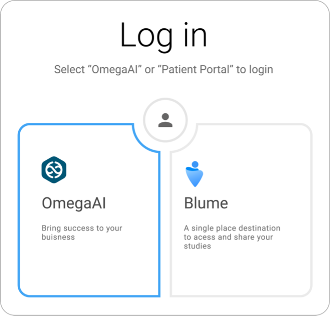

You will now see the Welcome to OmegaAI section.

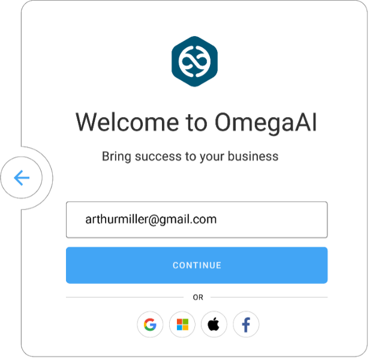

Enter your email address.
Click “Continue”.
You will now see the Enter PIN section. Enter your pin.

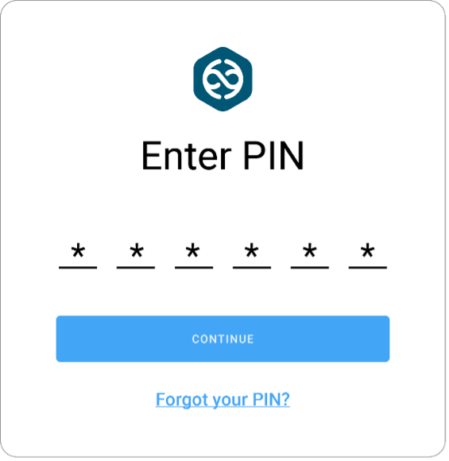

Click “Continue”. You have now successfully logged into OmegaAI and you will be directed to the OmegaAI Home page.

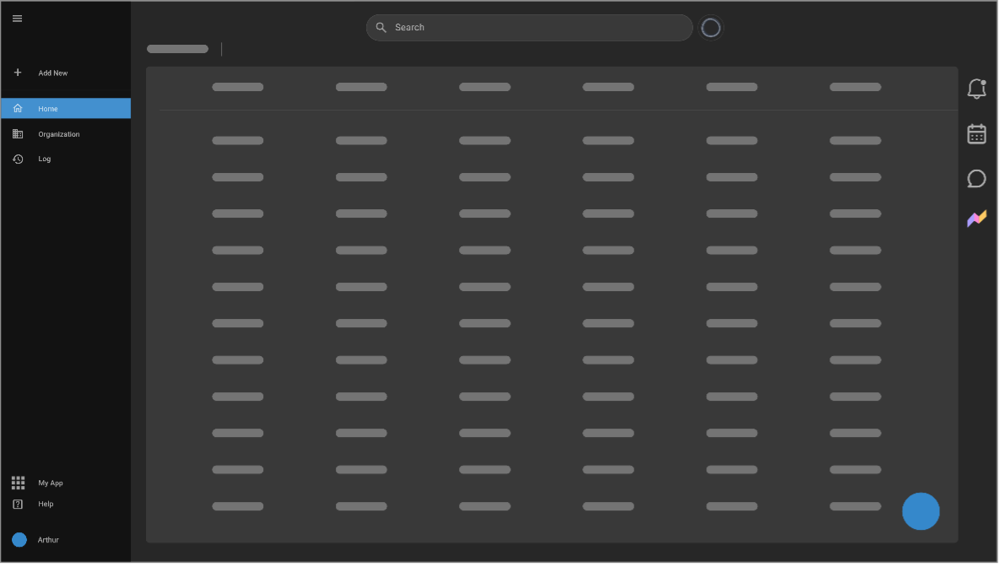

## MFA Procedure Applied to Multiple Login Scenarios

MFA login flow differs as per scenarios displayed in the below diagrams.
- Login via Regular Browser

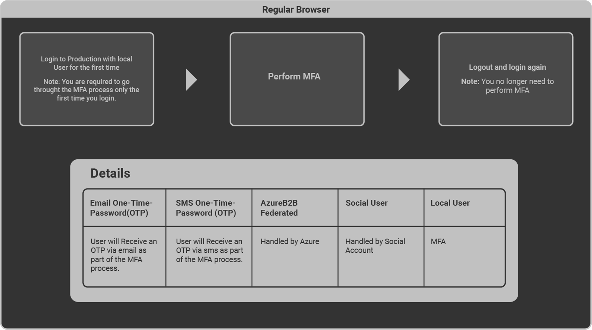

- Login via Incognito Browser (without closing browser)

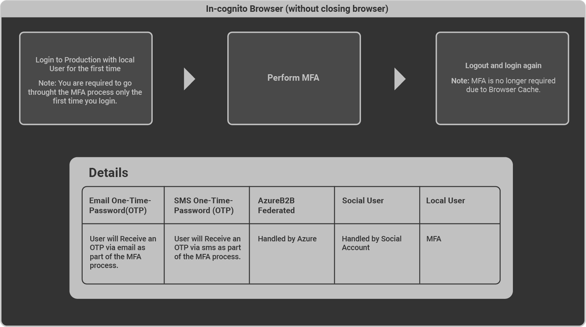

- Login via Incognito Browser (close browser)

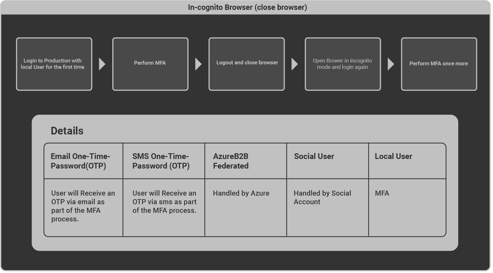

- Login with Different Browser

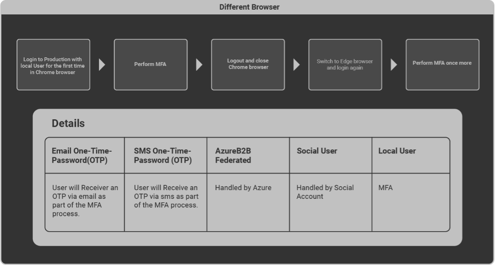

- Login with Different IP Address

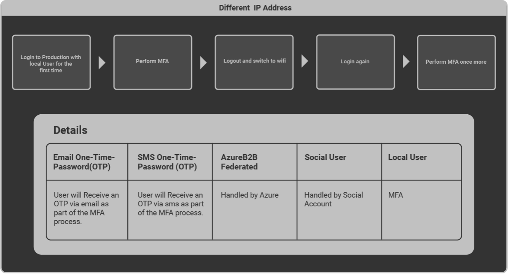

- Login with Different Device

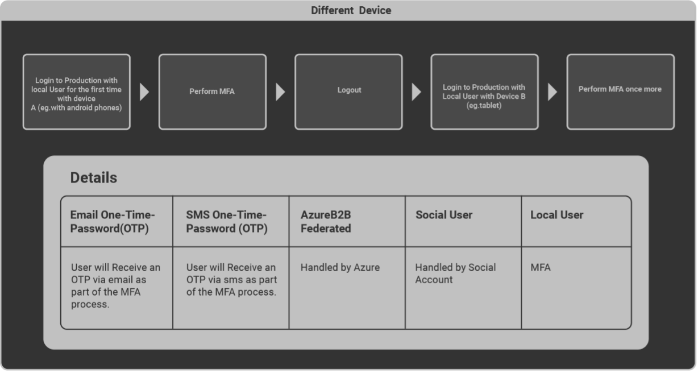

- Login via OTP Fingerprinting

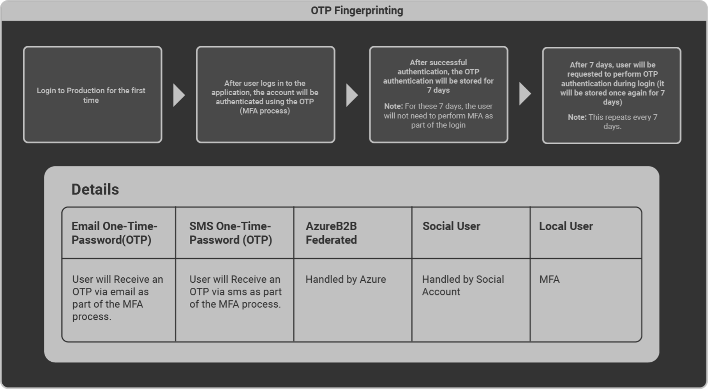

## How to prevent having to perform MFA every single time you login

Note: MFA triggers are tracked by the browser's local storage.

However, in some cases, browser security settings are set up to delete data stored in the browser’s local storage (as shown below) requiring the user to perform MFA every time they log in to OmegaAI.

### Solution

Access your respective browser settings (for example Chrome) and follow the below steps:
- Select Privacy and Security from the left navigation menu.
- Select Site settings.
- Select the third-last option from the list On-device site data.
- Select the first option Allow sites to save data on the device.

Your login details will now be stored in the browser’s local storage thus no longer triggering an MFA request.
