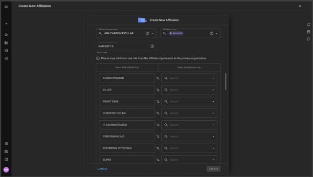
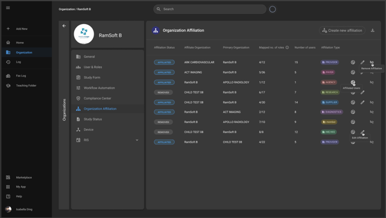
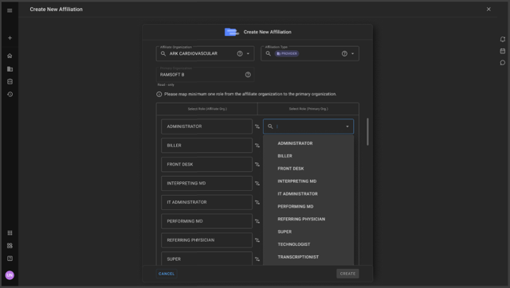

# Organization Affiliation

The Organization Affiliation feature enables a one-directional relationship between a Primary Organization (Main Org) and a Participating Organization (Affiliate Org). This allows users from the Affiliate Org to access studies from the Main Org based on predefined role mappings.

## Key Concepts

**One-Directional Access**: Only Affiliate Organization users gain access to Main Organization studies.

**Role-Based Privileges**: Affiliate users inherit privileges based on mapped roles.

**Affiliation Management**: Admins can create, edit, view, and remove affiliations.

**FHIR Compliance**: Follows FHIR standards for Organization Affiliation resource.

## Create an Affiliation Link

**Prerequisite**: Admin privileges in the **Primary Organization**.

#### **Steps:**

1.  Navigate to **Organization Directory** → **Affiliation Management**.

2.  Click **"Create New Affiliation"**.

3.  Fill in the following details:

    -   **Affiliate Organization**: Search and select the participating organization (supports meta-search across child, master, and referring orgs).

    -   **Affiliation Type**: Select from FHIR-defined values (e.g., *provider*, *vendor*).

    -   **Primary Organization Role**: Select a role from the Main Org that will be assigned to Affiliate Org users.

    -   **Role Mapping**:

        -   If **"Apply a Single Role to All Affiliate Roles"** is checked, all Affiliate Org users inherit the selected Main Org role.

        -   If unchecked, manually map each Affiliate Org role to a Main Org role.

4.  Click **"Create"** (enabled only when all fields are filled).

5.  Confirm details in the popup and proceed.

#### **Tooltips:**

-   **Affiliate Organization**: "The external organization you are affiliating with."

-   **Affiliation Type**: "Defines the relationship type (e.g., provider, vendor)."

-   **Primary Org Role**: "The role assigned to affiliated users in the Main Org."

    

### List & Manage Existing Affiliations

**Prerequisite**: Admin access in either Primary or Affiliate Org.

#### **Features:**

-   View all affiliations in a sortable table (sorted by last update).

-   Filter by **Active (AFFILIATED)** or **Inactive (REMOVED)** status.

-   **"Mapped Users"** tooltip: "Number of roles successfully mapped (e.g., 4/12 means 4 out of 12 roles mapped)."

-   **"Affiliated Users"**: Click to view users from the Affiliate Org who can access Main Org studies.

-   **Edit/Remove** affiliations (only for Active ones).

    

#### **Deleting an Affiliation:**

1.  Click **"Remove Affiliation"**.

2.  Confirm in the popup.

3.  Status changes to **REMOVED** (logged in audit trail).

### Affiliated Users Management

After affiliation, Affiliate Org users appear under **"Affiliated Users"** in the Main Org's User Management.

#### **Columns in Affiliated Users List:**

-   **User**: Name

-   **Login Email**

-   **Affiliated Roles**: User's roles in Affiliate Org.

-   **Primary Org Roles**: Mapped roles in Main Org.

-   **Affiliated User Types**

-   **NPI ID**

-   **Last Login Time**

#### **Notes:**

-   Affiliated users are **hidden** in the Main Org's regular user list.

-   If a user belongs to **both** Main and Affiliate Orgs, their Main Org role takes precedence.

### Role Mapping & Privileges

-   **Privilege Calculation**:

    -   Affiliate users get access based on **mapped roles** (e.g., "Performing MD" in Affiliate Org → "Reading Physician" in Main Org).

    -   If a single role is applied, **all** Affiliate users inherit that role's privileges.

-   **Role Deletion Warning**:

    -   If a role used in affiliation is attempted to be deleted, the system blocks it with:\
        *"⚠️ This role cannot be deleted: Role is used in organization affiliation mappings."*

        

### UAC (User Access Control)

-   Only users with **"Organization Affiliation"** UAC enabled can manage affiliations.

-   **Default Settings**:

    -   **ON** for **ADMINISTRATOR/RAMSOFT** roles (new orgs).

    -   **OFF** for all other roles.