 

# RIS Setting – Order Sets

## Adding Order Sets to the Organization

- In the left panel, click **Organization** and open the details page for the respective organization.
- Within the Organization details page, click **RIS** to expand and view the **Order** **Sets** option.
- Click **Order Sets** to open the Order Sets details page, where you can:
  - Add new Order Sets
  - Edit existing Order Sets
  - Delete existing Order Sets

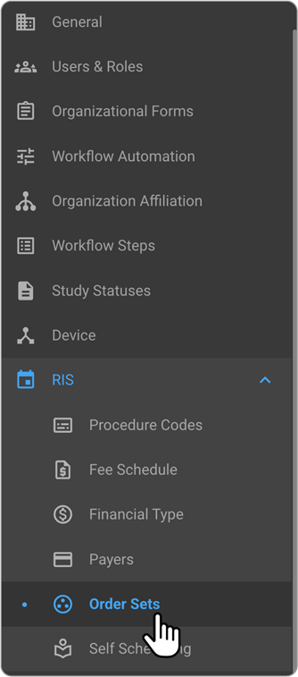

- To add a new Order Set:
  - Click the **+** icon.
  - The **Add New Order Set** drawer will open.

  

- Enter the required details for the Order Set:
  - Order Set Code
  - Description
  - Modality
  - Duration (Minutes)

These fields are mandatory and must be completed before proceeding.

  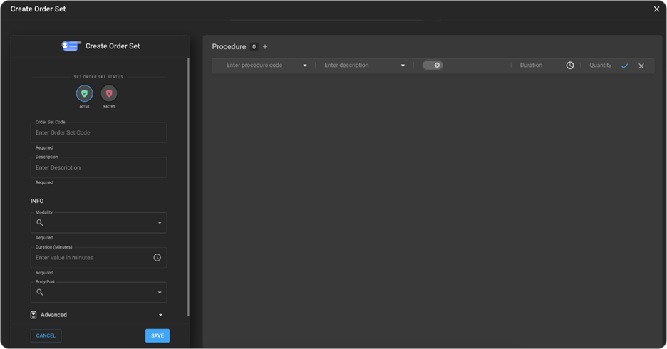

- (Optional) Expand the **Advanced** section to enter additional details:
  - Laterality
  - Type of View
  - Anatomic
  - Technique
  - Preparation (Minutes)
  - Recovery (Minutes)

These fields are optional and can be left blank if not applicable.

  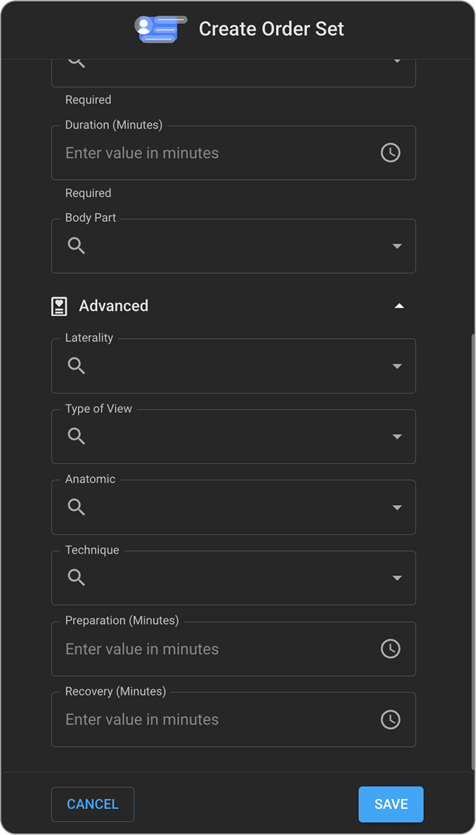

- As you enter values, the system will search and display suggested matches.
- To add a **Procedure Code** to the Order Set:
  - Click the **+** icon in the **Procedure Code** section.

  

- When you click the + icon next to the **Procedure Code** section title, an empty row will appear where you can enter:
  - Procedure Code
  - Modifiers
  - Duration (Minutes)
  - Quantity

  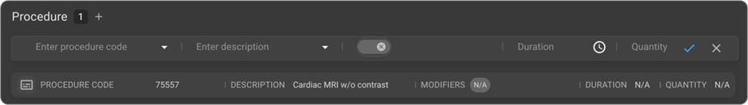

- Search for the required Procedure Code and select it from the drop-down menu.

  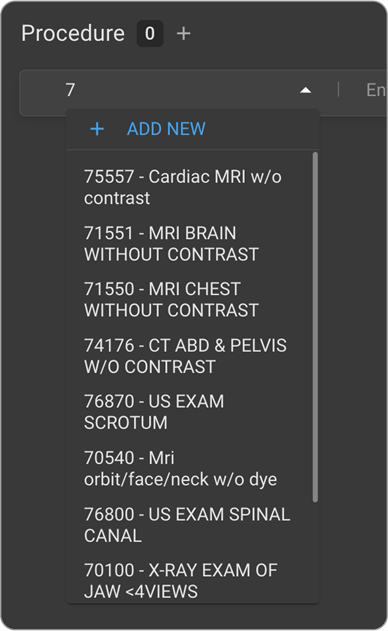

- If the required **Procedure Code** is not available in the drop-down list, click + **Add New** to create the procedure code directly.

  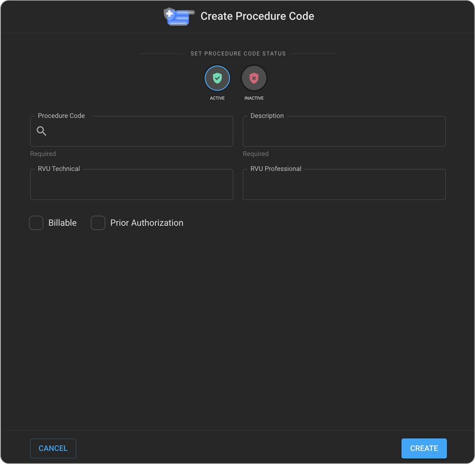

- After entering or updating the information, click the **tick mark** button on the right-hand side to save the procedure code.

  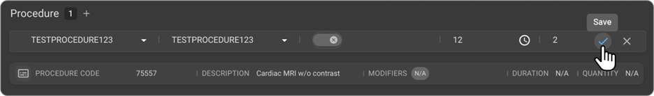

- To discard any changes made, click the **Cancel** button on the right-hand side.

  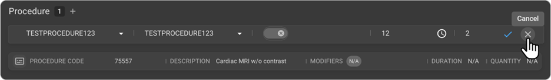

- Clicking the + icon on the procedure code section title would allow the users to enter multiple procedure codes for the Order Set code under the same Procedure Code

  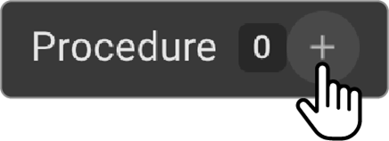

- Once all the details have been entered, click **Create** to save the Order Set record.
- After saving, the new Order Set will appear in the **Order Set** list.

  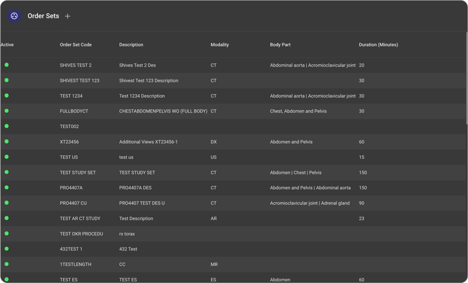

## Preview the Procedure Code for an Order Set

- On the **Order Sets** list page, hover over an Order Set record to display the **Preview Procedure Code** icon.

  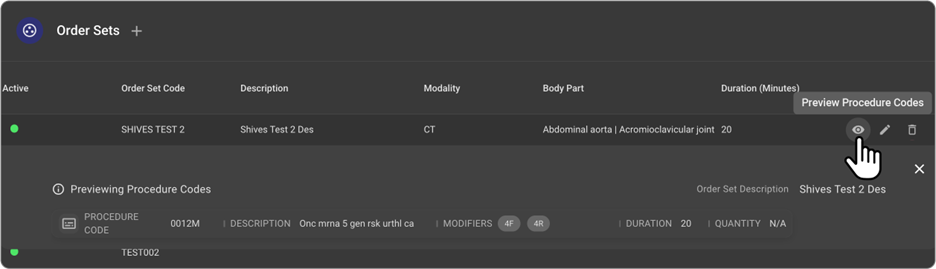

- Click the **Preview Procedure Code** icon to view the procedure codes associated with the selected Order Set.

## Editing/Deleting an Order Set Record

- On the **Order Sets** list page, hover over an Order Set record to display the **Edit** and **Delete** icons.

  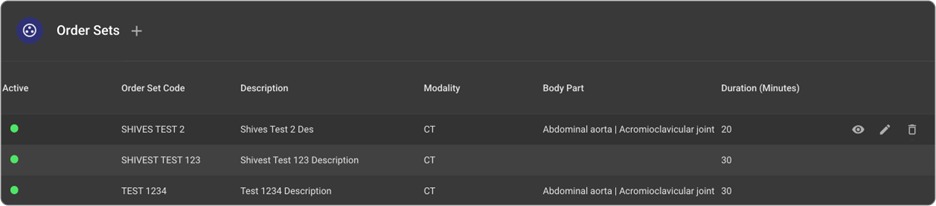

- Click the **Edit** icon to open the **Edit Order Set** drawer.

  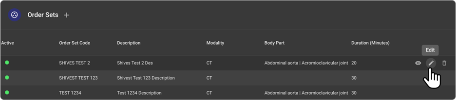

- In the **Order Set** section, edit the necessary details to update the Order Set information.
- In the **Procedure Code** section, hover over a procedure code row to display the **Pencil** (edit) and **Trash** (delete) icons.

  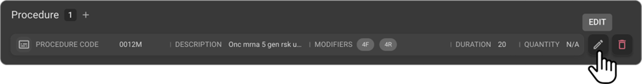

- Click the **Edit** button to open the procedure code row in edit mode.
- Make the necessary changes and click the **tick mark** button to save the procedure code.
- To discard changes to a procedure code, click the **Close** button.
- Once all updates to the Order Set are complete, click **Update** to save the changes.
- To delete an Order Set record, click the **Delete** icon.

  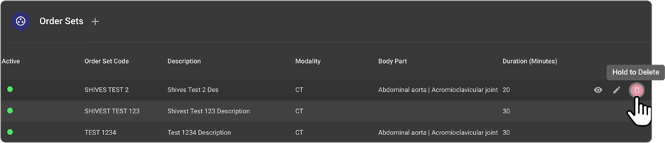

- Clicking the **Delete** icon will remove the corresponding Order Set record, and it will no longer appear in the **Order Sets** list.
- **Note:** If the Order Set is part of one or more **Studies**, it cannot be deleted. In such cases, you can only mark the Order Set as **Inactive**.

