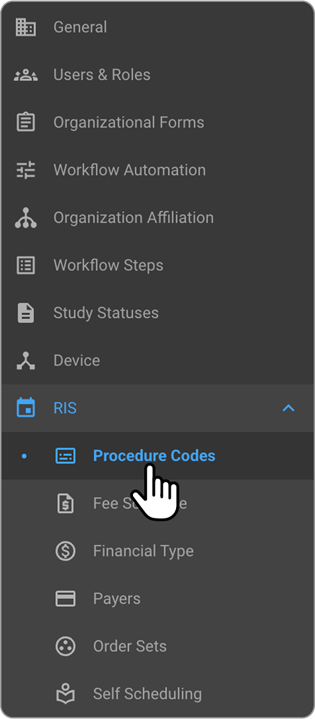
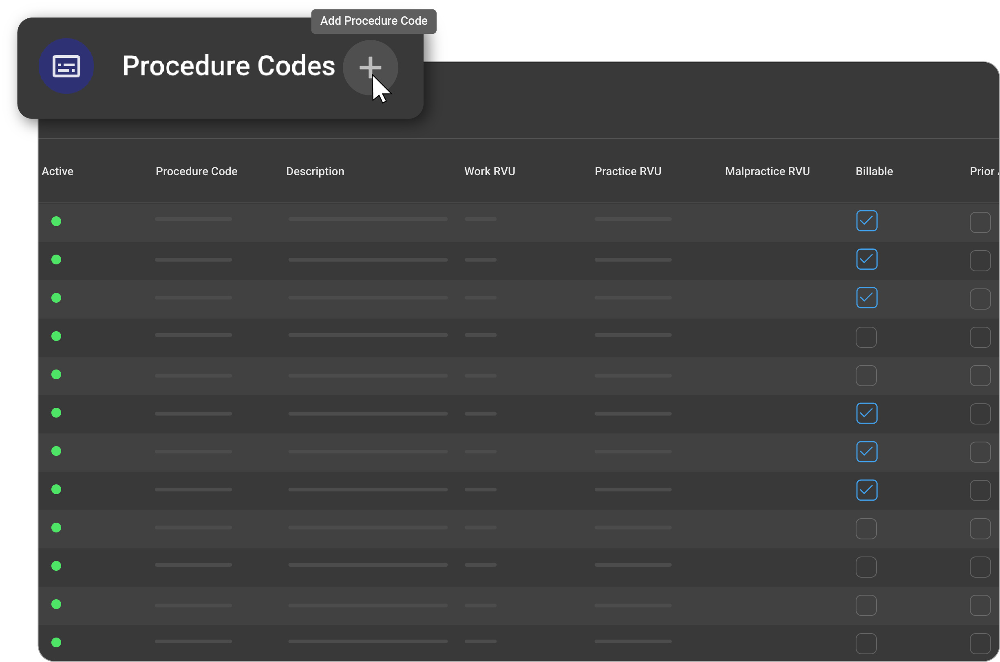
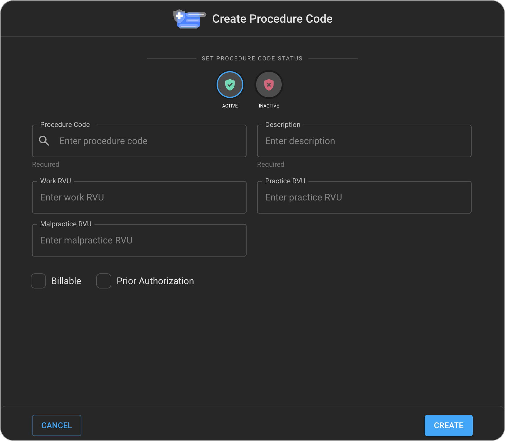
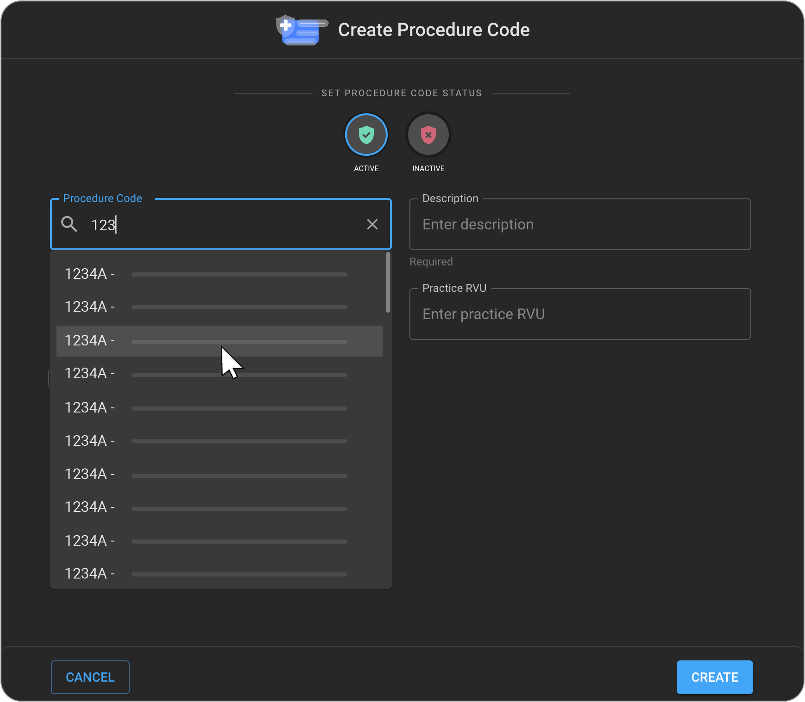
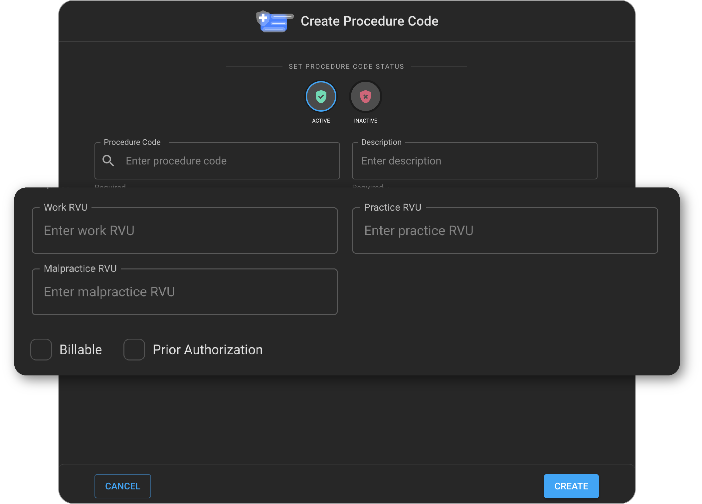
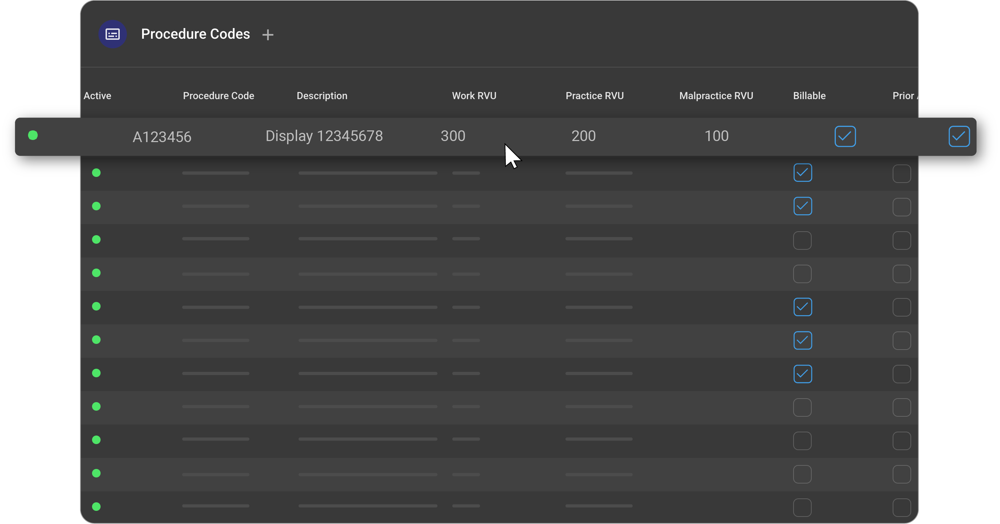
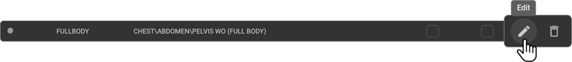
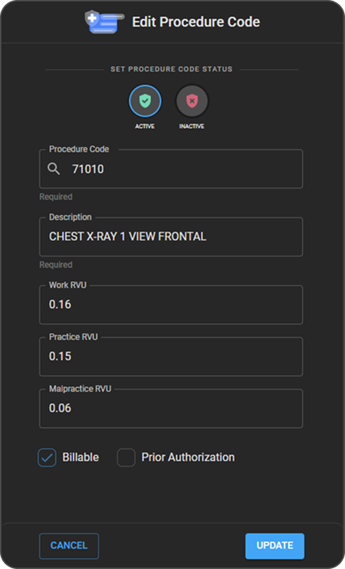
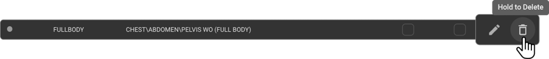

  
# RIS Setting – Procedure Codes

## Adding Procedure Codes to the Organization

- In the left panel, click **Organization** and open the details page for the respective organization.
- Within the Organization details page, click **RIS** to expand and display the **Procedure Codes** option.

   

- Click **Procedure Codes** to open the details page, where you can:
  - Add new procedure codes
  - Edit existing procedure codes
  - Delete existing procedure codes

  

- To add a new procedure code, click the **+** icon. This opens the **Add New Procedure Codes** drawer.

  

  

- Enter the procedure code value. The system will search and suggest matching values.
  - If you select a value from the drop-down, the **Procedure Code** and **Procedure Code Description** fields will be auto-populated.

  

- To enter the procedure code manually, you must also fill in the **Procedure Code Description** field.
- Enter the **Work RVU, Practice RVU** and **Malpractice RVU** values.

   

- If the procedure is billable and requires prior authorization, select the appropriate checkboxes. Then click **Create** to create the new procedure code record.
- Once saved, the procedure code will appear in the **Procedure Codes** list.

  

## Editing/Deleting a Procedure Code Record

- On the **Procedure Codes** list page, hover over the desired procedure code record.
  - The **Edit** and **Delete** icons will appear.

  

- When you click on the Edit icon, the Edit Procedure Code drawer will open.
  
  

- Users should be able to edit the details, and on clicking on the Update button, the details will be saved.
- To delete a procedure code:
  - Click and hold the **Delete** icon.
  - The corresponding procedure code record will be removed and will no longer appear in the **Procedure Codes** list.

  

- Important Notes:
  - **Note 1** – If the procedure code is part of one or more **Order Sets** but not part of any **Studies**, you must first remove it from all associated Order Sets before deletion.
  
  - **Note 2** – If the procedure code is part of one or more **Studies**, deletion is not allowed. In such cases, you can only mark the procedure code as **Inactive**.

