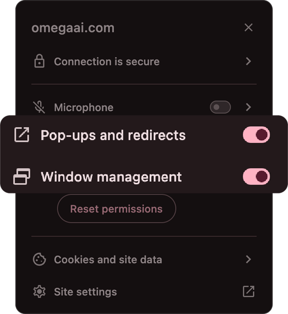
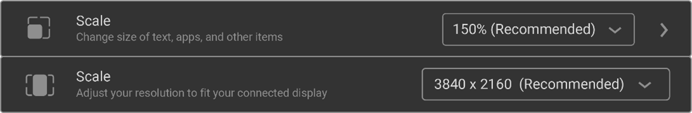
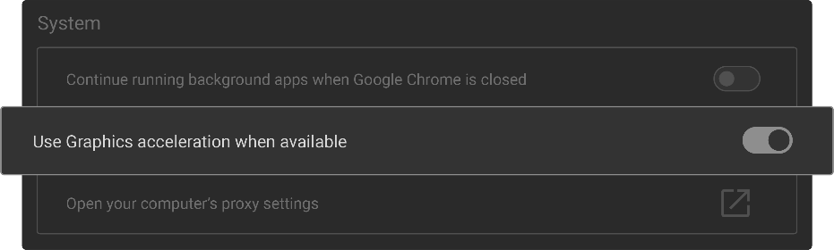
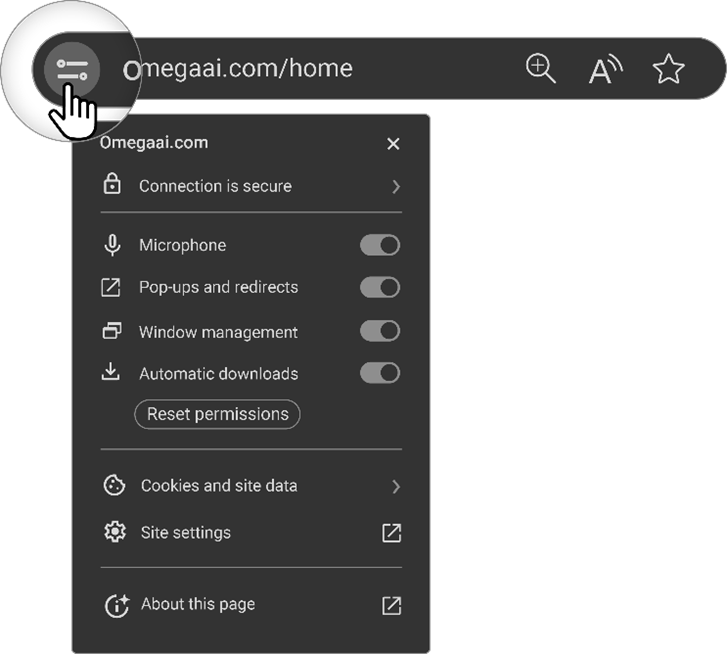

# System Requirements

## Hardware Specifications for General User:

| Requirement      | Specification                                                                 |
| ---------------- | ----------------------------------------------------------------------------- |
| **CPU**          | Intel Core i5 (10th Gen or newer) / AMD Ryzen 5 5000 series. Base clock speed ≥ 2.0 GHz, minimum 4 physical cores, with AVX2 instruction support |
| **RAM**          | 16 GB                                                                         |
| **Free Storage** | 50 GB SSD                                                                     |
| **Display**      | 1920 x 1080 resolution or higher                                               |

## Hardware Specifications for Diagnostic Image Review Users:

| Requirement      | Specification                                                                                 |
| ---------------- | --------------------------------------------------------------------------------------------- |
| **CPU**          | Intel Core i7 or i9 (11th Gen or newer) or AMD Ryzen 9 (5000 series or newer). Base clock speed ≥ 3.0 GHz, boost clock ≥ 4.0 GHz. High single- and multi-thread performance is required |
| **RAM**          | 32 GB                                                                                         |
| **Graphics**     | Dedicated GPU with at least 4 GB VRAM (e.g. NVIDIA GTX 1060 or equivalent)                                  |
| **Display**      | 2560 x 1440 resolution or higher, medically calibrated                                        |
| **Free Storage** | Minimum 100 GB SSD (dedicated drive recommended for browser caching)                                          |
| **Network**      | Recommended: A stable wired Ethernet connection, with 1 Gbps speed for optimal performance.                                             Please note: **Both download and upload speeds impact system performance.** Consumer internet plans often have much lower upload speeds, which can hinder workflows that involve uploading studies or adding DICOM files directly from the browser.|

## Software and Browser Requirements

| Requirement       | Specification                                    |
| ----------------- | ------------------------------------------------ |
| **Operating System** | Windows 11, macOS Catalina or later, Linux (Modern LTS versions) |
| **Browser**          | Latest stable version of Chrome, Edge, or other Chromium-based browsers |
| **Plugins/Add-ons**  | HTML5 and JavaScript enabled for full functionality |
| **Browser Settings** | Hardware acceleration enabled to enhance image rendering and processing |

## Browser Considerations

| Specification                            | Details                                             |
| ---------------------------------------- | --------------------------------------------------- |
| **Browser Compatibility**                | The software is compatible exclusively with Chromium-based browsers. |
| **Browser Version**                      | Use the latest stable browser release. Avoid experimental or beta versions to ensure reliability. |
| **Credential Storage & Cache**           | Enable cookies and local storage to securely store login credentials and preferences. |
| **Browser Zoom Level**                   | Set zoom level to 100% for optimal layout unless otherwise needed for lower-resolution displays. |
| **GPU Utilization**                      | Enable hardware acceleration via browser settings (Chrome: `chrome://settings/system`) to improve image rendering. |
| **Internet Connection and Speed**        | Minimum recommended speed: 1 Gbps wired connection for both upload and download. Consumer internet plans often have much lower upload speeds, which can slow workflows involving large file transfers, uploading studies, or adding DICOM files directly from the browser.Check the actual internet speed using tools like Speedtest by Ookla. |
| **VPN Usage**                            | VPNs may impact performance. If used, configure to bypass OmegaAI domain where possible. OmegaAI communications are secured with up-to-date web encryption. |
| **Intel GPU Issue**                      | Some Intel GPU models may encounter rendering issues. Visit `chrome://flags/#ignore-gpu-blocklist` and enable 'ignore-blacklist'. Configure additional angle settings at `chrome://flags/#use-angle` if needed. |

## Known Issues with Intel GPUs and Recommended Solutions

Users with specific Intel GPU models may encounter rendering issues in the OmegaAI Image Viewer.

### Solution Steps:

1. **Check GPU Blacklist Status:** 
   - Navigate to `chrome://flags/#ignore-gpu-blocklist`
   - Enable 'ignore-blacklist’ to bypass blocklisting on Intel GPUs.
2. **Configure Browser for Compatible Angle Settings:** 
   - Optionally, adjust browser graphics backend compatibility by configuring the ANGLE settings by visiting `chrome://flags/#use-angle`.
   - Select a compatible angle setting (options: d3d11on12, vulkan, and OpenGL).
   - This can improve performance and stability.

### Additional Recommendations for Mac Users:
- Keep your browser updated to the latest stable version while avoiding beta builds.
- Stick with the Default Angle settings.

## Browser Configuration Guide

### Browser Compatibility and Requirements

Our software is exclusively compatible with Chromium-based browsers such as Google Chrome, Microsoft Edge, and Opera, as these platforms offer the necessary functionality and compatibility required for optimal performance.

### Browser Version

Regularly verify that your browser is updated to the latest stable version, and refrain from using experimental or beta releases.

### Credential Storage & Cache

The browser must be configured to accept cookies and permit local storage in order to retain login credentials and user preferences.

#### Google Chrome

1. Open Settings from the menu.
2. Click on “Show Advanced settings”.
3. Under Privacy select 'Content settings'.
4. Enable 'Allow local data to be set (Recommended)' and disable 'Block third-party cookies and site data'.
5. Click Done.

#### Microsoft Edge

1. Select **More** (...) > **Settings** > **View advanced settings**.
2. Under **Cookies** select **Don't block cookies**.

### Multimonitor Setup

To operate the system in a multi-monitor environment, ensure that the browser has the necessary permissions for **pop-ups and redirects,** and **window management**. This permission prompt will appear after the user logs in for the first time. If the user previously declined this request, they could update the permission by clicking the "View Site Information" icon located on the left side of the browser's address bar.

From there, the user should ensure that **Pop-ups and redirects** and **window management** are allowed:

Click here for the full [Multi-Monitor Setup Guide](https://help.omegaai.com/docs/Communication-and-Organization-Tools/Omegaai%20Multimonitor%20Guide)

### Browser Zoom Level

Ensure that the browser's zoom level is appropriately set. Incorrect zoom levels may impact the user interface display.

### Scale and Display Resolution

Use the recommended values for the scale and display resolution as suggested by the operating system.

### GPU Utilization for Image Viewer

Ensuring hardware acceleration is enabled in the browser for better image rendering and processing.

- Chrome: Navigate to `chrome://settings/system`.

### Access Controls

Check if OmegaAI has the required permissions.

- Microphone (for voice recording and VR solutions)
- Window management (for multimonitor mode)
- Automatic Downloads (for downloading studies or burning to CD)
- Review Site Settings for changes from defaults at `chrome://settings/content/siteDetails?site=https://www.omegaai.com`.

### Internet Connection and Speed

Check your Internet speed using tools such as the Speedtest by Ookla (https://www.speedtest.net/). A 1 Gbps wired connection is recommended for both upload and download to ensure smooth operation.Slow upload speeds are common with many consumer internet plans, and high latency (ping) can negatively affect image viewing responsiveness and other real-time features.
### VPN Usage

Review the necessity of VPN usage as it can affect performance. If possible consider bypassing VPN for OmegaAI as OmegaAI communication is already secure and utilizes the latest web-based encryption methods.
