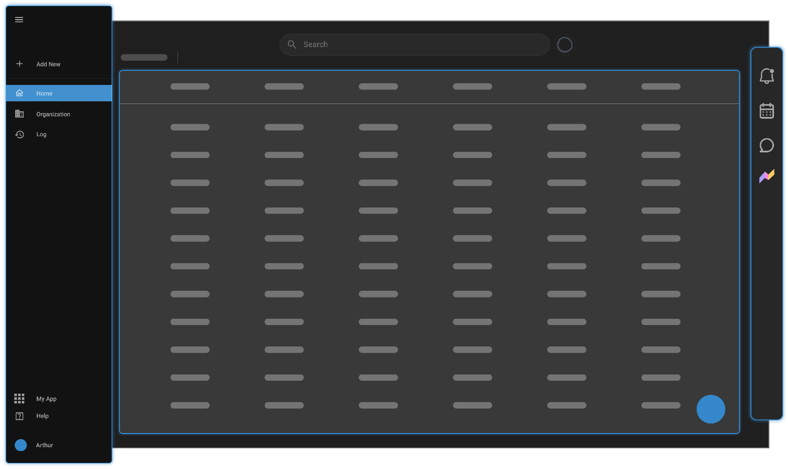

# Homepage

## Overview

Upon logging into OmegaAI, users are greeted with the homepage, which
serves as the central hub for navigation and functionality within the
software. This guide will walk you through the key components and
functionalities available on the home page to help you navigate and
utilize the software efficiently.

## Left-Side Navigation Panel

The navigation panel on the left side of the homepage is your primary
tool for accessing various features of OmegaAI.

> **Expanding the Navigation Panel**:

- Click on the Main Menu hamburger icon at the top of the panel to
  expand or collapse this section.

> **Main Options**:

- **Add New**: Click this to create a new order or import new studies.

- **Home**: Returns you to the main work list.

- **Organization**: If you have the necessary permissions, use this to
  access organizational settings.

- **Logs**: Access audit documents, task logs, and activity history.

> **Lower Section Options**:

- **My Apps**: Access additional functionalities such as Root Business
  Analytics and Blume Patient Portal.

- **Help Manual**: Direct link to the help manual for assistance.

- **User Profile**: Manage your user account and customize your
  workstation settings.

## Worklist

The central area of the homepage displays the worklist, which is crucial
for daily operations.

> **Global Search**:

- Located at the top of the worklist.

- Feature has built-in voice recognition that can be used to execute
  commands.

> **Worklist Details**:

- Displays the name of the worker and any active filters on the current
  list.

- The number of studies visible is shown at the top right. If more
  studies are present than can be displayed at once, additional entries
  will load as you scroll down.

## Right-Side Navigation Functionality

Additional tools and features are accessible on the right-side
navigation panel:

> **Notifications**: Access notifications by clicking on the bell icon
> at the top.
>
> **Scheduler**: Use this tool to view and manage schedules.
>
> **Chat**: The Chat feature allows for communication with other users
> within the system.
>
> **Root Chat**: Root Chat allows users to interact with any of the Root
> related features by prompting the chat to respond to specific
> inquiries or commands, such as **Show the count of all studies by
> modality for the organization RamSoft**.

