# Introduction

OmegaAI offers two primary types of worklists: User Worklists and Role Worklists. These tools are designed to streamline the workflow by organizing and displaying studies based on predefined or custom filters that cater to the specific needs of the users or roles within the organization.

## Access the New Worklist

1. Locate the **Try New Worklist** toggle in the top-right corner of the interface.

   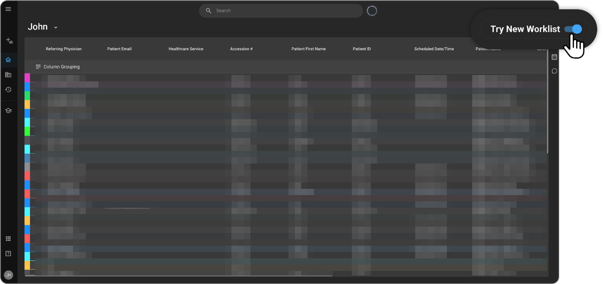
    
2. Click the toggle to enable the new layout.

## Colour Bar Study Status

Each colour is associated with a specific study status for easy findability and review.

1. Hover over the colour bar beside the respective study and the status will appear 

   (e.g. “**Study Status: ARRIVED**”, “**Study Status: CONFIRMED**”, “**Study Status: SCHEDULED**”, etc.

   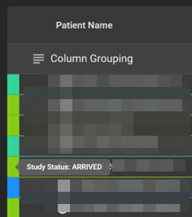
    
## Selecting Studies from the Worklist 

### Selecting a Single Study

1. Left click on a **Worklist** record to select the study.

   A checkbox will appear next to the study.

### Selecting Multiple Studies:

There are 3 methods to perform this action:

a) Click on the checkbox associated with the respective record(s). 

b) Hold CTRL while clicking on worklist records.

c) Hold SHIFT while clicking on worklist records will allow selection of multiple worklist records, from the first record selected to the last record selected. 

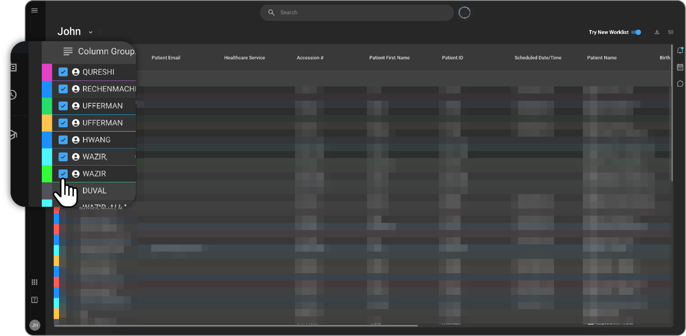

### Worklist Grouping:

To activate grouping function

1. Drag a column into the column grouping bar. 

   This will group all records by that respective column. 
   
   **Note**: Multiple groups can be created.

   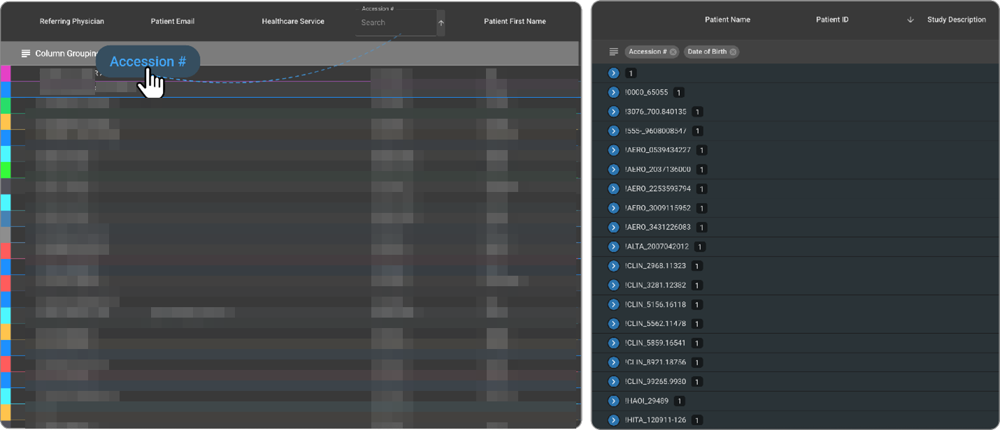 

2. Review created Groups in the column grouping bar.

3. To delete a group, click the **“X”** on the group label in the column grouping bar.

## Worklist Selector

### Access Selector

1. Click on the arrow next to the **Worklist** title in the top left corner of the interface to activate the Worklist selector dropdown menu.

2. A dropdown menu will appear, select as needed.

   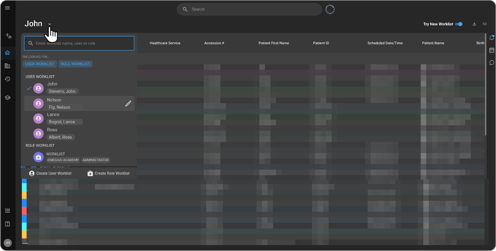

### Search Existing Worklist

1. Search for an existing worklist via the search bar while using one of the filters **USER WORKLIST** or **ROLE WORKLIST**, or without selecting any filter.

   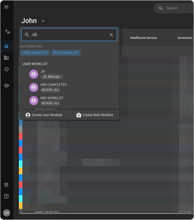

2. Click on the Worklist title to open it. You will be directed to the respective **Worklist**.

### Create New User Worklist or Role Worklist

1. Create a new **User Worklist** by clicking **Create User Worklist** from the bottom left of the menu.

   **Or**

   Create a new **Role Worklist** by clicking **Create Role Worklist** at the bottom right of the menu.

   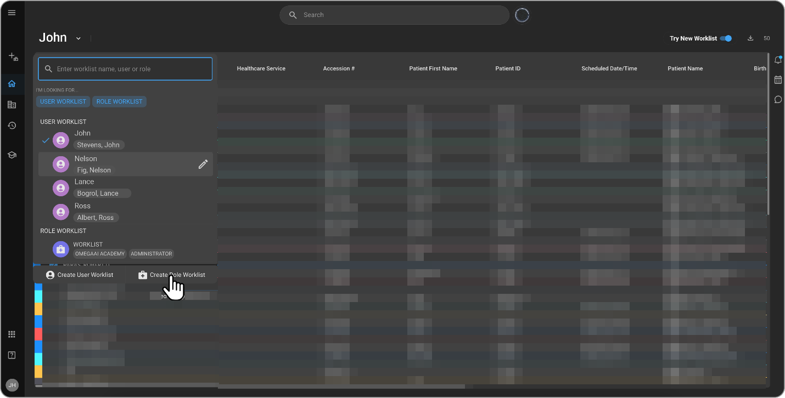

   The **New Worklist** panel will appear after clicking **Create User Worklist**.

   After clicking **Create Role Worklist**, the **New Role Worklist** panel will appear. Fill accordingly.

   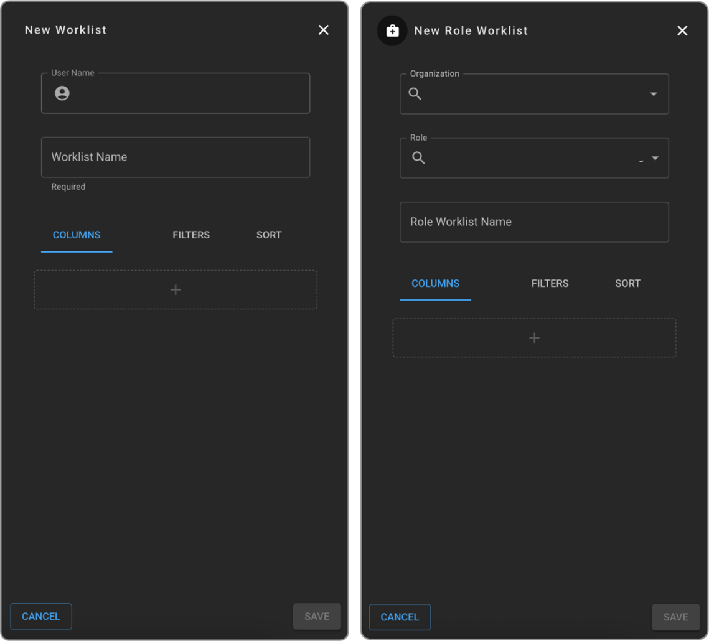

   You can also interchange between the **Role Worklist** and **User Worklist** from the above pannels, by hovering over the icon in the top left corner of the panel.

   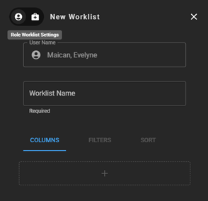

2. To edit the **Worklist**, hover over the name of the **Worklist** and click the edit pencil. This will open the Worklist editor panel. Edit accordingly.

   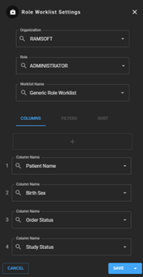

3. Click **SAVE** to save changes or **CANCEL** todiscard changes.

## Right-Click Menu 

### Access Right-Click Menu

1. Right click on the **Worklist** to call out the **right-click menu**.

   You will see 7 main icons at the top of the menu, click to navigate to respective experience:
        
   a) **Document Viewer**

   b) **Study**
        
   c) **Order**
        
   d) **Patient**
        
   e) **Study History**
        
   f) **Send**
        
   g) **Image Viewer** (**Note**: the Image Viewer can also be accessed by double clicking on a respective study directly on the Worklist)

   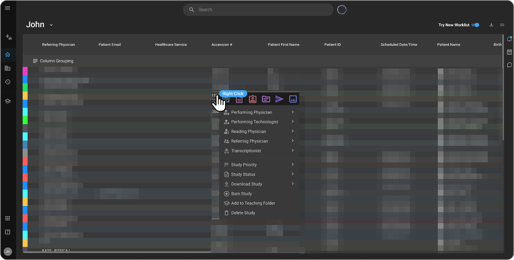

### User Role Assignment

1. You can update one or more of the following user roles via the Worklist from the **right-click menu** dropdown: 

   - Performing Physician 
   - Performing Technologist 
   - Reading Physician 
   - Referring Physician 
   - Transcriptionist 

2. Select your respective role to update.

3. To unassign a role, click "**UNASSIGN**" from the right dropdown.

   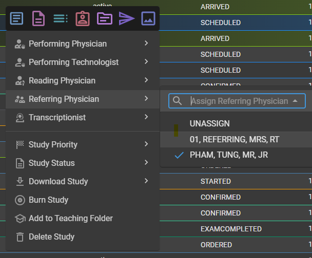

### Updating Study Priority 

1. Hover over **Study Priority** from the **right-click menu**.

   A dropdown will appear. 

   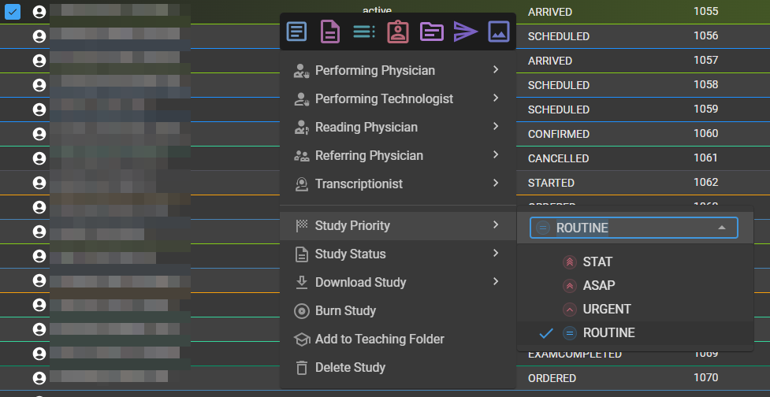

2. From the dropdown select desired status (e.g. STAT, ASAP, URGENT, ROUTINE). 
   
   Selected status will now be updated in the Worklist. 

### Updating Study Status

1. Right click over a specific study in the **Worklist** to select the sudy and call out the **right-click menu** dropdown.

2. Hover over “**Study Status**”.

3. A second dropdown will appear to the right of the main menu dropdown.

   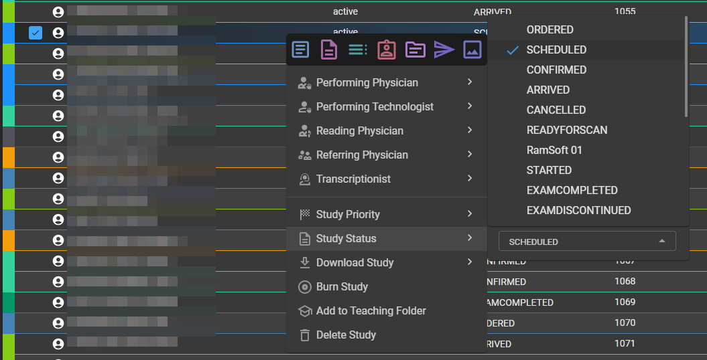

4. Select desired status from dropdown.

5. Status has now been successfully changed.

### Download Study 

1. Click on one or more studies to select them (blue checkbox will indicate that they have been selected) to download.

2. Right click to access the **right-click menu**. 

3. Hover over ""**Download Study**".

   Dropdown will appear.

   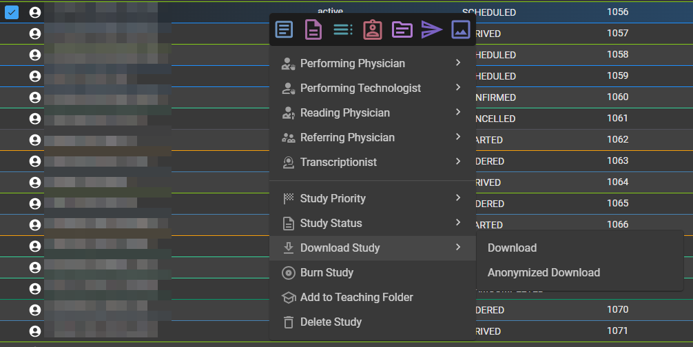

4. Select "**Download**" to simply download the study/studies as they are.

   **Or**

5. Select "**De-identified Download**" to download the study/studies without confidential information such as Personally Identifiable Information (PII).

### Burn Study

1. Click on the Worklist to select study or muliple studies.

2. Right click to access **right-click menu**.

2. Click "**Burn Study**" from dropdown. 

   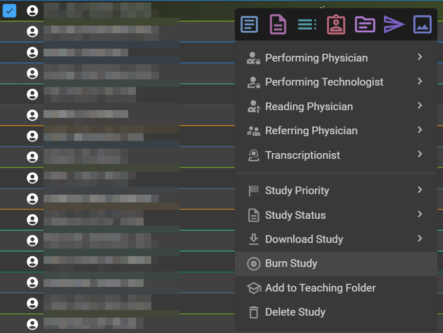

   If study contains images it will successfully burn.

   In the case that the respective study does not contain any images and/or final documents the following error will appear in the bottom left corner of the **Worklist**.

   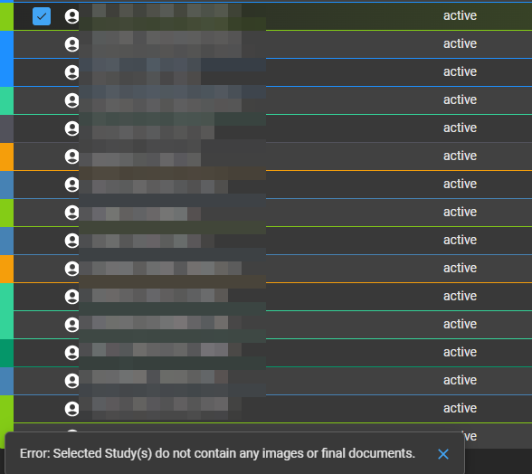

### Add to Teaching Folder 

1. Click on study/studies from the **Worklist** you desire to add to a **Teaching Folder**.

2. Click "**Add to Teaching Folder**" from dropdown. 

   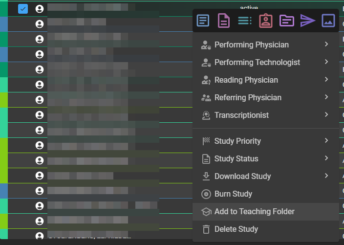

   The **Teaching Folder** panel will appear on the left side of the **Worklist**.

   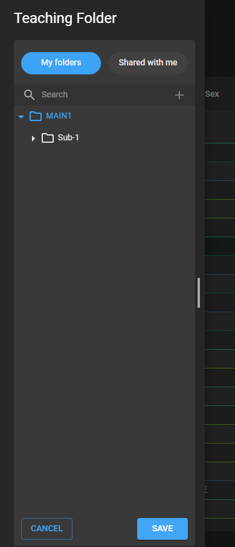

3. Add to respective folder or create new folder. 

   For step-by-step instructions, see [Teaching Folder](/docs/Advanced-Topics/teaching_folder).

### Delete Study 

1. Right click over a specific study (or multiple) in the **Worklist** to select the sudy and call out the **right-click menu** dropdown.

2. Click "**Delete Study**".

   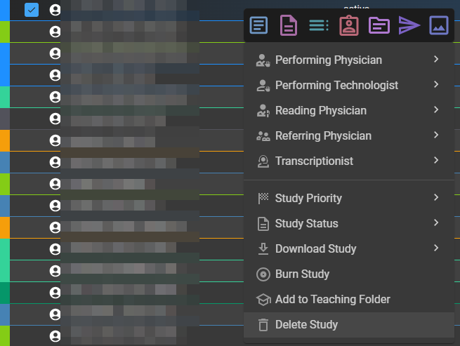

   The selected study (or studies) has now been deleted. 