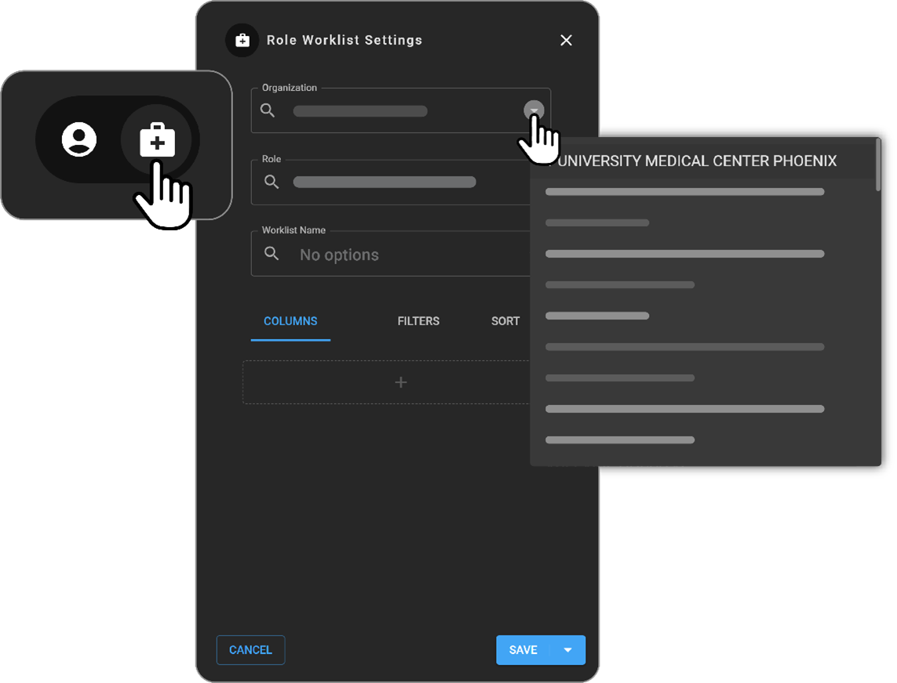

# Creating and Modifying Role Worklists

Role Worklists in OmegaAI are specialized worklists assigned based on
specific roles within an organization. These worklists are designed to
ensure that users in particular roles have access to relevant studies
and information that pertain to their specific responsibilities.

## Accessing Role Worklist Settings

To manage Role Worklists effectively, users need to navigate through the
Worklist Settings specifically tailored for role-based configurations.

### Creating a Role Worklist

1.  **Switch to Role Worklist Settings**:

    - Hover the mouse over the medical kit icon on the left side of the
      **Worklist Settings,** select **Role Work Settings**.

2.  **Define Role Worklist Settings**:

    - **Organization**: If your user account is associated with multiple
      organizations, select the appropriate one from the dropdown.

    - **Role**: Define which role the worklist will apply to by
      selecting from the "Role" field.

    - **Worklist Name**: Enter a name for the new **Role Worklist** in
      the **Worklist Name** field.

      

3.  **Customize the Role Worklist**:

    - Follow the instructions provided in the Worklist Settings section
      to add and configure columns, set filters, and define sorting
      criteria to tailor the worklist to the needs of the role.

### Modifying an Existing Role Worklist

1.  **Select the Role Worklist to Modify**:

    - Set the organization and the role for which the Role Worklist is
      configured.

    - Use the dropdown to search and select the existing Role Worklist
      you wish to modify.

2.  **Configure the Worklist**:

    - Upon selection, the worklist configuration will be displayed.

    - Hover over the options from the dropdown to rename, delete, or
      save the worklist under a different name.

### Saving Changes

- After making the necessary adjustments or configurations, ensure to
  save the changes to update the Role Worklist accordingly.

