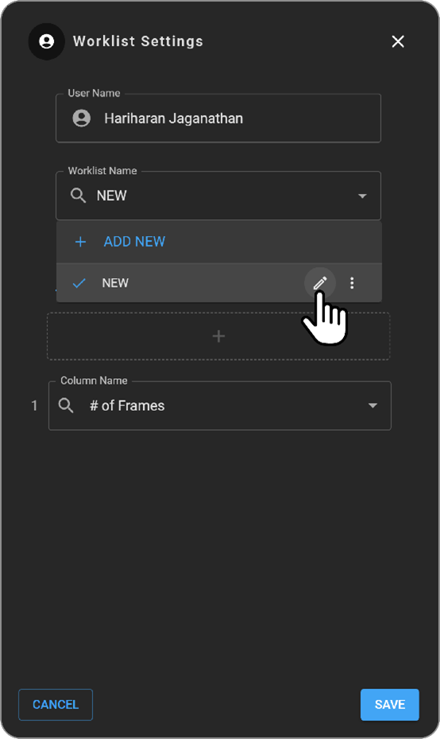

# Worklist Customization Guide

To enhance user experience and streamline study management, OmegaAI
includes a Worklist Settings page. This feature provides a centralized
location for customizing your worklist, including adding, renaming, and
arranging columns, as well as setting up filters and sorting
preferences.

## Navigating to Worklist Settings

1.  **Access Settings**:

    - Click on the blue circle icon for the Worklist Selector at the
      bottom right of the screen.

    - Select "Settings" to open the Worklist Settings page.

      

## Worklist Customization Options

1.  **Change Worklist User**:

    - To view or modify another user's worklist, change the username in
      the settings to look up their worklist.

2.  **Rename Worklist**:

    - The current worklist name will be displayed in a dropdown menu
      labeled "Worklist Name".

    - Click on the text box, find your worklist, hover over it to see
      the "Rename" option, and save your changes.

      

3.  **Worklist Management**:

    - Use the three-dot menu to set the worklist as default or delete it
      entirely.

    - Add a new worklist by clicking "Add New" at the top of the
      settings page or save the current settings as a new worklist by
      selecting "Save as New".

### Column Management

1.  **Adding and Removing Columns**:

    - Add a new column by clicking the plus button under the tab name.
      
      

    - Search for fields in the available box to populate the new column.

    - Rearrange columns by dragging them using the handle on the left of
      the column.

      

    - Remove a column by clicking the trash can icon or change its content
  with the dropdown on the right side of the column box.

### Filter and Sorting Setup

1.  **Filters**:

    - Filters can be set based on the type of fields added as columns.

    - Text columns often allow free text search, while dropdown columns
      provide prefixed options.

    - Date-time columns allow setting a specific data range.

2.  **Sorting**:

    - Define sorting by clicking the plus sign in the sorting tab and
      selecting the fields you want to use as sorting criteria.

### Saving Changes

- After making all adjustments, click "Save" in the lower right section
  of the Worklist Settings to apply changes.

- Exit without saving by clicking "Cancel" or the "X" mark at the top
  right of the Worklist Settings page.
