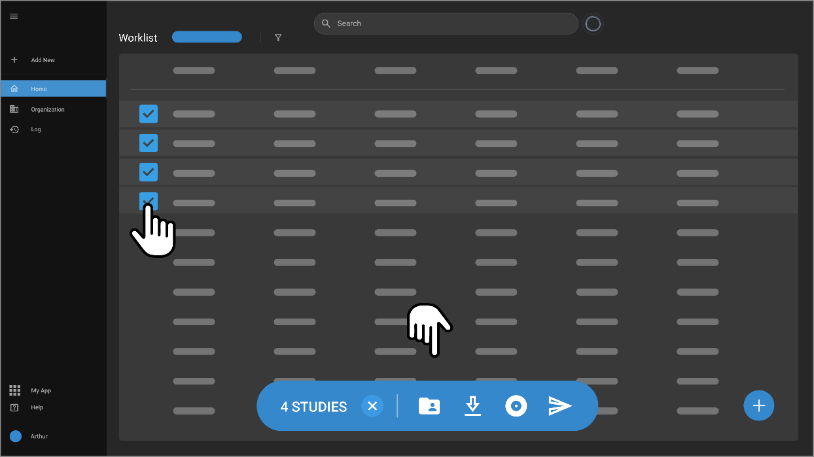

# Managing Study Selection and Actions

OmegaAI enhances study management by offering multiple actions for
selected studies within the worklist. These actions are accessible
through an intuitive interface that appears upon selecting a study.

## Study Selection and Available Actions

### Selecting Studies

- **Selection Process**: Click on any study row to reveal a checkbox
  on the leftmost side. Clicking the checkbox allows you to select that
  study.

- **Action Menu**: Once a study is selected, an action menu appears at
  the lower section of the worklist.

### Action Menu Options

1.  **Unselect Study**: Click the "X" icon to deselect a chosen study.

2.  **Assign Study**: Use the assignment icon to assign the selected
    studies to a reading physician.

3.  **Download Study**:

    - Download the study as a ZIP file.

    - Optionally, download the anonymized DICOM data inside the study.
      Anonymization applies only to DICOM metadata, not to hard-coded
      pixel data or images.

      

4.  **Burn to Disk**:

    - Select this option to burn one or multiple studies onto a disk.

    - The system will download a small executable file to facilitate
      this process.

5.  **Send Study**: This option allows you to send the study to another
    location or user.

6.  **Delete Study**: Use this option to delete the selected studies.

## Managing Patient Information

- **Patient Card View**: Hovering over a patient name displays a patient
  card with details like name, gender, patient ID, confidentiality
  level, date of birth, phone number, and any upcoming appointments.

- **Study Merge**:

  - If studies from the same patient are selected, you have the option
    to merge these studies.

  - For different patients, their records can be merged if selected.

  - Upon selecting to merge, a drawer on the left shows the patient name
    and both studies as individual cards.

  - An option below each card allows you to designate one study as the
    destination for the merge.
