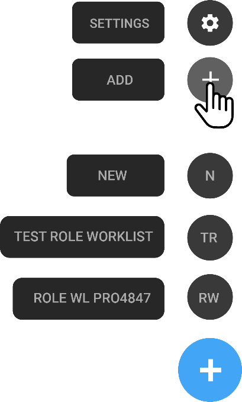

# Introduction to OmegaAI Worklists

OmegaAI offers two primary types of worklists: **User Worklists** and
**Role Worklists**. These tools are designed to streamline the workflow
by organizing and displaying studies based on predefined or custom
filters that cater to the specific needs of the users or roles within
the organization.

## User Worklists vs. Role Worklists

- **User Worklists**: Customizable by individual users. You can create
  multiple worklists to manage different sets of data or tasks.

- **Role Worklists**: Created and assigned by admins to different roles
  within the organization. They are pre-configured and may have
  restrictions based on the role.

  

## Managing Worklists

1.  **Accessing and Switching Worklists**:

    - Click on the blue circle icon at the lower right section of the
      screen.

    - If multiple worklists are available, you can search for them at
      the top of the blue circle interface.

    - Role Worklists are identifiable by an eye icon on the left side of
      their names and are usually listed first.

      

2.  **Setting a Default Worklist**:

    - You can set any worklist as your default. This worklist will be
      displayed on your homepage upon logging in.

3.  **Adding Worklist**:

    - Click the + button at the bottom right of the Worklist screen.

    - A navigation drawer opens.

    - Click the Add New icon.

    - The New Worklist drawer appears.

      

    **Note**: You can create your own personalized worklist or if you have
      administrative privileges, create worklists for other users or
      roles for users that belong to the same managing organization(s)
      as yours.

4. **Customize your Worklist**:

   - From the **User Name** dropdown menu, select the user name of the user
    you are creating the worklist for.

   - In the Type Worklist Name field, enter the name of the new worklist
    (eg. Worklist1).

   - As soon as you type the name, the columns available for the worklist
    are displayed in the Columns section below.

   - In the Columns section, click **+** to add more columns.

   - Click **FILTERS** to add a filter to the worklist.

   - Click **SORT** to sort the worklist by any column.

   - Click **SAVE** to save the worklist.

## Filtering & Search

1.  **Adding or Removing Filters**:

    - Each filter is represented by a blue bubble at the top left next
      to the worklist name.

    - Remove a filter by clicking the **X** inside the bubble.

    - To remove all filters, click on the icon on the far right of the
      filter list.

      

2.  **Exporting Worklist Data**:

    - Export the worklist as an Excel or CSV file by clicking the
      download icon at the top right.

    - Note: Only loaded studies (up to 50) can be downloaded. Scroll
      down to load additional studies before exporting.

3.  **Column Search and Customization**:

    - Hover over a column header and click to reveal a search box.

    - Depending on the column type, you may perform a free text search,
      select from a dropdown, or set a date range.

    - For date columns, click on the main search component to set a date
      and time range.

4.  **Sorting and Saving Worklist Changes**:

    - Adjust sorting by clicking the sorting option next to the search
      box.

    - Save changes to the worklist by clicking **Save** under the worklist
      selector circle to retain changes on the next load.

## Interacting with Worklist Columns

- **Status Changes**: Hover over the status column for a specific study
  to open a dropdown menu, allowing status updates.

  

- **Assigning Roles**: Click on the user currently assigned to a role to
  open a search box for reassignment to another user.

## OmegaAI Dial

The Omega Dial is a unique radial menu in OmegaAI designed to enhance
user efficiency by providing quick access to various functionalities
directly from the worklist. This guide details each option available in
the Omega Dial and explains their functions and usage.

### Accessing the Omega Dial

To access the Omega Dial:

1.  **Navigate to the Worklist:**

    - Open the worklist where studies and patient records are listed.

2.  **Activate the Dial:**

    - Perform a single left-click on any row in the worklist. A circular
      menu, the Omega Dial, will appear around the cursor.

### Omega Dial Options

The Omega Dial presents seven options:

1.  **Image Viewer:**

    - Opens all images related to the selected study.

    - For more information, see the "Image Viewer Overview."

2.  **Study Explorer:**

    - Accesses all studies related to a specific patient and linked
      patients in one centralized location.

    - For more information, see "Using the Study Explorer."

3.  **Send:**

    - Opens a drawer with options to send study-related information to
      other systems or users.

    - Specific functionalities depend on configured system integrations
      and user permissions.

4.  **Patient Order Study:**

    - View and update order details for a study.

    - For more information, refer to "Viewing and Updating Order
      Information."

5.  **Document Viewer:**

    - View all documents and reports related to the selected study.

    - For more information, see "Document Viewer Overview."

6.  **Patient:**

    - Opens the patient page for updating or viewing detailed patient
      information associated with the selected study.

    - For more information, see "Viewing and Updating Patient
      Information."

7.  **Study:**

    - View and edit detailed information about the selected study,
      including thumbnails, summary, and final reports.

    - For more information, see "Viewing and Updating Study
      Information."

### Permissions and Access

Access to each option in the Omega Dial depends on user privileges:

- **Roles and Privileges:**

  - User access to various functionalities within the Omega Dial is
    controlled through User Access Control settings.

  - Only certain roles have the permissions necessary to view or edit
    specific information.

