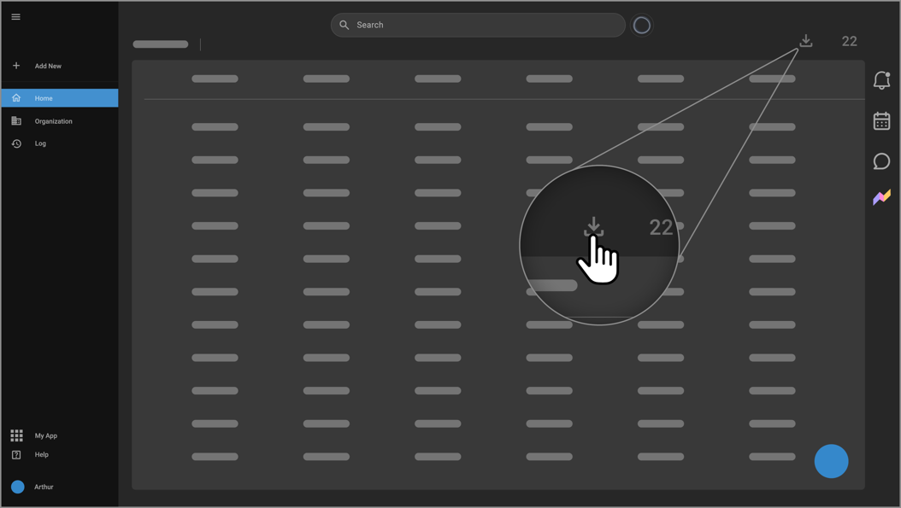
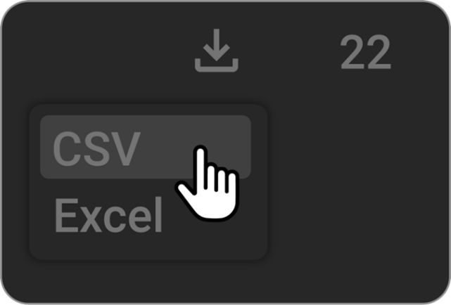

# OmegaAI Export Features

OmegaAI offers robust options for exporting data from worklists into
CSV, Excel, or as a Zip file containing complete study data including
DICOM images and associated documents. This guide provides step-by-step
instructions on how to use each export function, ensuring data is
accurately and efficiently extracted from OmegaAI.

## Exporting Data to CSV or Excel

- **Location**: Worklist page, top right beside the number of studies.

  

- **Steps**:

  1.  Click on Export and then select Export as CSV or Export as Excel depending on your requirement.

      

2.  Once selected, the data from the worklist will be converted to the
    chosen file format and automatically saved to the Downloads folder
    on your local computer.

3.  The filename is assigned by default as "Worklist\_\[export date\]."

**Note**: Only the fields (columns) that are visible in your worklist at the time of export will be included in the file. These columns will appear in the same order as displayed on the worklist page.

## Exporting as a Zip File or Burn

- **Function**: This feature allows users to export complete study data,
  including DICOM images and additional files such as diagnostic reports
  or scanned documents, in a Zip format.

- **Steps**:

  1.  Select the studies you wish to export by placing a checkmark next
      to each on the worklist. Checkboxes are located on the leftmost
      side of each study row.

  2.  A menu will appear at the bottom of the screen. Click on Download to proceed with downloading as Zip, with options for an anonymized or normal download, or choose Burn to burn the data
      onto a physical medium.

  3.  The exported data is saved in the Downloads folder of your
      computer.

  4.  The folder structure within the Zip follows DICOM standards:

      - **Top-level folder**: Named using the Accession number followed
        by STUDYUID.

      - **Second-level folders**: Named according to SERIESUID.

      - **Third-level folders**: Each contains files named with their
        respective SOPUIDs, representing the DICOM image or object IDs.

## Usage Notes

- Ensure visibility settings in your worklist are configured to display
  all necessary columns before exporting to CSV or Excel.

- Confirm the accuracy of the data and file names, especially when
  exporting sensitive medical data.

- Utilize the anonymization option wisely to comply with patient privacy
  regulations when exporting data.