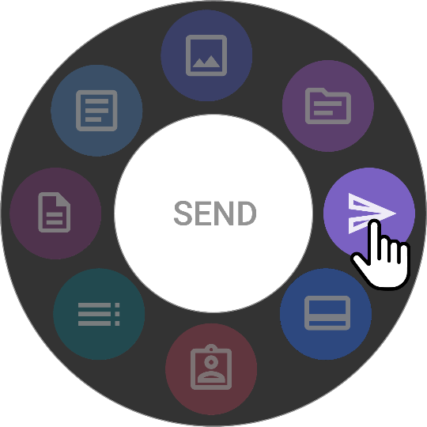

# Send

Omega AI Send feature is a comprehensive tool designed for
distributing medical reports and studies to various recipients,
including patients, referring physicians, and imaging organizations.
This feature supports multiple communication methods such as fax, SMS,
and email. It also integrates with external systems like Blume Patient
Portal and DICOM-capable devices. This document provides detailed
instructions on how to use each functionality within the Send feature.

## Sending Reports to Referring Physician, Fax, SMS, and Email

- **Steps**:

  - **Referring Physician**: Select this option to send the report to a
    physician listed in the patient care team.

  - **Fax**: Enter the fax number manually or it auto-fills if
    associated with the user profile. Click Send Report.

  - **SMS**: Enter the recipient's phone number. Click Send Report.

  - **Email**: Type the email address manually or it will auto-fill if
    linked with the user. Click Send Report.

## Send a Study

- **Location**: Top of the Send screen

- **Options**:

  - **Imaging Organization**: Sends the study as a DICOM file.

    - Select "Send to Imaging Organization."

    - Set the priority and enter the name of the imaging organization
      where Omega AI is installed.

    - Specify the destination station.

    - **Anonymize Toggle**: If selected, the study will be anonymized
      before sending.

      **Note:** DICOM file will contain Final report

  - **External User**: Sends a link via email to view the study and
    associated reports.

    - Enter one or multiple email addresses.

    - Click Send the Study to send an access link. Recipients will need the patient's date of birth to open the link.

## Usage Notes

- Ensure recipient information is correct and up-to-date to avoid
  miscommunication.

- Use the anonymization toggle wisely to maintain patient
  confidentiality when required.

- Verify that all recipient email addresses are accurate before sending
  to avoid unauthorized access.
