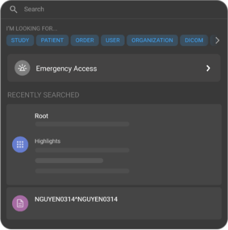
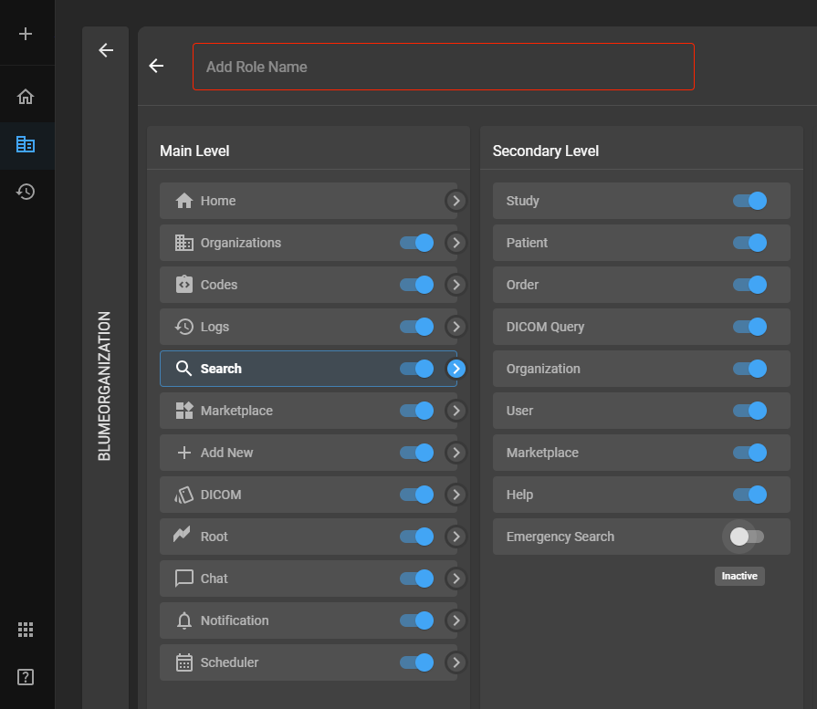
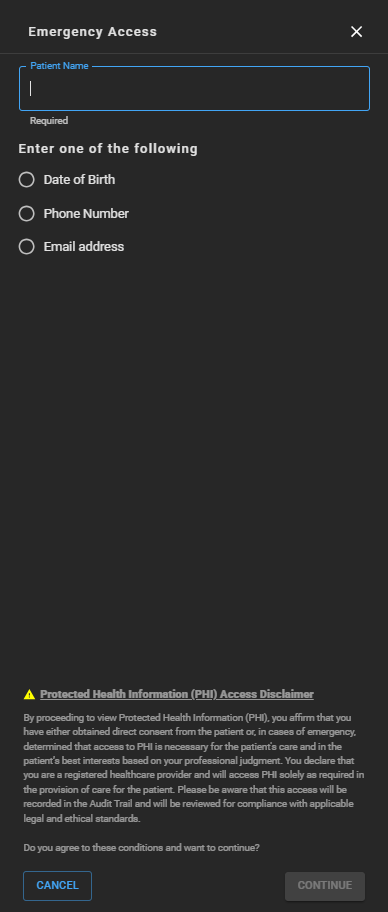
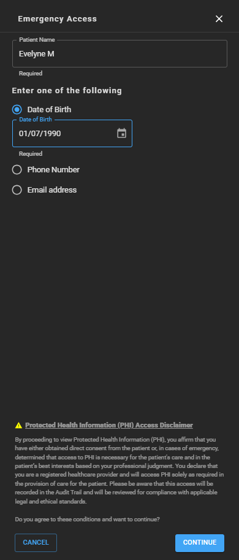

# Emergency Access 

The Emergency Access feature in OmegaAI is specifically designed to
provide physicians with expedited access to search patient studies and records
in critical situations. This feature is crucial when immediate patient
data is necessary, and the user may not have regular access permissions
under normal circumstances. Below is a guide on how to utilize the
Emergency Search functionality.

## Accessing Emergency Access

1.  **Initiating Emergency Access**:

    - Click on the search bar found at the top centre of any page in
      OmegaAI.

    - Among the list of search options, click on **Emergency
      Access**. This will direct you to the **Emergency Access** drawer.

      

    **Note**: By default the **Emergency Access** option will be turned off for all roles with the exception of users (i.e. **Referring Physicians**) who are part of the Referring Physician portal. 
    
    For users to gain access to this feature, the Organization's Admin must provide access via the Roles settings page. 
    
    ### Steps to Enable Emergency Access Feature for Users
   
    **Note**: The following steps apply only to the **Organization's Admin**. 
    
    1. Access the Organization page by clicking on **Organization** from the left side navigation bar within OmegaAI. 

    2. Select desired Organization from the **Master Organizations** panel located on the left side of the screen.

    3. Click **Details** from the right side panel. 

    4. Click **Users & Roles** from the left side panel. 

    5. Hover your mouse over the third icon in the top right corner of the **Users** page, it will read **Roles**. 

    6. Click **Roles**. The Roles page will now appear.

    7. Hover your mouse over the **+** icon found next to **Roles**, you will see **Add Roles**, click it.

    8. Add role name in the top text box.

    9. Click **Search** from the **Main Level** panel. 

    10. Click the grey toggle (will turn blue once activated as it is inactive by default) next to **Emergency Search** in the **Secondary Level** panel.

         

        The respective role will now have access to the **Emergency Access** feature in the search bar dropdown. 

2.  **Entering Patient Information**:

    - To access a patient's studies, reports, and images you must enter their details:

      - **First Name** and **Last Name** of the patient.

      - At least one of the following: **Date of Birth**, **Phone Number**, or **Email address** of the patient.

        

3.  **Verification and Compliance**:

    - After entering the patient information, the **CONTINUE** option
      will turn blue and thus be clickable.

      

- By proceeding, you acknowledge and agree that you have the necessary
  privileges to access the patient records under emergency conditions.

- Understand that all actions taken during this search are recorded in
  audit trails and are auditable, ensuring compliance with privacy
  regulations and organizational policies.

## Accessing Patient History and Records

1.  **Navigating Patient History Page**:

    - Once the information is verified and you continue, you will be
      directed to the patient history page.

    - This page will display all available studies for the selected
      patient.

2.  **Accessing Study Details**:

    - To access specific study details, hover your mouse over the
      desired study.

    - You will see options to access final images, records, forms, or to
      perform other relevant actions.

    - A single left click will bring up the Omega Dial, where you can
      select your preferred action or view additional study options.

## Practical Considerations

- **Privilege**: Use the **Emergency Access** responsibly, acknowledging
  that it is intended for critical situations where quick access to
  patient information could be lifesaving.

- **Security and Compliance**: Ensure you stay informed about your organization’s policies governing Emergency Access. Regularly review applicable rules, guidelines, and regulatory requirements to maintain proper legal and ethical compliance when using this feature.
