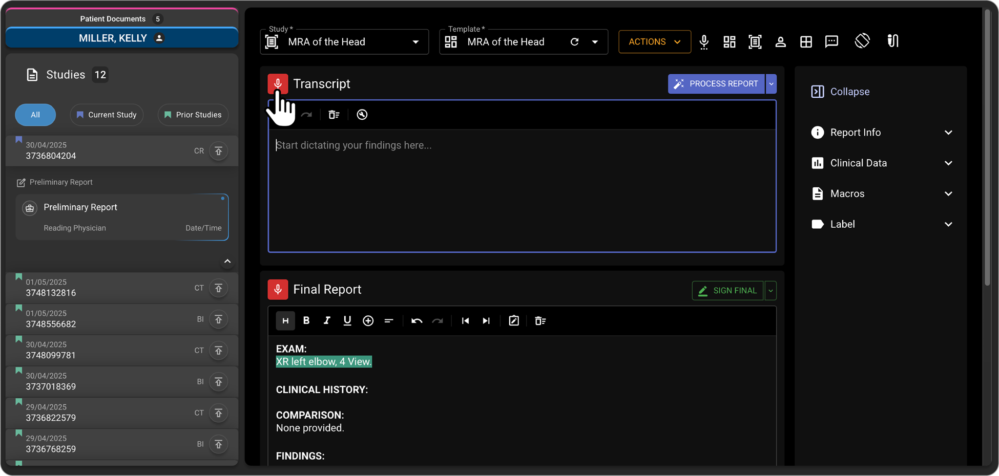
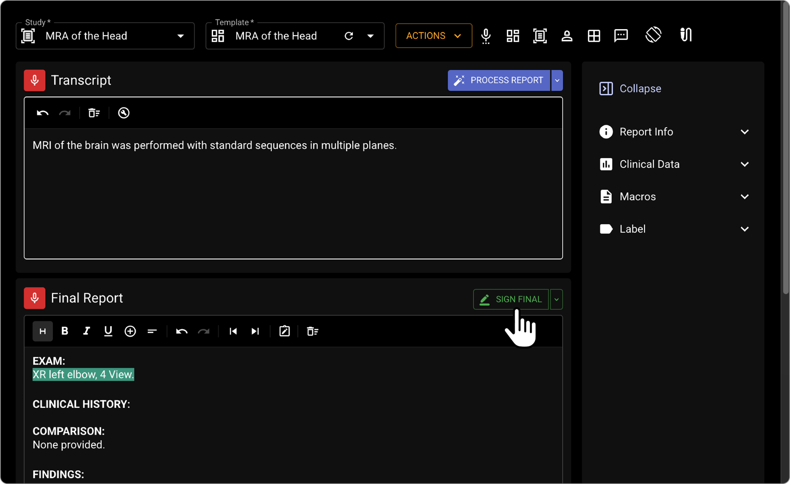
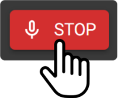

# AI Transcription (Add-On Feature)

## AI Reporting with Radpair

The AI Transcriptionist Radpair, a key feature of OmegaAI, revolutionizes the reporting process for healthcare professionals, particularly in diagnostic radiology. Unlike traditional medical voice-to-text systems, Radpair does not require radiologists to dictate their reports in full. Instead, radiologists can casually mention key findings or highlights they want included in the report. Radpair processes this information, and leverages advanced AI to generate a professionally formatted report. It automatically compiles and lists diagnostic impressions based on the input provided.

### Create/Edit RadPair Report

1.  Go to Document Viewer Pane.

2.  Click on Create Report option on the left top side.

3.  Open the Radpair interface automatically, provided user has the
    Radpair license.

4.  Click on Record inside Radpair interface.

The Header and Footer remain the same, but the body of report should be
replaced with RadPair content.

Template will be automatically selected on procedure code and some
predefined criteria. If not, user has to manually select the values
based on their needs.

5.  Click on STOP button to stop the recording.

6.  Click on Approve and Edit button to process the report or click on
    Sign button to complete the report.

 **Speech Mic usage with Radpair**

User connects the speech mic to device and the LED indicator color
changes from red to green. Compatible Speech Mics ensures seamless usage
with the Radpair Voice-to-Text Solution.

 **Start Recording**

1.  User is in Document Viewer and has a Speech Mic Device attached.

2.  Click On the start Button.

3.  Recording Starts.

 **Stop Recording**

1.  User is in Document Viewer and has a Speech Mic Device attached.

2.  Click on the Stop Recording Button.

3.  Recording stops.

 **Process Report**

1.  User is in Document Viewer and has a Speech Mic Device

2.  Click on the EOL on speech mic

3.  Report gets processed.

 **Sign Report**

1.  User is in Document Viewer and has a Speech Mic Device attached

2.  Double Click on the EOL Button

3.  Report gets signed.

 **Previous and Next fields**

1.  User is in Document Viewer and has a Speech Mic Device attached.

2.  Click on the Fast forward Button.

3.  User moves to Next Variable \[\] (cursor should move inside the
    bracket)

4.  User is in Document Viewer and has a Speech Mic Device attached.

5.  Click on the backward Button.

6.  User moves to Prev Variable \[\] (cursor should move inside the
    bracket).

 **Draft Report**

1.  User is in Document Viewer and has a Speech Mic Device attached.

2.  User starts dictation and report is processed.

3.  Click on Ins/Ovr button to draft the report

## Accessing and Using the AI Transcriptionist

1.  **Enabling the Feature**:

    - The AI Transcriptionist feature is available once enabled for your
      user profile. When creating a new report, you will be
      automatically directed to the AI Transcriptionist user interface.

2.  **User Interface Orientation**:

    - At the top of the interface, you will find a study dropdown menu.
      This allows you to specify the type of study you are reporting on,
      or you can leave it empty for the system to auto-detect the study
      type based on your dictation.

    - Ensure the study type is correct before finalizing the report.

      

3.  **Dictation and Transcription**:

    - **Microphone Button**: Located on the left, this is where you
      dictate the findings. It functions similarly to traditional
      transcription dictation.

      

- **Side-by-Side Option**: In the middle of the interface, this feature
  displays both your dictation and the final report simultaneously,
  allowing for real-time comparison and edits.

- **Final Report Area**: Positioned on the right, this area displays the
  completed report.

  
  

4.  **Generating the Report**:

    - Start by pressing the 'Record' button and dictate all findings and
      details to be included in the report.

    - Once dictation is complete, click 'Stop Recording', then click
      'Process Report' to generate a fully formatted diagnostic
      radiology report.

      

### Reviewing and Finalizing the Report

1.  **Report Review Mode**:

    - In this mode, you can review the generated report and make any
      necessary edits using voice commands or manual text editing.

    - The 'Impression' section is auto-generated, but you have the
      flexibility to add, delete, or reorder lines as needed.

2.  **Signing and Editing the Report**:

    - After reviewing, you can finalize the report by clicking the
      'Sign' button located at the top right of the interface.

    - If further edits are needed or you wish to use OmegaAIΓÇÖs built-in
      report editor for final adjustments, click the dropdown icon next
      to 'Sign' and select **Approve and Edit Report**. This option is
      particularly useful for saving a preliminary report instead of
      directly signing it.

      
      

### Practical Tips for Using AI Transcriptionist

- **Verify Accuracy**: Always double-check the auto-detected study type
  and the impressions generated to ensure accuracy and relevance.

- **Utilize Voice Commands**: Make full use of the dictation feature to
  streamline the reporting process, reducing the need for manual typing
  and speeding up the creation of reports.

