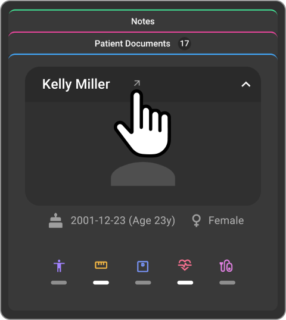
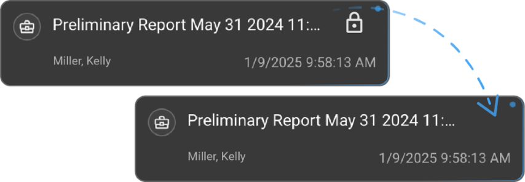

# Document Explorer

## Overview

The Document Explorer is an essential component of the OmegaAI Document
Viewer, primarily located in the left panel. This tool provides a
structured and detailed view of various studies associated with selected
patients from the work list, enhancing the management and accessibility
of medical imaging documents.

## Layout and Functionality

1.  **Patient Details:**

    - At the top of the Document Explorer, patient-specific details are
      displayed. These details include patient identifiers and relevant
      medical information, providing a quick reference at a glance.

2.  **Study Categories:**

    - The studies are organized into three distinct sections:

      - **Current:** Displays the currently selected study.

      - **Prior:** Lists all previous studies related to the patient,
        facilitating historical data review.

      - **All:** Combines both current and prior studies for access and
        comparison.

3.  **Report Management:**

    - Each study in the Document Explorer includes three types of
      documents:

      - **Preliminary Reports:**

        - Start here to draft new reports. Options for using templates,
          editing names, and deleting the report are available via icons
          that appear when you hover over the report entry.

      - **Final Reports:**

        - Once a preliminary report is signed, it becomes a final
          report. Final reports can be uploaded, renamed, or deleted as
          necessary. These reside in a dedicated 'Final Report' section
          within the explorer.

      - **Visit documents:**

        - Essential for maintaining patient records, visit documents can
          be uploaded for each study. Similar to reports, hovering over
          these documents provides options for deletion.

## Step-by-Step Guide

1.  **Accessing Document Explorer:**

    - Open OmegaAI and navigate to the Document Viewer. The Document
      Explorer is immediately accessible on the left panel.

      

2.  **Viewing Patient Details:**

    - Look at the top section of the Document Explorer to see the
      details of the patient whose studies you are examining.

      

3.  **Navigating Studies:**

    - Click on the desired category (Current, Prior, All) to view the
      respective studies. Each category helps in sorting and accessing
      the studies based on their relevance and time frame.

4.  **Managing Reports:**

    - To create or draft a preliminary report, select the study and
      click on the 'Preliminary Report' section. Use the hover-over
      icons to customize, edit, or delete the report.

    - After finalizing and signing a preliminary report, it will shift
      to the 'Final Reports' section where further actions like
      uploading a new version or renaming can be performed.

    - For visit documents, select the appropriate document under the
      study and use the hover options to manage these records.

5. **Upload Reports:** 

   - Click the upload icon to open the file explorer. 

   - Select a document to upload. 

   - Upload widget will be displayed, Rename the file if needed 

   - Choose to upload as a Final Report or Study Document.  

   - Click **Upload** to complete the process 

6. **Pop Out Report:** 

   - Click the pop out icon on the report card.

   - Report will open in a new window.

## Accessing and Using the Patient Chart Module in Document Viewer

### Accessing the Patient Chart

Patient chart can be accessed in the left panel inside document viewer.

There will be 3 sections in the chart- Patient information card, Patient documents, & Notes.

Hover or click on any section to expand the section.

1. **Viewing Patient Information**
   
   - **Patient Name**: Displayed prominently at the top of the patient card.

   - **Pop out patient details**: Clicking on pop out icon opens patient page in a new tab

  
  
   - **Demographic Details**: Includes gender, age, and date of birth, displayed below the patient emoji card with icons.

   - **BMI Measurement**: Displayed with an indicator (normal or abnormal) in a tooltip.
     
  
    
   - **Vital Signs**: Includes height, weight, heart rate, and blood pressure, listed below the BMI measurement.
  
     
     
   

2. **Patient Document Access Interface** 

   - View and manage patient documents (e.g., reg forms, treatment plans, medical history etc.). 

   - Click on a particular section to filter desired document type (All, uploaded documents & registration forms).

   - Click on any document or form to view it in the viewport or drag and drop to the desired viewport.

   - Click on upload icon to upload any document from the file explorer.

     

     
     
<!--
3. **Accessing Notes**

   - Access the unified notes (ex- patient notes, Study notes, clinical comments, Clinical history).

   - Ability to create and update the notes.
  
     

     
 
-->

## Creating more than one report 

When the study comprises of an existing final report or a preliminary report then the user tries to create an additional report, an alert with following message appears. 

*Report already exists* 

*Do you still want to proceed with creating another report?* 

Click on **Cancel** to discard and **Proceed** to continue. 

## Display of Linked Patient Record on Document Viewer

1.  **Open the Document Viewer:**

    - Launch **Omega AI Document Viewer**.

     

2.  **View Linked Patient Studies:**

    - Linked patient studies will appear as **prior studies** in
      Document Viewer.

      

- Prior studies will include **all associated reports**.

  

3.  **Identify Linked Patient Information:**

    - When a report is displayed in the viewport, the **specific linked
      patients name** will be shown for clear identification.

      

4.  **Navigate and Review:**

    - Users can switch between the **primary patient record** and
      **linked patient records** for efficient study comparison.

## Report Access Indicator

**Overview**

The Report Editing Lock and Alert System is a new OmegaAI feature designed to prevent simultaneous editing of medical reports. It ensures data integrity by
locking reports when a user is editing them and notifying others of the editing status. This feature integrates seamlessly with existing OmegaAI tools, streamlining workflows and
enhancing collaboration across user roles, particularly for radiologists, technologists, and administrators.

1.  **Start Editing a Report:**

    - A user opens a study in **Document viewer**.

    

- If any report in the editable form is opened, the report and study
  will be **automatically locked**.

  

2.  **View Editing Indicator:**

    - The **active editors name** is displayed as an indicator,
      notifying other users that the report is in use.

    - Also, user will see the text You are editing.

3.  **Attempt to Edit a Locked Report:**

    - Another user will not be able to edit the same report, they will
      be seeing the lock symbol without any editing tools for the
      report.

4.  **Automatic Unlock:**

    - If the active editor remains inactive for **15 minutes**, the
      report is **automatically unlocked**.

- If user exit the study or close the browser, the report is
  automatically unlocked.

5.  **Take Over Editing:**

    - If the report is unlocked due to inactivity, another user can
      **take over editing** by clicking on the button.

