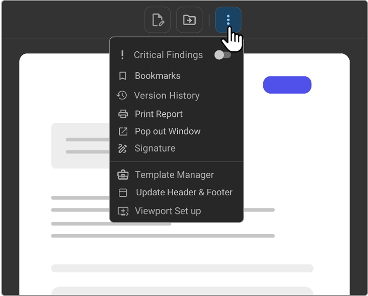
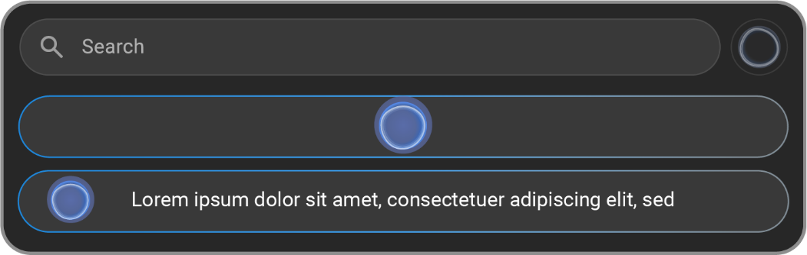

# Document Toolbar

## Overview

The Document Toolbar, positioned at the top of document viewport, offers a
set of tools designed to streamline the workflow for medical document
management. This toolbar includes a variety of functions, from
previewing documents to advanced voice dictation features, enhancing
both the efficiency and flexibility of the document handling process.

## Key Features and Functionalities

1.  **Preview Document:**

    - Allows users to view documents in their current state before
      making any further decisions or actions, ensuring accuracy and
      completeness. The eye icon of the toolbar offers capability for
      preview.

2.  **Proxy Sign:**

    - Enables a designated proxy user to sign documents on behalf of the
      primary user, facilitating collaborative and delegated workflows.

- Adding Images and Text to Signature

  - Access Signature options in Document Viewer.

  - Incorporate Images: Click on the Signature box to import signature
    images directly from your computer.

  - Enhance with Text: click on signature box, signature text field
    appears. add text to proxy signatures for additional context or
    information.

  - Finalize Signature: Once satisfied with the signature click the Done
    button to complete the process.

3.  **Done Sign the Report:**

    - Finalizes the signing process for the current report, officially
      completing it. The tick mark symbol on the toolbar indicates Done.

4.  **Done Next Sign and Open Next Report:**

    - Signs the current report and automatically opens the next one,
      streamlining the review and approval process. The right arrow
      symbol indicates Done Next.

5.  **Augnito VR (voice to text):**

    - Activates voice recognition technology for dictating content into
      reports, significantly speeding up data entry and reducing manual
      input errors. Human voice symbol indicates the Augnito VR.

      

6.  **More options:**

    - This menu extends additional functionalities:

      - **Toggle Critical Findings:** Allows users to mark reports that
        contain critical findings for immediate attention and follow-up.

      - **Bookmarks:** Provides quick access to saved bookmarks, which
        can include frequently used fields, picklists, and categories.

      - **Version History:** Keeps a log of all changes made to the
        report, supporting effective document management and audit
        trails.

      - **Pop Out Window:** Opens the current report in a new, separate
        window for enhanced focus or dual-monitor workflows.

      - **Signature:** Offers tools to add or customize digital
        signatures, and manage proxy signing permissions.

      - **Template Manager:** Aids in creating, editing, and publishing
        document templates to standardize report creation.

      - **Viewport Setup:** Customizes the settings of the document
        viewport to match user preferences or specific requirements for
        document display.

## Step-by-Step Guide

### Using Toolbar Features

1. **Preview and Sign Documents:**

      - Click on 'Preview Document' to review the document.

      - Use 'Proxy Sign' or 'Done' to sign the report. Select 'Done
        Next' to continue to the subsequent report without interruption.

2. **Voice Dictation:**

      - Activate 'Augnito VR' to begin voice dictation. This could be
        triggered by Philips SpeechMike record button, which is
        especially useful for lengthy documentation or when hands-free
        operation is needed. 
        
        **Note**: When using VR, you do not need to stay on
        the document editor page, as the system will continue to convert your voice to text and add it to the report.
        
