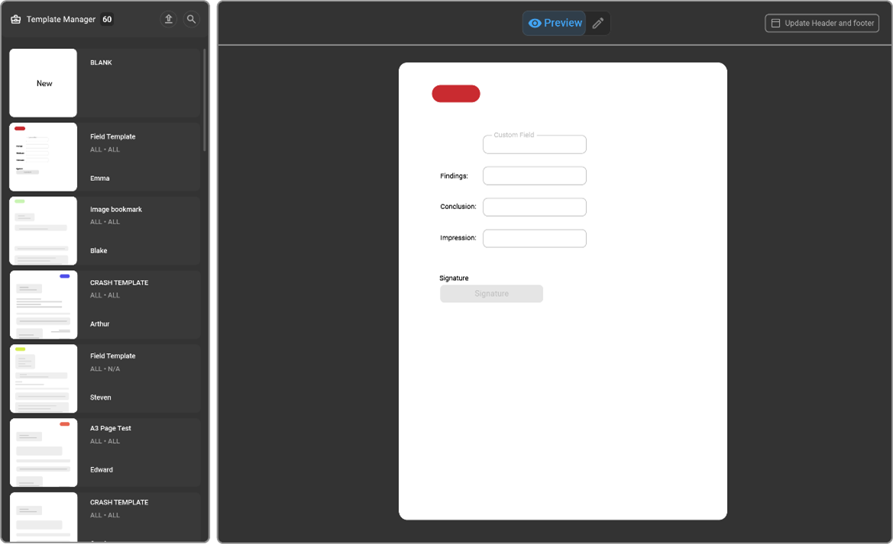
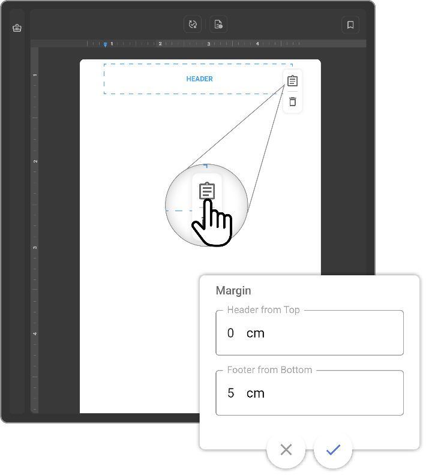
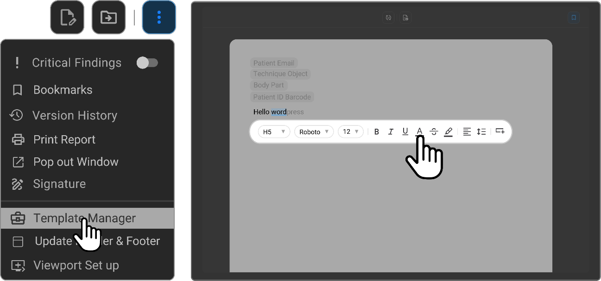
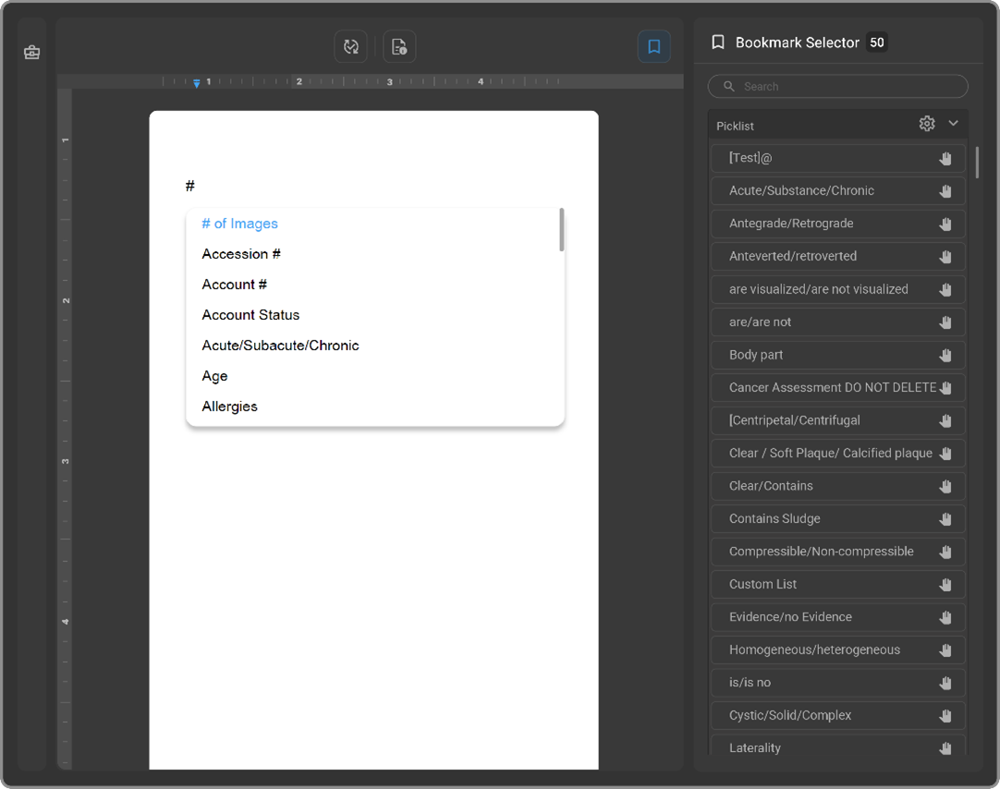
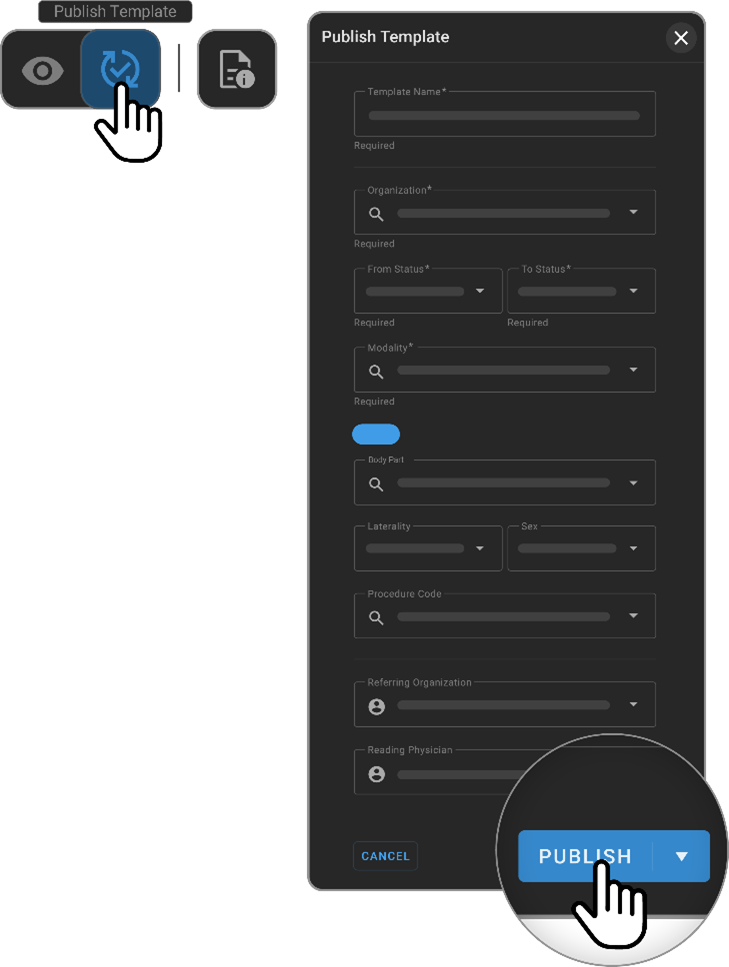

# Template Management

## Overview

The Template Manager in OmegaAI is a vital tool for creating, managing,
and publishing document templates, streamlining the documentation
process for medical professionals. Accessible via the three-dot menu in
the document viewport, the Template Manager simplifies the process of
template customization and deployment.

## Access and Setup

1.  **Header Format Change:**

    - Adjust the style of headers to organize document sections clearly.
      Choose from various header formats to structure content logically.

      

2.  **Open Template Manager:**

    - Click on the three-dot menu located above the document viewport in
      OmegaAI.

    - Select "Template Manager" from the dropdown list to access the
      template creation and management interface.

      

## Creating and Publishing Templates

1.  **Upload or Create:**

    - Decide whether to upload a predefined template or create a new one
      from scratch based on your specific needs.

2.  **Blank Template:**

    - Choose a blank template as a starting point, which includes
      predefined header and footer areas. Customize the body text
      section as required for your document structure.

3.  **Bookmark Integration:**

    - Integrate bookmarks by pressing the hash key (#) or clicking the
      bookmark icon to add placeholders directly into the template.

    - Use drag and drop to position bookmarks in the desired locations
      within the report, ensuring efficient data entry in future use.

      

4.  **Utilizing the Document Toolbar:**

    - Right-click within the document to access the document toolbar for
      further customizations:

      - Modify text attributes (font style, size, colour).

      - Insert images or tables to enrich the template content.

5.  **Preview and Page Setup:**

    - Click the "Preview" button to see how the template appears with
      the current settings.

    - Adjust the page setup, including size (A4, A3, letter) and
      orientation (portrait or landscape), to ensure the template meets
      the intended use case.

6.  **Publishing Process:**

    - Once the template is ready, click "Publish" to finalize it.

    - In the "Publish Template" drawer, enter details such as the
      template name, associated organization, modality, and other
      relevant information.

    - Review all details and publish the template to make it available
      for future documentation needs.

      

## Detecting square brackets [] and automatic conversion to custom fields**

1. Copy your content with square brackets from your source document or text editor.

2. Paste the content into the Omega AI Document Viewer’s editor.

   The Omega AI Document Viewer will automatically recognize the square brackets.

   Each section enclosed within square brackets will be converted into a custom field. These fields are editable and can be customized further based on your 
   requirements.

**Example Scenario**

Clinical: []

Comparison: [None]

Findings: [The cervical vertebral bodies are normal in height, signal intensity, and alignment]. [No] [degenerative spondylotic changes are seen]. [The cervical spinal cord is normal in thickness and signal intensity]. [The craniovertebral junction and the visualized posterior fossa is unremarkable].

C2-C3: [There is no evidence of disc herniation, spinal canal or neural foraminal narrowing].

