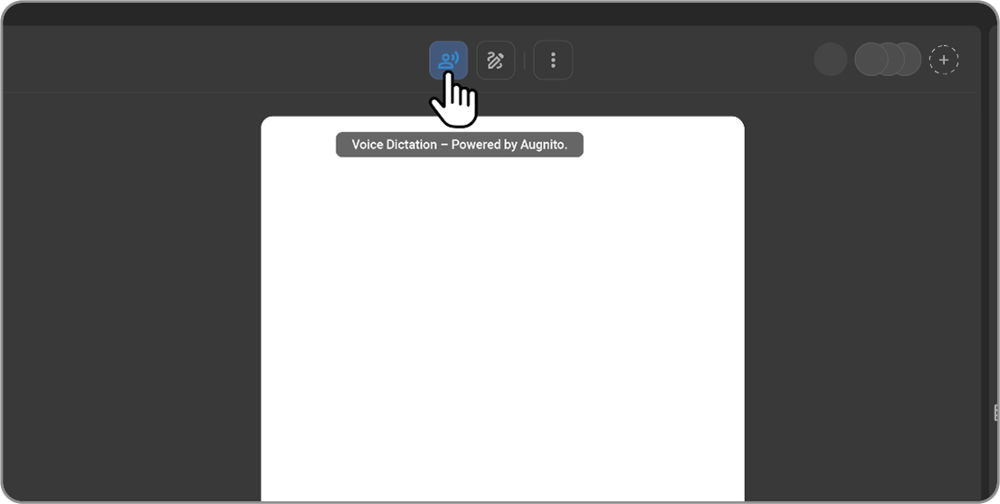

# Voice Recognition and Voice Command Features

## Overview

OmegaAI integrates advanced voice recognition and command capabilities,
allowing users to navigate and input data via voice, enhancing
efficiency and accessibility. This feature is beneficial for healthcare
professionals who need hands-free operation while focusing on patient
care.

## Voice Recognition and Command

### Activating Voice Recognition

1. Click the circle icon located in the top right corner of the main window to activate voice recognition.

2. Speak the command, such as "Create Report," to execute specific
      actions.

3. Dictate the content that needs to be included in the document; the
      spoken text will be transcribed directly into the editor.

4. To deactivate or put the voice recognition into sleep mode, hover over the icon and click the cancel button.

## VR Macros Setup and Usage

1. **Accessing VR Macros**:

   - Navigate to your Profile via the left navigation pane.

   - Select User Settings and click on the Macro button within the thumbnail section.

   - Choose the language from the dropdown menu at the top right corner.

      

2.  **Creating and Managing Macros:**

    - Click the Command + icon to add a new macro.

    - Select the desired function (Action or Text) from the dropdown
      menu.

    - Define the trigger word or phrase and associate it with a specific
      action or text entry.

    - Confirm and save the settings by clicking the tick mark on the
      right.

    - Macros can be edited or deleted as needed from this menu.

      

3.  **Using Macros in Practice:**

    - In the Document Viewer or Worklist, activate the Voice Recognition
      button.

    - Voice the predefined text or command. The system will execute the
      action or display the text based on the set macro.

## Voice Commands

There are two types of voice commands:

- **Action command**: Performs defined action when respective command is given.

- **Text command**: Replaces the text designated to the macro/text command.

## Default Action Commands

| Serial No | Action Command                         | Description                          |
|-----------|----------------------------------------|--------------------------------------|
|           | "Create Report"                        | Create a new Report                  |
|           | "Critical Finding"                     | Mark the report Critical             |
|           | "Print Report"                         | Print the Report                     |
|           | "Pop out Window"                       | Pop out window                       |
|           | "Go back to Work list"                 | Go back to Work list                 |
|           | "Open first Study"                     | Open first Study                     |
|           | "Sign Study"                           | Sign Study                           |
|           | "Sign and Open Next Study"             | Sign and open next study             |
|           | "Next Field"                           | Move to next field                   |
|           | "Previous Field"                       | Move to previous field               |
|           | "Save Selection as new Macro"          | Save Selection as new Macro          |
|           | "Next Line"                            | New Line                             |
|           | "New Paragraph"                        | New Paragraph                        |
|           | "Go to End of Paragraph"               | Go to End of Paragraph               |
|           | "Select All"                           | Select All                           |
|           | "Select Last Line"                     | Select Last Line                     |
|           | "Select Last Paragraph"                | Select Last Paragraph                |
|           | "Select Last Word"                     | Select Last Word                     |
|           | "Select Last # Words"                  | Select Last # Words                  |
|           | "Search For #"                         | Search for `<Text>`                  |
|           | "Insert Before #"                      | Insert Before `<Text>`               |
|           | "Insert After #"                       | Insert After `<Text>`                |
|           | "Bold"                                 | Bold Selected Text                   |
|           | "Italic"                               | Italicize Selected Text              |
|           | "Underline"                            | Underline Selected Text              |
|           | "Clear Selection"                      | Clear Selection                      |
|           | "Delete Selection"                     | Delete Selection                     |
|           | "Backspace"                            | Delete Last Character                |
|           | "Delete Last Line"                     | Delete Last line                     |
|           | "Turn On Caps"                         | Turn On Caps Lock                    |
|           | "Turn Off Caps"                        | Turn Off Caps Lock                   |
|           | "Undo"                                 | Undo                                 |
|           | "Capitalize that"                      | Capitalize the selected text         |

## Formatting Commands

| Formatting Command     | Description           |
|------------------------|-----------------------|
| "Period"               | Add a Period          |
| "Comma"                | Add a Comma           |
| "Colon"                | Add a Colon           |
| "Semicolon"            | Add a Semicolon       |
| "Hyphen"               | Add a Hyphen          |
| "Quote"                | Add a Quote           |
| "Question Mark"        | Add a Question Mark   |
| "Slash"                | Add a Slash           |
| "Open Parenthesis"     | Open Parenthesis      |
| "Close Parenthesis"    | Close Parenthesis     |

## Text Commands

| Serial No | Text Command | Description                                                                                          |
|-----------|--------------|------------------------------------------------------------------------------------------------------|
|           | Speed        | Check your Internet speed using tools such as [Speedtest by Ookla](https://www.speedtest.net/). We recommend a download speed of 50–100 Mbps. Note that low upload speeds or high ping values can result in performance issues. |

## Speech Mike Integration

- **Philips Speech Mike:** Certain Speech Mike devices are supported by OmegaAI for voice input. Use the "Detect Mike" button to connect the Speech Mike.

  **Registry Configuration to grant permission for WebHID API**

  **Chrome**

  1. Navigate to the following registry path:

     Computer\HKEY_LOCAL_MACHINE\SOFTWARE\Policies\Google\Chrome

  2. Create a new String Value:

    - Name the value: WebHidAllowAllDevicesForUrls

  3. Double-click the newly created string value and update the Value
     data field with the following:

     

     \[ "https://www.omegaai.com", "https://pre-us01.omegaai.com" \]

  4. To verify the policy is applied:

    - Open Chrome and go to chrome://policy/.

    - Check that the WebHidAllowAllDevicesForUrls policy is listed and
      correctly configured.

    

    **Edge:**

    1. Navigate to the following registry path:

    Computer\HKEY_LOCAL_MACHINE\SOFTWARE\Policies\Microsoft\Edge

    2. Create a new String Value:

      - Name the value: WebHidAllowAllDevicesForUrls

    3. Double-click the newly created string value and update the Value
       data field with the following:

       

       \[ "https://www.omegaai.com", "https://pre-us01.omegaai.com" \]

    4. To verify the policy is applied:

    - Open Edge and go to edge://policy/.

    - Check that the WebHidAllowAllDevicesForUrls policy is listed and
      correctly configured.

    

    **Windows Registry Updater for OmegaAI Production**

    Set-Omegaai-WebHIDPolicy.reg

    Follow the steps below to update the registry settings for OmegaAI production:

    1.**Download the Registry File**

    - Download the Set-Omegaai-WebHIDPolicy.reg file provided above and
      save it to your local machine.

    2.**Run the Registry File**

    - Double-click the Set-Omegaai-WebHIDPolicy.reg file to initiate the
      registry update.

    3. **Confirm the Registry Update**

    - When prompted, click **Yes** to confirm that you want to update
      your registry.

    4.**Success Message**

    - You should receive a success message indicating that your registry
      has been updated successfully.

## ChatGPT Integration

- **Error Correction:** ChatGPT functions in the background to correct
  grammatical, vocabulary, and articulation errors during voice
  dictation and macro usage, ensuring accurate and professional
  documentation.

## Formatting and Augnito Integration

1.  **Formatting Toolbar:**

    - Utilize the formatting toolbar when creating text macros to apply
      consistent formatting. This formatting persists when content is
      copied or added to a report.

2.  **Augnito VR Setup:**

    - From the left navigation, go to My Profile and then to User
      Settings.

    - Click on the Voice Command button and select the required Accent
      from the dropdown.

      

    - In the Document Viewer, open a patient record and the required template.

    - The toolbar will display Voice Dictation Powered by Augnito. The
  cursor is positioned at the top by default.

      

    - Activate voice dictation by clicking on the Voice Command button and start dictating the information field by field.

    - To cease recording, deactivate the Voice Command icon.
  
By leveraging these voice-driven functionalities in OmegaAI, medical professionals can significantly streamline their workflow, reducing manual input while maintaining high accuracy in document creation and management.
  

