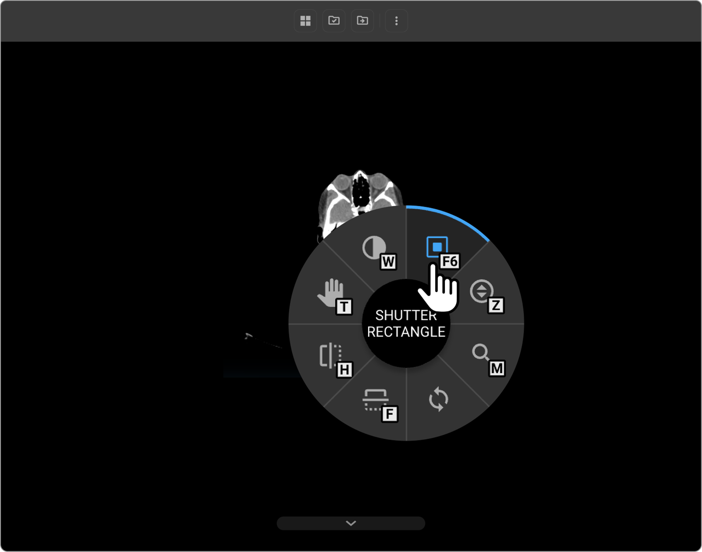
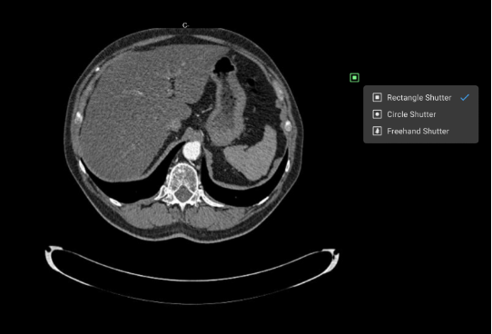

# Shutter Toolset

## Overview

This section guides users in utilizing the Shutter Tool feature in Image
Viewer. This toolset aims to enhance the diagnostic process, focus on
relevant image areas, and ensure patient privacy.

## Shutter Toolset Options

The Shutter Toolset can easily be accessed via the customized tool
wheel.

The toolset has three options to select from including:

- Rectangular Shutter

- Circle Shutter

- Freehand Shutter (can use without having to drag your mouse/cursor)

### Enhanced Image Visibility

The Shutter Toolset allows clinicians to better visualize specific areas
of medical images by darkening peripheral, non-relevant regions. This
feature allows for more accurate diagnoses.

### Reduction of Visual Distractions

The Shutter Toolset helps minimize unnecessary and distracting elements
in medical images, enabling healthcare professionals to concentrate on
the critical aspects of the image for diagnosis and treatment planning.

### Improved Contrast and Brightness Management

The Shutter Toolset allows for more effective adjustments in contrast
and brightness in isolated regions of the image. This enhancement
improves the overall readability and clarity of essential areas.

### Effective Annotation and Emphasis

The Shutter Toolset provides a tool for radiologists and other medical
professionals to emphasize significant findings within an image, such as
fractures or tumors. This feature facilitates clearer communication and
understanding among medical teams and with patients.

### Ensured Patient Privacy

The Shutter Toolset includes a feature to obscure identifiable features
of a patientΓÇÖs body that are not relevant to the diagnosis. This feature
is particularly important when images are shared or presented in various
settings, ensuring patient privacy.

### Standardization for Image Comparison

The Shutter Toolset aids in comparing multiple images by allowing the
standardization of visible areas. This feature is crucial for monitoring
changes over time in serial imaging.

### Diagnostic Accuracy Enhancement

The Shutter Toolset improves overall diagnostic accuracy by enabling
clinicians to focus on pertinent aspects of medical images. This feature
leads to more informed and precise medical decisions.
