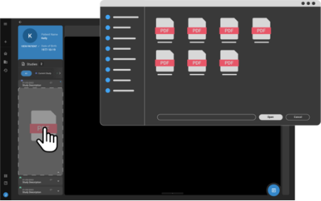

# Import Images, Videos and Documents

The QC module also includes a robust image, video and report import
feature. This allows you to import various file types by simply dragging
and dropping them into the destination study within the Image Viewer.

**Supported File Types:**

- **JPEG**

- **PDF**

- **Text**

- **DICOM**

- **MP4**

**Importing Process:**

1.  Follow the mentioned steps to [Access the Image
    Viewer](https://po-us01-help-manual-app-webapp.azurewebsites.net/docs/Image%20Viewer/1%20Accessing%20the%20Image%20Viewer%20in%20OmegaAI#access-methods).

2.  **Drag and Drop:**

    - Drag and drop the supported file types from your file explorer
      into the Image Viewer left side panel.

      

3.  **Processing Based on File Type:**

    - **Text or PDF Files:**

      - You can import these as hard copy DICOM objects into the Image
        Viewer or as study documents into the Document Viewer.

    - **DICOM Files:**

      - The system checks if the same DICOM series or frames exist in
        the study. If additional frames are detected, they are added to
        the existing series. If the DICOM objects belong to a separate
        series, a new series is created.

    - **JPEG Files:**

      - You can import them into the same series or as separate series.

**Processing Time:**

- The time to process and import files depends on their size.

- If you navigate away from the Image Viewer screen during the import
  process, a message will prompt you to confirm whether to cancel or
  continue the import.

- After processing, the imported files will be visible in the Image
  Viewer Study Explorer.
