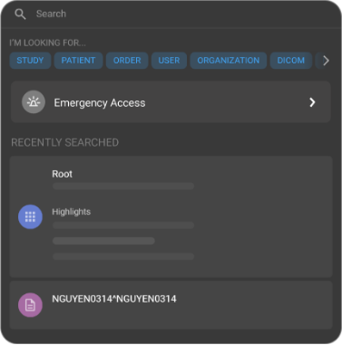
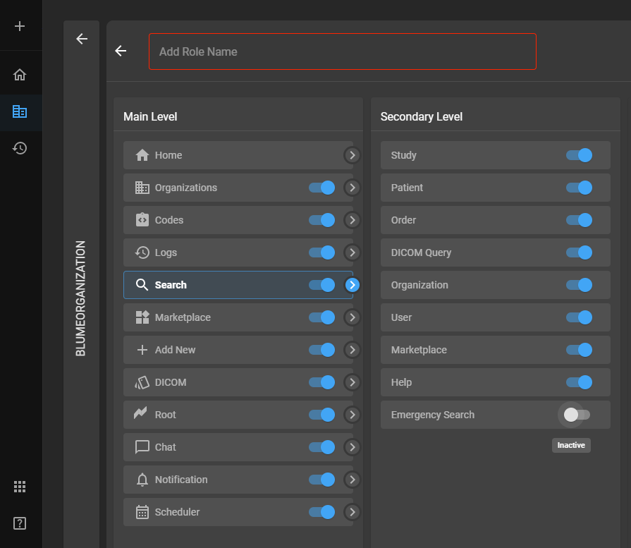
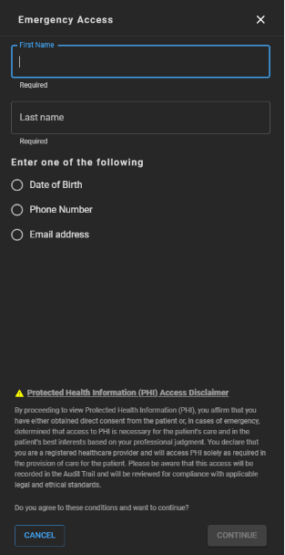
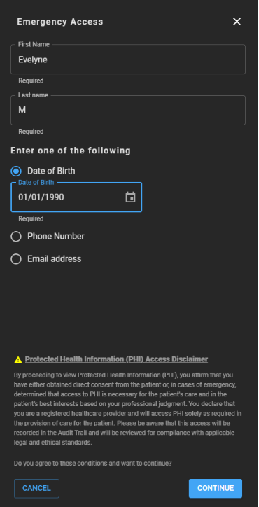

# Using Global Search

The Global Search feature in OmegaAI is designed to provide search
functionality that caters to various user needs.

**Note:**

- You must have the required privileges to be able to perform a study
  search.

- You can only search for records that belong to the organizations and
  child imaging organizations you are associated with. However, if the
  order is assigned to a specific Referring or Consulting Physician, the
  user will be able to view the study records belonging to any
  organization.

## Sub-components of Global Search

1.  **Global Search**: This is the most extensive search option,
    encompassing the following searchable categories: patient, study,
    user, organization, DICOM

2.  **Study Search**: Focused on retrieving study results, this search
    is tailored for users looking to find specific clinical studies.

3.  **Patient Search**: This search option is specifically designed for
    finding patients.

4.  **DICOM Search**: Targeted at fetching studies from connected DICOM
    devices, DICOM Search integrates with external medical imaging
    devices to pull data directly into the OmegaAI system.

5.  **Organization Search**: This functionality enables users to find
    specific organizations within your network.

6.  **User Search**: User Search is designed to find users of the
    OmegaAI system.

7. **Emergency Access**: The emergency access option provides physicians with expedited access to search patient studies and records in critical situations. 

    **Note**: The user may not have regular access permissions under normal circumstances. 

### How to Use Global Search

1.  **Locating and Using the Search Bar**:

    - Navigate to the main interface of OmegaAI.

    - Locate the search bar at the top of the page.

    - Upon clicking the search bar, the system will display the last
      three search results as a quick reference.

      

2.  **Performing a Search**:

    - Enter your search term into the search bar.

    - As you type, the topmost matched results will appear instantly in
      a drop-down list.

    - These results are organized into different categories such as
      patient, study, order, organization, and user.

      

3.  **Handling Search Results**:

    - If there are fewer than two results, they will be directly
      displayed.

    - If there are more than two results, a 'View More' button appears.

    - Clicking the 'View More' button directs you to a full Results
      Page, where the top four results for each category are displayed.

4.  **Clearing the Search**:

    - After entering text, a 'Clear' option (represented by an "X" icon)

      appears in the search bar.

    - Clicking on this icon will clear the entered text, allowing for
      easy search reformulation.

5.  **Navigating from the Search Results**:

    - Each category result leads to its respective detailed page (e.g.,
      order page, user page, organization page).

    - For study-related searches, clicking on a study row will open the
      study page. Additionally, an ellipsis icon appears upon mouse
      hover over a study result, providing options to open the study in
      an Image Viewer, Document Viewer, or to send the study to another
      user or department.

6.  **View More Results**:

    - Clicking on the **View More** from the drop-down will lead to a full
      screen list of results, showcasing the top four results per
      category.

    - Depending on the category, different options are available for
      further actions.

      

## How to Perform Contextual Search

The **I'm Looking For** feature in OmegaAI enhances targeted search capabilities, allowing users to refine their search criteria across various data types. This feature is useful for users who need to conduct specific or mixed-category searches efficiently. Below is a detailed guide on how to use this functionality to perform precise and tailored searches.

1.  **Accessing the Feature**:

    - Navigate to the search area within the OmegaAI interface.

    - Locate and select the "I'm Looking For" option, which will present
      multiple selectable search elements, including study, patient,
      order, user, organization, and DICOM.

      

2.  **Selecting Search Categories**:

    - Choose one or more categories from the options provided. You can
      select up to six different items.

    - For mixed searches, such as combining 'study' and 'order', select
      both categories. The search results will be grouped accordingly,
      making it easy to access combined information.

3.  **Performing and Viewing Results**:

    - Once the desired categories are selected, enter the search term(s)
      and execute the search.

    - The results will be displayed grouped by the chosen categories.
      For instance, studies and orders will be shown in their respective
      groupings.

4.  **Special Features for Study Results**:

    - Clicking on a study result row will direct you to the study page.

    - An ellipsis menu icon appears to the right of the study results.
      Clicking this icon will present several direct action options:

      - **Image Viewer**: Opens the study in an image viewing
        application.

      - **Document Viewer**: Allows you to view related documents.

      - **Send Options**:

        - **Send to Referring Physician**: Options to send study reports
          via fax, email, or SMS.

        - **Send to DICOM Device**: Transfers the study data to another
          DICOM-compatible device.

        - **Send as External URL**: Sends a link to the study via email.
          The recipient can access the study by entering the patient's
          date of birth.

## DICOM Search in OmegaAI

**Keywords**: DICOM Search, Global Search, specific search fields,
search customization, results management, data retrieval, task tracking,
search criteria

DICOM Search within OmegaAI is a specialized search functionality
designed to interact specifically with DICOM-compatible devices and
repositories. This search tool is uniquely structured and offers
extensive search capabilities that are not included in the general 'All
Search' function. Here is a step-by-step guide to effectively using the
DICOM Search feature.

### Accessing DICOM Search

1.  **Starting the Search**:

    - Navigate to the Global Search area within the OmegaAI interface.

    - Select "DICOM" from the "I'm Looking For" options to activate
      DICOM-specific search functionalities.

      

2.  **Setting Search Parameters**:

    - **Organization**: After selecting DICOM, an option to specify the
      organization you are searching within will appear. This defines
      the scope of the search to include only devices associated with
      the selected organization.

    - **Device**: Specify the device using the Omega I link. This is
      crucial as it sets the exact source device for the search.

3.  **Defining Search Fields**:

    - Numerous search fields are available to tailor your search. These
      include Study Date, Time, Patient Name, Patient ID, Number of
      Instances, Accession Number, Age at Study, Anatomical Focus,
      Birthdate, Gender, Imaging Organization, Managing Organization,
      Modality, Study Priority, Reading Physician, Referring Physician,
      SSN, Study Description, Study ID, Study Status, Study UID, and
      Assigned Authority.

    - Select and add the desired fields. Once added, a search box for
      each field will appear, allowing you to input specific search
      criteria.

      

### Conducting the Search

1.  **Executing the Search**:

    - After entering all necessary criteria into the respective search
      fields, click the **Search** button.

    - The system will then display a full screen of search results based
      on the defined parameters.

2.  **Managing Search Results**:

    - **Individual Study Management**: You can choose to pull specific
      study results into your system by selecting them individually.

    - **Bulk Download**: Use the **Download All Results** button at the
      bottom of the screen to retrieve all studies shown in the search
      results simultaneously.

    - Each result will also display a trash icon, which when clicked,
      directs you to the task log. This log allows you to track the
      status of importing each study into your system.

### Practical Tips for DICOM Search

- **Customization**: Take advantage of the extensive search fields to
  refine your search. This ensures that the results are as relevant as
  possible to your needs.

- **Tracking**: Utilize the task log to monitor the progress of studies
  being pulled into your system, ensuring that all data is accounted for
  and properly managed. 

## Emergency Access 

The Emergency Access feature in OmegaAI is specifically designed to
provide physicians with expedited access to search patient studies and records
in critical situations. This feature is crucial when immediate patient
data is necessary, and the user may not have regular access permissions
under normal circumstances. Below is a guide on how to utilize the
Emergency Search functionality.

### Accessing Emergency Access

1.  **Initiating Emergency Access**:

    - Click on the search bar found at the top centre of any page in
      OmegaAI.

    - Among the list of search options, click on **Emergency
      Access**. This will direct you to the **Emergency Access** drawer.

      

    **Note**: By default the **Emergency Access** option will be turned off for all roles with the exception of users (i.e. **Referring Physicians**) who are part of the Referring Physician portal. 
    
    For users to gain access to this feature, the Organization's Admin must provide access via the Roles settings page. 
    
    #### Steps to Enable Emergency Access Feature for Users
   
    **Note**: The following steps apply only to the Organization's Admin. 
    
    1. Access the Organization page by clicking on **Organization** from the left side navigation bar within OmegaAI. 

    2. Select desired Organization from the **Master Organizations** panel located on the left side of the screen.

    3. Click **Details** from the right side panel. 

    4. Click **Users & Roles** from the left side panel. 

    5. Hover your mouse over the third icon in the top right corner of the **Users** page, it will read **Roles**. 

    6. Click **Roles**. The Roles page will now appear.

    7. Hover your mouse over the **+** icon found next to **Roles**, you will see **Add Roles**, click it.

    8. Add role name in the top text box.

    9. Click **Search** from the **Main Level** panel. 

    10. Click the grey toggle (will turn blue once activated as it is inactive by default) next to **Emergency Search** in the **Secondary Level** panel.

         

        The respective role will now have access to the **Emergency Access** feature in the search bar dropdown. 

2.  **Entering Patient Information**:

    - To access a patient's studies, reports, and images you must enter their details:

      - First Name and Last Name of the patient.

      - At least one of the following: Date of Birth, Phone Number, or
        Email address of the patient.

        

3.  **Verification and Compliance**:

    - After entering the patient information, the **CONTINUE** option
      will turn blue and thus be clickable.

      

- By proceeding, you acknowledge and agree that you have the necessary
  privileges to access the patient records under emergency conditions.

- Understand that all actions taken during this search are recorded in
  audit trails and are auditable, ensuring compliance with privacy
  regulations and organizational policies.

### Accessing Patient History and Records

1.  **Navigating Patient History Page**:

    - Once the information is verified and you continue, you will be
      directed to the patient history page.

    - This page will display all available studies for the selected
      patient.

2.  **Accessing Study Details**:

    - To access specific study details, hover your mouse over the
      desired study.

    - You will see options to access final images, records, forms, or to
      perform other relevant actions.

    - A single left click will bring up the Omega Dial, where you can
      select your preferred action or view additional study options.

### Practical Considerations

- **Privilege**: Use the **Emergency Search** responsibly, acknowledging
  that it is intended for critical situations where quick access to
  patient information could be lifesaving.

- **Security and Compliance**: Regularly review the rules and guidelines
  set forth by your organization regarding emergency access to ensure
  adherence to legal and ethical standards.
