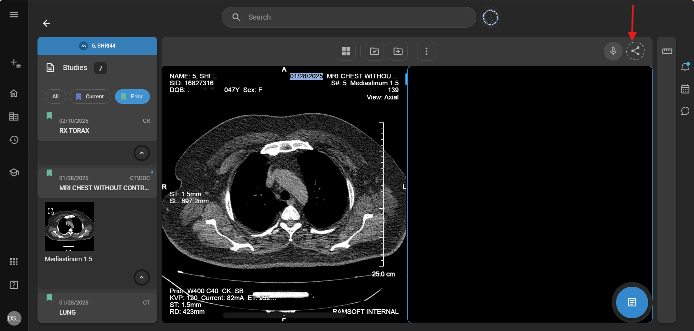
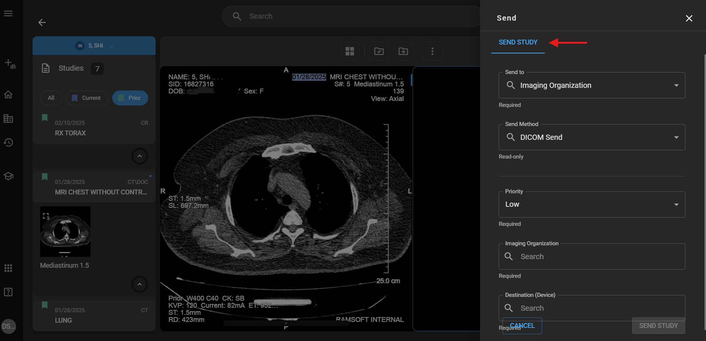
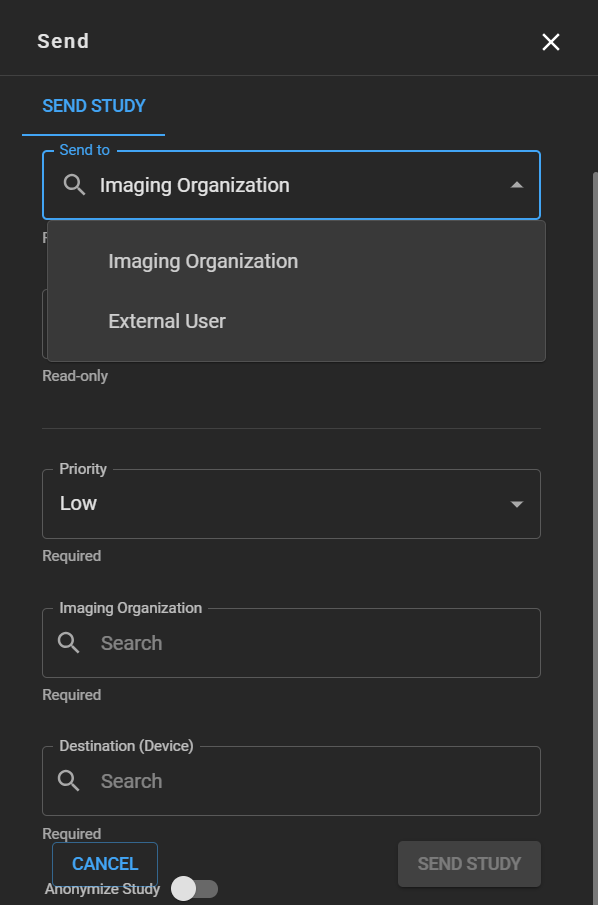
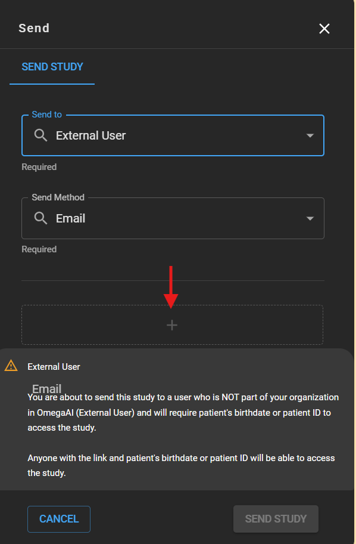
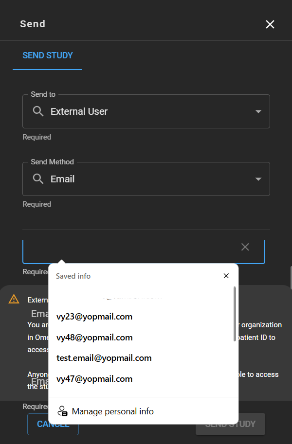
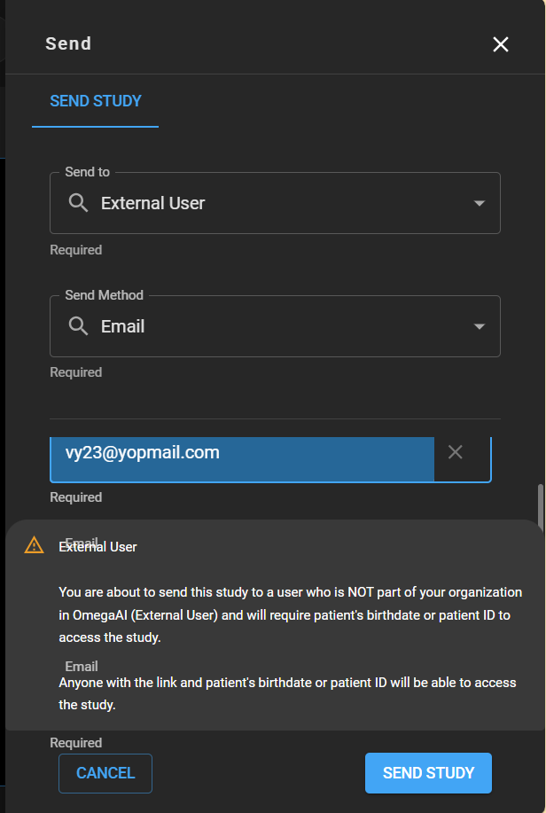
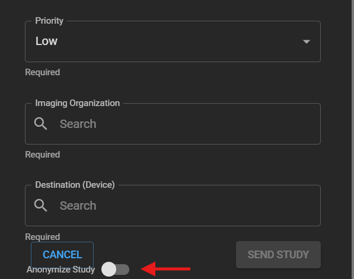

# Study Sharing – Image Viewer

## Overview

OmegaAI offers a seamless and consistent interface directly within the Image Viewer (IV), making it easy to share studies securely and efficiently.

The Share Study feature enables users to collaborate within their organization by managing sharing permissions, searching for colleagues, and adding comments to the shared studies. This interface ensures a unified, intuitive experience when distributing imaging data.

## Accessing Share Options

- Launch the **OmegaAI** application.
- From the worklist, choose the study you want to open in the Image Viewer.
- Open the **Image Viewer** and select the desired study or image.
- Tap the **Share** icon located in the top-right corner of the toolbar.
- The following tab will appear:
  - **Send Study**
    

### Send Study

To share a study:

1. Select **Send Study** from the top tabs.

2. Choose the recipient type:
   1. **Imaging Organization**
     

     
          **Note**:- **Send Method** defaults to **DICOM SEND**
         
3. Set the **Priority**: Low, Medium, High, or Highest

4. Use **meta search** to select the **Imaging Organization** and the **Device**

5. Optional: Toggle **Anonymize** to anonymize the study before sending.
       
    2. **External User**
       1. **Send Method** defaults to **Email**
       2. Click the **"+"** button to enter the recipient’s email address
       3. A warning message will appear:     
  _External User_
  _You are about to send this study to a user who is NOT part of your organization in OmegaAI (External User) and will require the patient's birthdate or patient    ID to access the study.
  Anyone with the link and the patient's birthdate or patient ID will be able to access the study._

          
        5. After reviewing the warning, proceed by clicking **Send Study**    
        6. Click **Cancel** to exit if needed.    
 

 **Note** :  Turn the Toggle on to anonymize the study if necessary.    
 
 
 
## Key Highlights

- Available across **Worklist**, **DV**, and **IV**.
- Secure, trackable sharing with simplified workflows.
- Designed for seamless communication with referring physicians, imaging partners, and patients.

## Presentation State

### Overview
Presentation State (PR) in OmegaAI is a critical feature designed to capture and preserve the exact visual representation of medical images as configured by the user. This includes settings such as window level, zoom, pan, rotation, flip, and any applied measurements or annotations. These saved states ensure consistency and compatibility when images are shared, exported, or reloaded for viewing.

### What is a Presentation State (PR)?

A Presentation State is a DICOM-compliant object that stores the visual and interactive configuration of an image or series at a specific point in time.

PR ensures that settings like Window Width/Level, Display Area, Zoom, Flip, Rotate, Pan, and Annotations remain intact when images are reopened or transferred to another system.

Included Tools in a Presentation State while sending and recieving the studies:

- Window Level

- Zoom

- Pan

- Flip

- Rotate

- Measurement & Annotation

### When is a Presentation State Created?

A PR is automatically saved when a user with proper permissions clicks “DONE” or “DONE & NEXT” in the Image Viewer/QC Module, for any study not yet marked as VERIFIED.

The PR can also be manually saved if the user has appropriate access.

PR is also saved with bookmarks that retain view state and tool configuration.

### Presentation State Conversion to DICOM:

When exporting studies, burning to CD, or transmitting via OAI Link, PRs are converted into DICOM objects.

This conversion retains key PR elements for consistency and interoperability across systems.

### User Access Control (UAC) for PR Creation:

Admins can manage which roles or individual users can create and save Presentation States.

Access Settings Path: Home → Image Viewer → QC Module → Presentation State

#### Toggles Available:

Application PR: On → Apply PR | Off → Do not apply PR (Default)

Edit PR: On → Save PR | Off → Do not save PR (Default)

#### Permissions:

By default, only users with the roles Reading Physician or Performing Physician have the ability to create PRs.

Admins can override this default setting to extend PR creation capabilities to other custom roles as per business requirements.

#### Automatic Behavior:

On loading a study in the Image Viewer, the last saved Presentation State is automatically applied for a seamless review experience.

If a PR exists for a study, it overrides the default auto-window leveling to preserve intended image interpretation.

