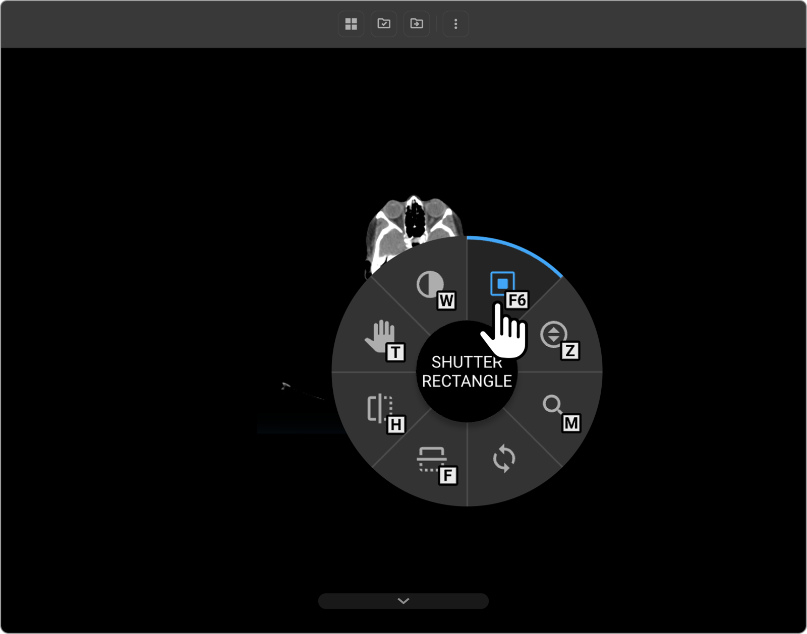
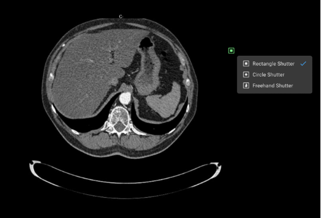

# Using the Cine Tool

## Overview

The Cine tool in OmegaAI is designed for real-time viewing of medical
imaging studies, such as Ultrasound, CT (Computed Tomography), MR
(Magnetic Resonance), and XA (X-ray Angiography). It enables users to
efficiently navigate through large multi-frame series without repetitive
manual interaction, enhancing the review process. This tool is
particularly useful in dynamic imaging where frame-by-frame analysis is
essential.

## Accessing the Cine Tool

1.  **Visibility and Activation:** The Cine tool is available only if
    the loaded study contains more than two images. It can be accessed:

    - Via the Cine icon located at the bottom of the viewport menu

    - From the toolbar

    - By pressing the "C" key, which serves as a hotkey for quick access

      

## Cine Tool Interface and Functions

Once activated, the Cine tool GUI (Graphical User Interface) appears
with several control options:

1.  **Go to First Frame:** Jumps directly to the first image of the
    series.

2.  **Move to Previous Frame:** Steps back to the previous image in the
    series.

3.  **Play/Stop:** Starts or stops the automatic playback of frames.

4.  **Move to Next Frame:** Advances to the next image in the series.

5.  **Move to Last Frame:** Moves directly to the last image of the
    series.

6.  **FPS (Frames Per Second) Indicator:** Shows the current frames per
    second rate. FPS can be adjusted by clicking and holding the left
    mouse button and dragging left or right. The FPS rate is set based
    on DICOM data for the selected series (active viewport), or a
    default value is used based on the series modality if no DICOM data
    is available.

    
    
    
    > **Note**: The Cine GUI can be moved within the viewport by dragging
    > and dropping it.

    

## Additional Features

- **Playback Progress Indicator:** An indicator at the top of the GUI
  displays the progress of the playback.

- **Automatic Playback in Hanging Protocols:** As part of the hanging
  protocols configuration, users can set the viewport to autoplay the
  cine when a study is opened, facilitating a more streamlined workflow.

## Using the Cine Tool Effectively

- To enhance workflow efficiency, familiarize with the hotkeys and GUI.

- Utilize the FPS adjustment feature to match the pace of image review
  to the specific requirements of the study being analyzed.

### Practical Example

In a clinical scenario where rapid assessment of a cardiac function is
required through an echocardiogram, the Cine tool allows clinicians to
play through the echocardiogram's image series swiftly, pause at
critical frames, or review specific segments repeatedly to ensure
accurate analysis and diagnosis.

# Shutter Toolset

## Overview

This section guides users in utilizing the Shutter Tool feature in Image
Viewer. This toolset aims to enhance the diagnostic process, focus on
relevant image areas, and ensure patient privacy.

## Shutter Toolset Options

The Shutter Toolset can easily be accessed via the customized tool
wheel.

The toolset has three options to select from including:

- Rectangular Shutter

- Circle Shutter

- Freehand Shutter (can use without having to drag your mouse/cursor)

### Enhanced Image Visibility

The Shutter Toolset allows clinicians to better visualize specific areas
of medical images by darkening peripheral, non-relevant regions. This
feature allows for more accurate diagnoses.

### Reduction of Visual Distractions

The Shutter Toolset helps minimize unnecessary and distracting elements
in medical images, enabling healthcare professionals to concentrate on
the critical aspects of the image for diagnosis and treatment planning.

### Improved Contrast and Brightness Management

The Shutter Toolset allows for more effective adjustments in contrast
and brightness in isolated regions of the image. This enhancement
improves the overall readability and clarity of essential areas.

### Effective Annotation and Emphasis

The Shutter Toolset provides a tool for radiologists and other medical
professionals to emphasize significant findings within an image, such as
fractures or tumors. This feature facilitates clearer communication and
understanding among medical teams and with patients.

### Ensured Patient Privacy

The Shutter Toolset includes a feature to obscure identifiable features
of a patientΓÇÖs body that are not relevant to the diagnosis. This feature
is particularly important when images are shared or presented in various
settings, ensuring patient privacy.

### Standardization for Image Comparison

The Shutter Toolset aids in comparing multiple images by allowing the
standardization of visible areas. This feature is crucial for monitoring
changes over time in serial imaging.

### Diagnostic Accuracy Enhancement

The Shutter Toolset improves overall diagnostic accuracy by enabling
clinicians to focus on pertinent aspects of medical images. This feature
leads to more informed and precise medical decisions.
