# Hanging Protocols in OmegaAI

## Overview

Hanging Protocols in OmegaAI allow you to standardize how medical images
are arranged and displayed in the Image Viewer. They control the layout,
sequence, and behavior of images based on modality, study attributes,
and defined matching rules.

This guide provides an overview of how to access Hanging Protocols, use
the default protocols and the saved configurations, and create or
customize protocols to support consistent, efficient clinical reading
workflows.

## Accessing Hanging Protocols
You can access Hanging Protocols in the OmegaAI Image Viewer using two
methods.

**Method 1: Quick Access**

1.  Click the **Change Layout (Grid Icon)** on the top toolbar of the
    Image Viewer.

2.  The **Layout Selector** panel will open.

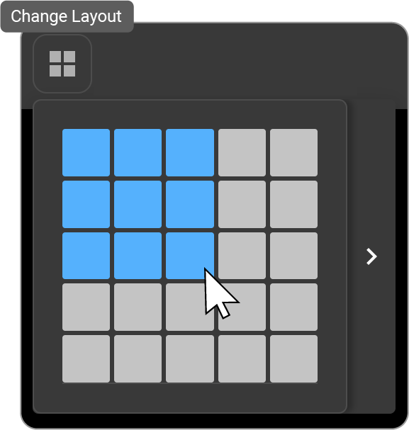

3.  Click the **Right Arrow (\>)** to expand the panel and view all
    available Hanging Protocols.

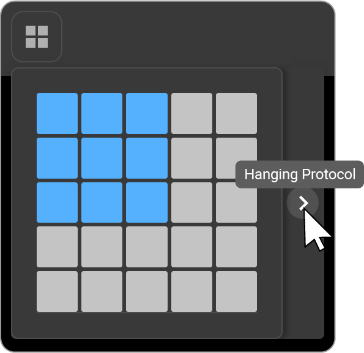

4.  The expanded panel allows you to:

- Create a new Hanging Protocol

- View saved and default Hanging Protocols for the active modality

- Access both default and user-saved protocols

5.  To create a new protocol, click the first blank tile (+ icon):

- The Hanging Protocol Configuration screen will open.

- A **Save** button appears on top of the tile---use it to save your
  current viewport layout as a new protocol.

- A **pencil icon** appears when you hover over existing protocol
  tiles---click it to edit.

6.  The **active protocol** is highlighted in **blue** in the expanded
    list.

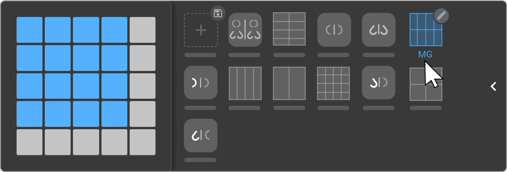

**Method 2: Access via Settings**

1.  Click on the **three-dot menu (More Options)** icon in the Image
    Viewer toolbar.

2.  Select **Settings** from the dropdown menu.

3.  Click **Hanging Protocols** to open the configuration screen and
    manage all available protocols.

    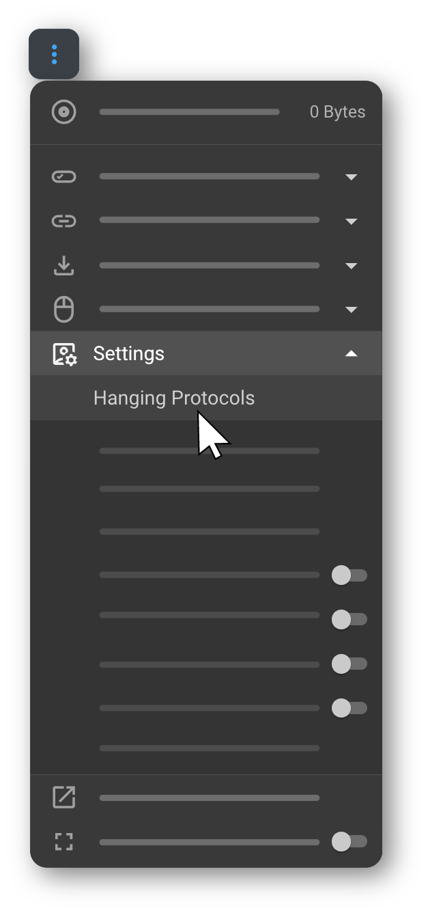

## Hanging Protocol Configuration

When you open the configuration screen, the **Saved Hanging Protocols**
panel is displayed on the top-right. Use this panel to view, create,
duplicate, and manage protocols.

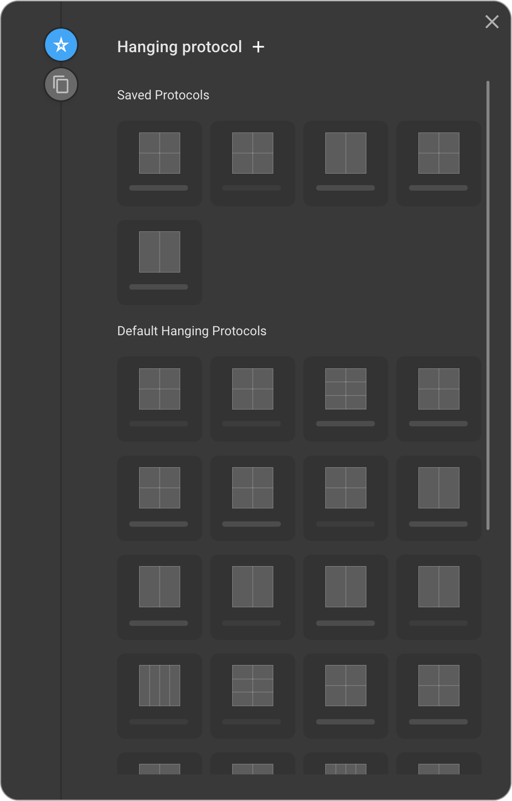

### Configuration Panel Options:

1.  **Star Icon---View Saved Protocols**

- Displays all saved Hanging Protocols along with default system
  protocols.

- The list is automatically filtered by the **active modality** shown at
  the top.

2.  **Duplicate Protocols**

- Select an existing protocol and click **Duplicate** to create a copy.

- Modify the configuration and save it with a **new name**.

3.  **Add New Protocol**

- Click the **"+" icon** at the top to create a new Hanging Protocol
  from scratch.

  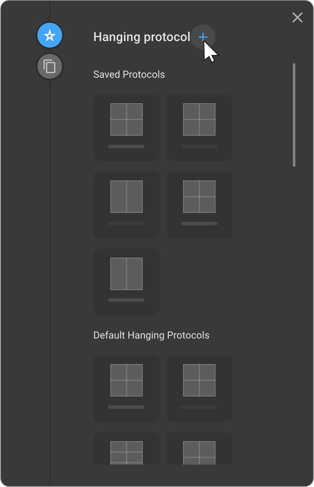

### Default Hanging Protocols:

Default Hanging Protocols in OmegaAI provide pre-configured layouts
designed to streamline the diagnostic workflow and support quick
adoption of the Image Viewer. These protocols offer a reliable starting
point for new users and an efficient baseline for experienced readers.

- You can browse a curated list of **ready-to-use protocols** that
  support the standard reading workflows without requiring any initial
  configuration.

- Default protocols can be **duplicated and customized** to match
  individual preferences or institutional standards.

- All Hanging Protocols are organized into collapsible groups under
  **"Default Protocols"** and **"Saved Protocols"** to simplify
  navigation and management.

OmegaAI provides default protocols for the following modalities:
    
○ **11** protocols for **MG (Mammography)**

○ **7** protocols for **XR (X-ray)**

○ **2** protocols for **US (Ultrasound)**

○ **7** protocols for **CT (Computed Tomography)**

○ **5** protocols for **MR (Magnetic Resonance)**

These protocols are created for user convenience and serve as a robust
foundation for most reading workflows.

- The list is automatically filtered by the **active modality**, which
  is shown at the top of the list.

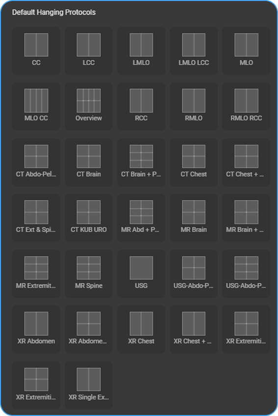

### Hanging Protocol Matching Criteria

Hanging Protocols are matched based on the following study attributes:

- **Modality**

- **Body Parts** available in the study

### Create a Hanging Protocol

Follow the steps below to create a new Hanging Protocol and define the
desired image layout and display rules.

1.  **Open the Hanging Protocol configuration page**

- Navigate to the *Create Hanging Protocols configuration* window

2.  **Select a Layout**

    - **Left click once** inside the **Viewport Setup** area.

    - A **layout selector grid** appears, allowing you to define the
      number of viewports (e.g., 1x1, 2x2, 3x1, etc.).

    - Click on the grid cells to select your preferred layout
      configuration. The highlighted cells (in blue) represent active
      viewports.

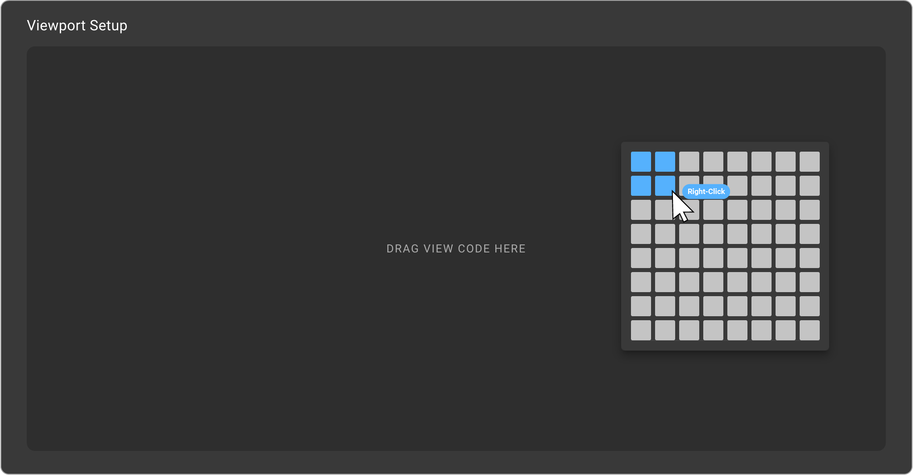

[Learn more about Viewport Setup](https://help.omegaai.com/docs/Advanced-Topics/Mastering_Hanging_Protocols#configuration-screen-layout)

3.  **Assign View Codes**

    - From the **View Codes** panel below, **drag and drop** the desired
      codes (e.g., *CT: AXIAL*, *CT: CORONAL*, *AP*, *LAT*) into each
      active viewport area.

    - These codes define which image orientation or series type will
      appear in each viewport.

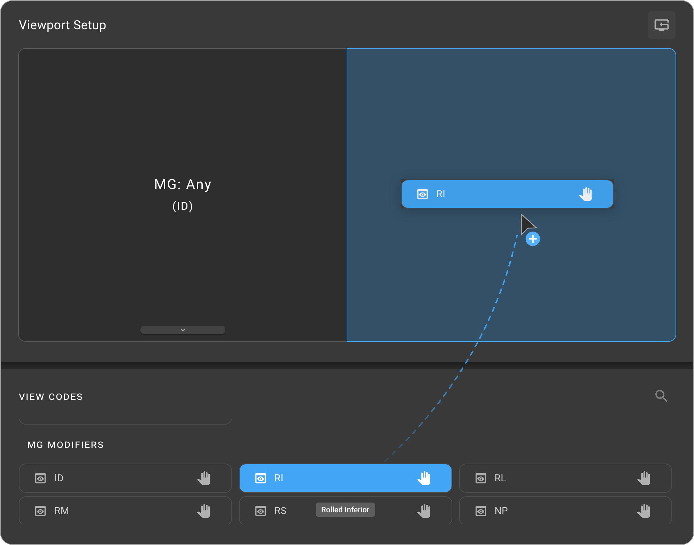

[Learn more about View Codes and Modifiers Panel](https://help.omegaai.com/docs/Advanced-Topics/Mastering_Hanging_Protocols#2-view-codes-and-modifiers-panel)

4.  **Configure Hanging Protocol Rules**

- Select the viewport you want to configure. A blue border indicates
  that it is active.

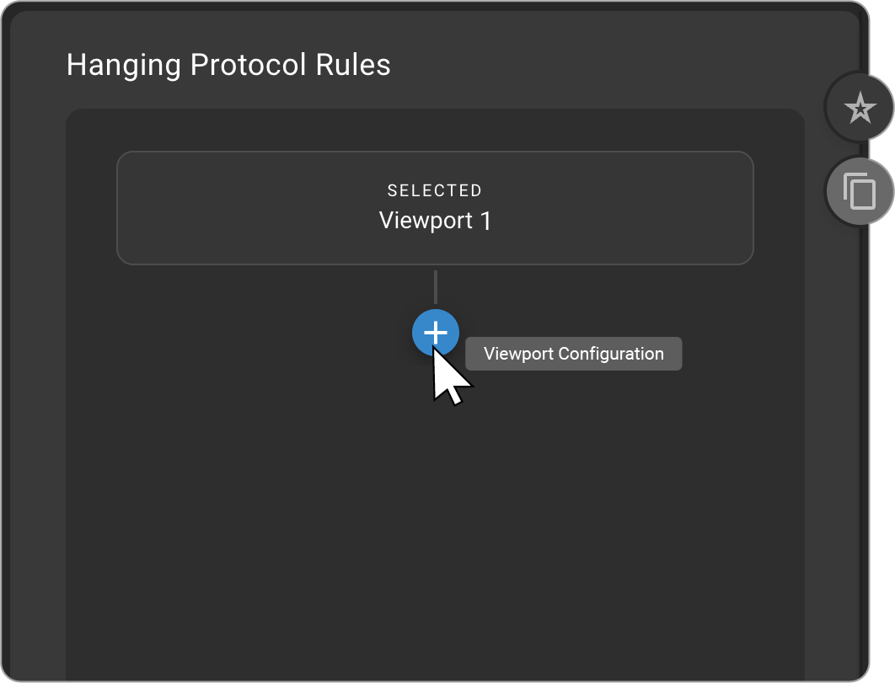

  - On the **Hanging Protocol Rules** panel (right side). Click the
    **"+" button** to add rules that control how the selected viewport
    behaves when the protocol is applied.

You can configure:
  
○ **Toggles** — enable/disable viewer features  

○ **Scaling** — control image fit or zoom

○ **Window Presets** — apply WL/WW  

○ **Conditions** — DICOM-based matching rules  

○ **Orientation** — flip, rotate, or align images.
 These rules automate and standardize how images appear.

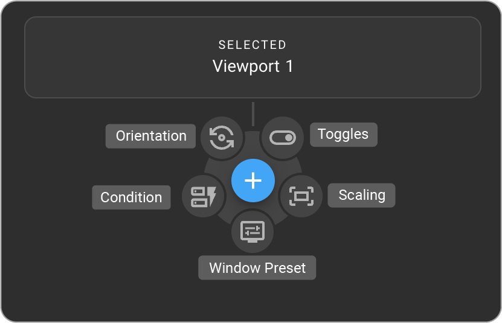

[Learn more about Hanging Protocol Rules Panel](https://help.omegaai.com/docs/Advanced-Topics/Mastering_Hanging_Protocols#3-hanging-protocol-rules-panel)

5.  **Selecting Prior Matching Model:**

This feature loads the correct study (current or prior) based on the
**selected view code**.

- Select the viewport (a blue border indicates active).

- Click the **down arrow** at the bottom center of the viewport to open
  the options menu.

- Click the **file icon** to open study matching options.

- Choose one of the following:

- **Current**---loads the active study

- **1st Preceding Prior**---the most recent prior that matches the view
  code

- **2nd Preceding Prior**---prior before the 1st matching prior

- **3rd Preceding Prior**---prior before the 2nd matching prior

- Use **Set Matching Model** for advanced prior selection based on
  criteria like

    - Body part

    - Modality

    - Study date

    - Procedure code

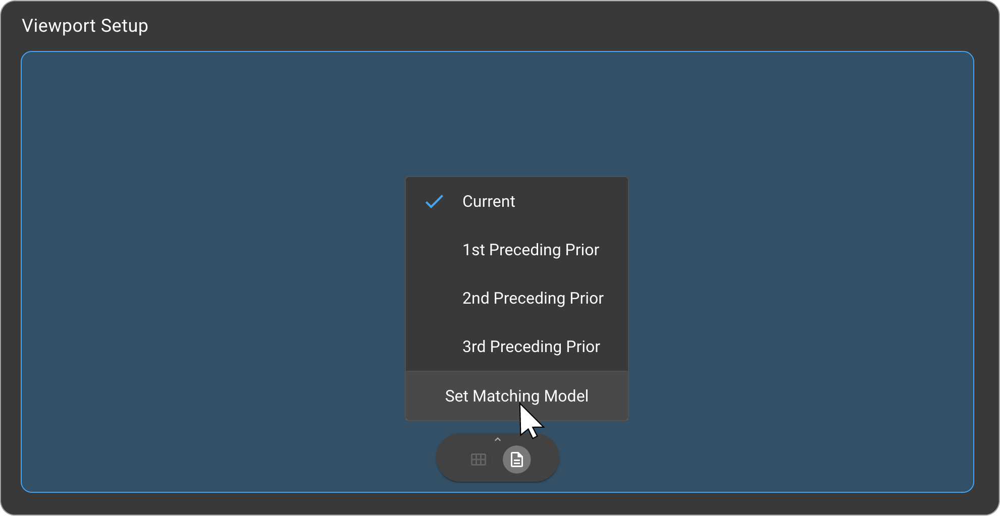

[Learn more about Prior Matching Model Configuration in OmegaAI](https://help.omegaai.com/docs/Advanced-Topics/Mastering_Hanging_Protocols#prior-matching-model-configuration-in-omegaai)

6.  **Add Additional Stages.**

- If your protocol includes multiple viewing monitors/ stages, click
  the **"+" (Add Stage)** icon at the bottom of the screen.
  
- Each stage can have its own layout and rules for multi-step
  reading workflows.

  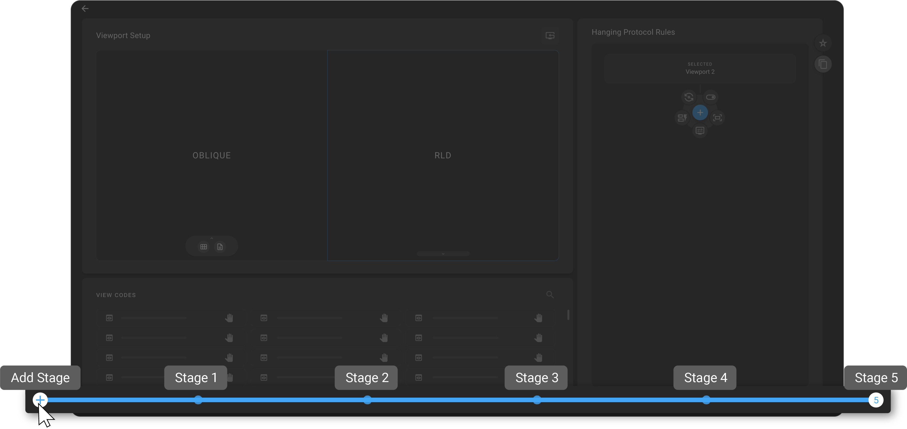

[Learn more about Hanging Protocol Stages Management](https://help.omegaai.com/docs/Advanced-Topics/Mastering_Hanging_Protocols#hanging-protocol-stages-management)

7.  **Save the Protocol**

- Click the **Star** button to open the Save Protocol window.

- Enter a **protocol name**.

- Select the **organization** or leave blank to use the default from the
  current study.

- Optionally choose the **modality** and add filters such as **procedure
  code**, **body part**, or **laterality**.

- Enable **\"Set as default\"** if needed.

- Click **Save** to store the protocol.

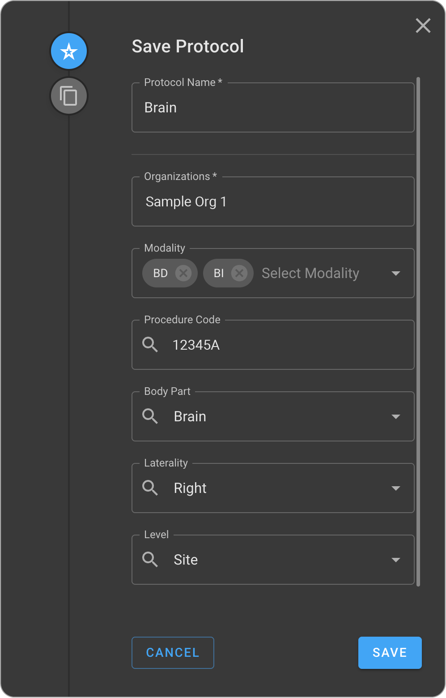

[Learn more about Managing organizations in Hanging Protocols.](https://help.omegaai.com/docs/Advanced-Topics/Mastering_Hanging_Protocols#managing-organizations-in-hanging-protocols)

## Monitor Configuration Adaptability

OmegaAI automatically adjusts Hanging Protocol layouts based on your
monitor setup:

- **Single Monitor**---Viewports are displayed on one screen.

- **Multiple Monitors**---Layout expands across available screens for an
optimized viewing experience.

### Hanging Protocol -- Window Level Preset Sync

The **Window Level Preset Sync** feature in OmegaAI ensures seamless
integration of presets created with the Window Level Tool directly into
Hanging Protocols. This eliminates inconsistencies, reduces manual
adjustments, and improves image rendering reliability.

**Key Benefits**

- **Automatic Sync:** New presets created with the Window Level Tool
  appear instantly in Hanging Protocols.

- **Auto-Remove:** Deleted presets are removed from the dropdown,
  preventing errors.

- **Custom Editing: Users** can adjust WW/WL directly within Hanging
  Protocols.

- **Improved Rendering:** Prevents invisible or mismatched images.

- **Accessibility:** the Presets can be applied at the **site
  level** (all users) or **user level** (individual use).

### Workflow Example

1.  Create a preset in the Window Level Tool (adjust WW/WL, save).

2.  In **Settings \> Hanging Protocols**, enable Window Level, select
    the preset, and save.

3.  Apply the protocol to a study, the synced preset renders
    automatically.

4.  For adjustments, use the **Custom** option to fine-tune WW/WL in the
    protocol editor.

This feature ensures real-time sync, reduces manual effort, and provides
consistent, accurate image display across similar studies.

[Learn more about Mastering Hanging Protocols](https://help.omegaai.com/docs/Advanced-Topics/Mastering_Hanging_Protocols)

