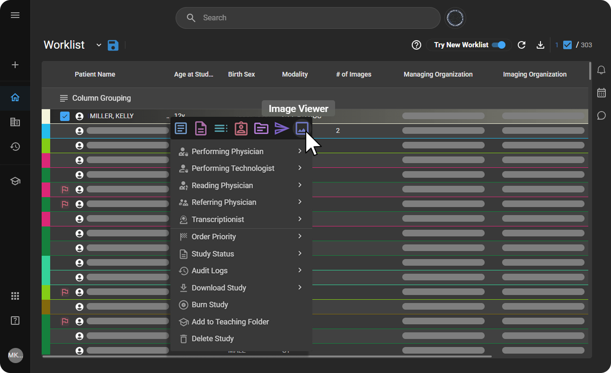
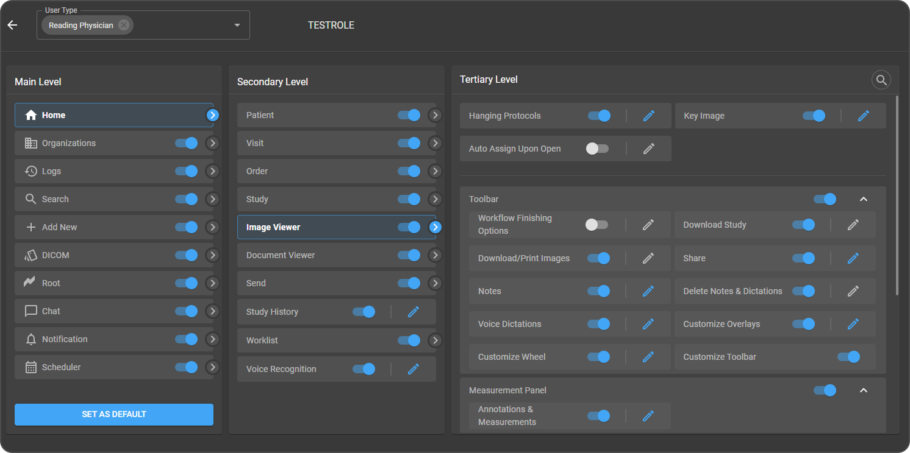

# OmegaAI Image Viewer

The **OmegaAI Image Viewer** is a comprehensive diagnostic imaging
workspace designed to provide fast, secure, and high-quality
visualization of medical studies. It supports efficient clinical
workflows by offering advanced viewing tools, customizable layouts,
measurement capabilities, and seamless study management.

Built for radiologists, physicians, and imaging professionals, the Image
Viewer enables users to analyze studies with precision while maintaining
compliance, security, and role-based access control across the
organization.

## Accessing the Image Viewer in OmegaAI

**Access Methods**

You can access the Image Viewer from the OmegaAI Worklist using the
following methods:

**1. Double-Click Method**

- Navigate to the **Worklist** on the OmegaAI dashboard.

- **Double-click** on the desired study to open it in the Image Viewer.

**2. Right-Click Menu Method**

- **Single Right-click** on the study you wish to view from the
  worklist.

- From the context menu that appears, select **Image Viewer**.

  

## Configuring Monitor Settings 

OmegaAI allows customization of the display settings to enhance the
image viewing experience, which is especially useful in multi-monitor
setups.

<u>*[Learn how to configure Multi-Monitor](https://help.omegaai.com/docs/Communication-and-Organization-Tools/Omegaai%20Multimonitor%20Guide)*</u>

1.  **Single Monitor Mode:**

    - In this mode, the **Image Viewer** opens in the default monitor
      setup.

2.  **Multi-Monitor Mode:**

    - The **Image Viewer** can be configured to open in full-screen mode
      across **multiple monitors** automatically.
    - This mode enhances workflow efficiency and provides a broader view
      for detailed medical image analysis.

3.  **Full-Screen Mode Settings:**

    - By default, in a **multi-monitor** setup, the Image Viewer
      launches in full-screen mode.
    - If you are using a **single monitor**, you can manually enable
      full-screen mode by performing the following steps:

    1.  In the **OmegaAI Image Viewer** toolbar, click the **More
        Options** menu (⋯).
    2.  Toggle on **Full Screen Mode**.

        

## User Access Control (UAC) -- Image Viewer

User Access Control (UAC) for the **Image Viewer** ensures that access
to image viewing and image-related actions is managed securely and
consistently across the organization.

Using role-based permissions, administrators can control who can
**configure viewer settings, mark key images, download or share studies,
create notes and dictations, perform annotations and measurements,
manage series and studies, and access document review tools** based on
each user's responsibilities.

**Configure Image Viewer Access**

Follow these steps to configure access:

1.  Open **Organizations** from the left navigation panel and select the
    required top-level organization.

2.  Navigate to **Users and Roles** from the organization dashboard.

3.  Click the **Roles** icon at the top right corner to open role
    configuration.

4.  Hover over the required role and click **Edit**.

5.  From the **Main Level**, select **Home**.

6.  Under the **Secondary Level**, select **Image Viewer**.

7.  In the **Tertiary Level**, enable or disable the required
    permissions.

8.  Click **Save** to apply the changes.

    

<u>*[Learn more about User Access Control](https://help.omegaai.com/docs/Advanced-Topics/User_Access_Control)*</u>
