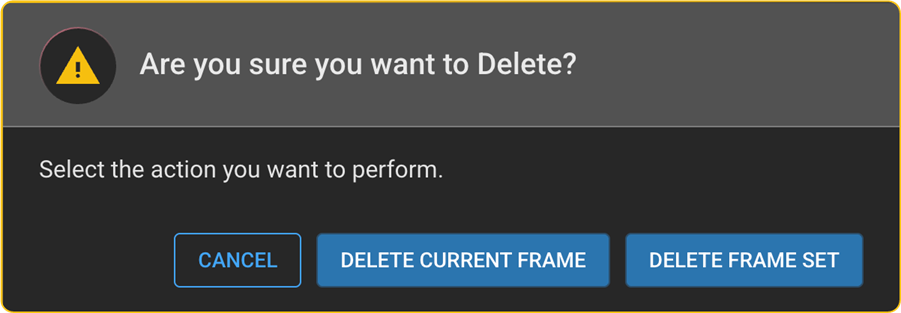

# Delete a Frame or Frame Set

This feature allows users to remove either a single frame or an entire
frame set from the active viewport.

**Steps to follow:**

1.  Navigate to the viewport displaying the frame or frame set you want
    to delete.

2.  Open the **Viewport Menu** located at the bottom center of the
    viewport.

3.  Click on the **Trash Can icon**.

4.  In the confirmation popup:

- Click **DELETE CURRENT FRAME** to remove only the displayed frame.

- Click **DELETE FRAME SET** to remove the entire frame set.

