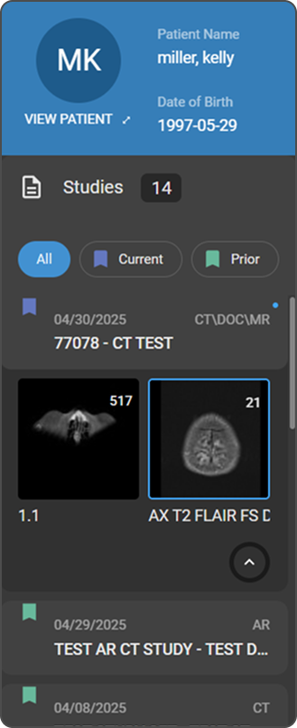
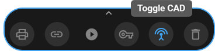

# Orientation of the Image Viewer in OmegaAI

## Overview

The **Image Viewer in OmegaAI** is a comprehensive diagnostic workspace
designed to help users review, analyze, compare, and manage medical
imaging studies.

This article provides an overview of the main components of the Image
Viewer interface, including navigation panels, toolbars, viewports, and
image interaction tools. Understanding these components will help you
work more efficiently and customize your viewing experience based on
your workflow.

## Main Components of the Image Viewer

### 1. Study Explorer (Left Panel)

The **Study Explorer** is located on the **left side** of the Image
Viewer and is **collapsed by default**.

**How to Access**

- Click on the **Study Explorer icon (File icon)** in the **top-left
  corner** of the Image Viewer to expand the panel.

**Key Functions**

The Study Explorer acts as a **Study Quality Control (QC) module**,
allowing you to review and manage patient studies efficiently.

**Sections Within Study Explorer**

- **Patient Header**

  - Displays patient name, date of birth, patient ID, and other key
    demographic details.

- **Studies Section**

  - Shows the total study count.

  - Provides filter options:

    - **All**

    - **Current**

    - **Prior**

- **Study List**

  - Displays study date and study description.

  - Click a study to view its series thumbnails.

- **Series Thumbnails**

  - Preview images of available series.

  - **Double-click a thumbnail** to open the series in the Image Viewer.

   

  <u>*[Learn more about Study Explorer and Image QC Module](https://help.omegaai.com/docs/Image-Viewer/Study_Explorer_and_Image_QC_Module)*</u>

### 2. Search Bar

The **Search Bar** is located at the top of the Image Viewer.

**Function**

- Allows global search across the database.

- Automatically hides in **Full-Screen Mode** to maximize viewing space.

  

<u>*[Learn more about Using Global Search](https://help.omegaai.com/docs/Global-Search/Global_Search)*</u>

### 3. Toolbar

The **Main Toolbar** is located directly below the Search Bar and
provides quick access to essential tools.

**Toolbar Options**

- **Patient Tag**

  - Visible when the Study Explorer is closed.

  - Click **View Patient** to open the patient profile.

- **Layout Selector & Hanging Protocols**

  - Configure viewport layouts.

  - Apply predefined hanging protocols for structured viewing.

<u>*[Learn more about Layout Selector](https://help.omegaai.com/docs/Image-Viewer/Image_Viewer_Toolbar%23using-the-layout-selector-in-omegaai)*</u>

<u>*[Learn more about Hanging Protocols](https://help.omegaai.com/docs/Image-Viewer/Hanging_Protocols_in_OmegaAI)*</u>

- **More Options (Ellipsis Icon)**

  - Access additional viewer options.

<u>*[Learn more about More Options Toolbar Menu](https://help.omegaai.com/docs/Image-Viewer/MoreOptionsToolbarMenu)*</u>

- **Document Review Mode (Document Icon)**

  - In single-monitor mode, it allows viewing documents or creating
    reports side-by-side with images.

<u>*[Learn more about Document Review Mode](https://help.omegaai.com/docs/Image-Viewer/Document_Review_Mode)*</u>

- **Voice Notes & Study Notes**

  - Add written notes to the study.

  - Record voice notes or dictations.

<u>*[Learn more about Voice Notes and Study Notes](https://help.omegaai.com/docs/Image-Viewer/Study,_Voice_Notes,_&_Dictations)*</u>

- **Share Icon**

  - Share studies with other users or organizations.

<u>*[Learn more about Sharing Studies](https://help.omegaai.com/docs/Image-Viewer/Sharing_Studies)*</u>

**Customizing the Toolbar**

You can customize the toolbar by adding, removing, or rearranging tools
to match their workflow, ensuring a more streamlined viewing experience.
This includes repositioning commonly used tools such as Zoom, Measure,
Annotate, and Preset adjustments to preferred locations.

<u>*[Learn more about Customizing Toolbar](https://help.omegaai.com/docs/Image-Viewer/MoreOptionsToolbarMenu#3-customizing-toolbar)*</u>

### 4. Measurement Panel (Right Panel)

The **Measurement Panel** is located on the **right side** of the Image
Viewer.

**Purpose**

- Manage and review measurements and annotations.

- Access all measurements related to the current study or series.

- Organize and analyze image findings efficiently.

<u>*[Learn more about Measurement Panel](https://help.omegaai.com/docs/Image-Viewer/Measurement_Panel)*</u>

### 5. Viewports (Main Display Area)

The **Viewport Area** is the central workspace where images are
displayed.

**Key Features**

- Displays medical images and series.

- Shows overlay annotations, positional indicators, and image markers.

- Support multiple viewport layouts.

 **Embedded Document Viewer (EDV)** introduces a unified and efficient
reporting experience by enabling radiologists and physicians to view
DICOM images, navigate prior studies, and document findings---all within
a single interface in the OmegaAI Image Viewer. This enhancement
supports advanced diagnostic workflows, and complex reporting needs
while ensuring accuracy, traceability, and ease of use.

<u>*[Learn more about Embedded Document Viewer](https://help.omegaai.com/docs/Document-Viewer/Edv)*</u>

When the Document Viewer is open (side-by-side or on another monitor):

- Hover over the **image icon** in the top-left corner of a viewport.

- A **grab icon** appears.

- Drag and drop the image directly into reports.

This allows seamless integration between image review and reporting.

  

## Viewport Tools and Controls

### 6. Viewport Menu (Bottom Center of Each Viewport)

The **Viewport Menu** is located at the **bottom center** of each
viewport.

**How to Access**

- Hover over the arrow bar to expand or collapse the menu.

**Function**

Provides quick access to image interaction and viewing tools.\
Available options may vary depending on the image type.

**Viewport Menu Options**

- **Print Image**

  - Print the currently displayed image.

- **Copy to Clipboard**

  - Copy the active image frame for use in reports or presentations.

- **Prior Study Navigation**

  - Navigate between current and prior studies for comparison.

- **Cine Playback Controller**

  - Control playback of multi-frame image series.

  - Includes play, pause, speed adjustment, and frame navigation.

  <u>*[Learn more about Cine Tool](https://help.omegaai.com/docs/Image-Viewer/Using_the_Cine_Tool)*</u>
 

**Create Key Image**

- Mark an image as clinically significant.

- Automatically saved under the study in Study Explorer.

- **Tile Mode**

  - Split the viewport into multiple tiles for simultaneous viewing.

- **MPR (Multiplanar Reconstruction) Mode**

  - Enable coronal, sagittal, and axial reconstructions.

  - Useful for volumetric and 3D analysis.

  <u>*[Learn more about Multiplanar Reconstruction Mode](https://help.omegaai.com/docs/Image-Viewer/MPR)*</u>

**Delete Frame or Frame Set**

- Remove a single frame or entire frame set from the viewport.

  <u>*[Learn more about Delete a Frame or Frame Set](https://help.omegaai.com/docs/Image-Viewer/21%20Delete%20a%20Frame%20or%20Frame%20Set)*</u>

**PET-CT Fusion Mode**

- Overlay PET metabolic data with CT anatomical images.

- Enhance diagnostic interpretation.

  <u>*[[Learn more about PET-CT Fusion Mode](https://help.omegaai.com/docs/Image-Viewer/PET)*</u>

**CAD Objects Toggle**

- Show or hide Computer-Aided Detection findings (e.g., mammography).

  <u>*[Learn more about Mammography Features](https://help.omegaai.com/docs/Image-Viewer/Mammography_Features)*</u>

### 7. Scroll Bar (Frame Navigation)

The **Scroll Bar** is located on the **right border of each viewport**.

**Function**

- Navigate through multi-frame image series.

- Hovering displays the current frame number.

- Click and drag or use the mouse wheel to move between frames.

