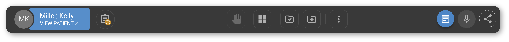
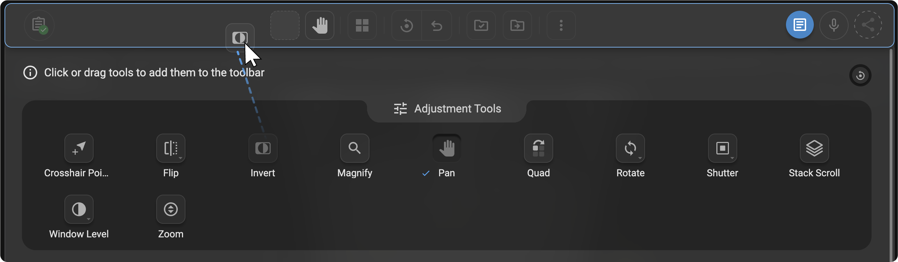
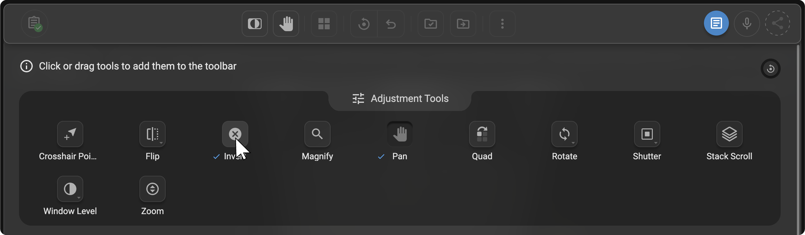
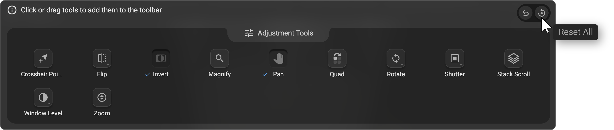
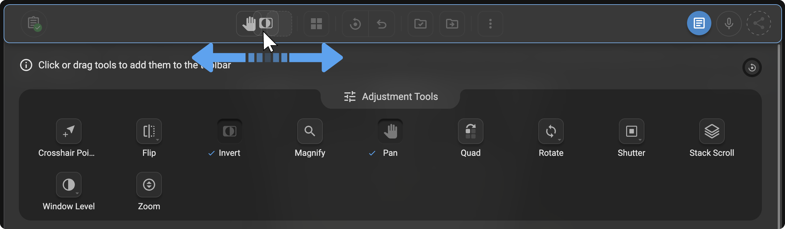
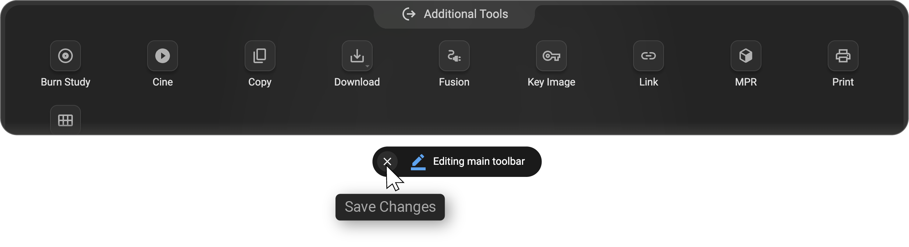

# Image Viewer Toolbar 

The Image Viewer Toolbar provides quick, one-click access to key
functions that support efficient study review and reporting. Positioned
below the search bar, it brings together essential tools for navigation,
layout management, documentation, and collaboration---helping users
tailor their viewing environment to their workflow.

The toolbar is fully customizable- users can add, remove, or rearrange
tools such as **Adjustment, Markup** and **Additional Tools**, enabling
a personalized and streamlined viewing experience.

## Toolbar Components

- **Patient Tag:** Visible if the Study Explorer is closed. Clicking on
  VIEW PATIENT will open the patient profile.

- **Technologist form:** Opens the Technologist Form, allowing reading
  radiologists to review technologist-entered clinical, technical, and
  procedural information related to the study.

  <u>*[Learn more about Technologist form](https://help.omegaai.com/docs/Image-Viewer/Image_Viewer_Toolbar#technologist-form)*</u>

- **Layout Selector and Hanging Protocols:** Allows users to set up
  viewport layouts or select pre-defined hanging protocols.

    <u>*[Learn more about Hanging Protocols](https://help.omegaai.com/docs/Image-Viewer/Hanging_Protocols_in_OmegaAI)*</u>

- **More Options (Ellipsis Icon):** Allows users to access additional
  options.

    <u>*[Learn more about More Options Toolbar](https://help.omegaai.com/docs/Image-Viewer/MoreOptionsToolbarMenu)*</u>

- **Document Review Mode (Document Icon)**: In single monitor mode,
  users have the option to view documents or create reports side-by-side
  with images.

    <u>*[Learn more about Document Review Mode](https://help.omegaai.com/docs/Image-Viewer/Document_Review_Mode)*</u>

- **Voice Notes and Study Notes Icons**: Allows you to quickly add
  written notes to the study or record a voice note/dictation for
  reference.

    <u>*[Learn more about Voice Notes and Study Notes](https://help.omegaai.com/docs/Image-Viewer/Study,_Voice_Notes,_&_Dictations)*</u>

- **Share Icon:** Allows you to share studies with other users.

    <u>*[Learn more about Sharing Studies](hhttps://help.omegaai.com/docs/Image-Viewer/Sharing_Studies)*</u>

- **Undo and Reset Tools**
  These tools become visible only after an adjustment or markup action
  is performed on the image.

   - **Reset All**

     The **Reset All** icon restores the viewer to its default state.
Click **Reset All** to clear all applied adjustments, annotations, and
measurements in the current study.

   - **Undo Previous**

     The **Undo Previous** icon reverts the most recent action performed in
the viewer, allowing you to quickly correct changes or mistakes.

     

## Technologist Form

The Technologist Form is an organization-specific form accessed directly from the Image Viewer toolbar. It displays clinical, technical, and procedural information entered by technologists during or after exam acquisition.

This information is presented alongside the study to support accurate image interpretation without interrupting the viewing workflow. The form supports documentation, quality tracking, and effective communication across the care team.

## Configuration and Availability

- Technologist Forms are organization-specific and must be created and published by administrators.
- Forms are configured under Organization Forms as part of the organization setup.
- If no Technologist Form is configured or published, the Technologist Form option will not be visible in the Image Viewer toolbar.

For more details on creating and managing forms, see: <u>*[Setting Up Forms](https://help.omegaai.com/docs/Getting-Started/Setting_Up_Forms)*</u>

**Accessing the Technologist Form**

1.  Open a study from the worklist.

2.  In the Image Viewer header, click **Technologist Form** in the top toolbar.

3.  The form opens in a new window without affecting viewer functionality.

    

**Review Status**

    - **Yellow (Pending):** Technologist Form has not yet been reviewed.

   - **Green (Completed):** Technologist Form has been reviewed and
  submitted.

**Workflow**

- Click the **Technologist Form icon** in the Image Viewer toolbar to
  open the form in a new window.

- Review the technologist-entered details.

- Click **Edit** to make changes, if required.

   

- Click **Submit** to complete the review.

   

- Once submitted, the form status updates to **Green (Completed)**.

   

**Use Cases:**

Reading radiologists can use the Technologist Form to:

- Review **clinical context** before or during interpretation

- Verify **exam conditions and safety considerations**

- Understand **technical factors** influencing image quality

- Correlate findings with **acquisition technique or protocol**

- Reduce follow-up communication by accessing technologist notes
  directly

- Reference documentation for **reporting, QA, or audit purposes**

## Using the Layout Selector in OmegaAI

The Layout Selector is a powerful feature within the OmegaAI Image
Viewer that allows users to customize the arrangement of viewports
according to their specific needs. This tool is accessible via the
toolbar and provides options to manage both standard and
mammography-specific viewing protocols.

### Accessing the Layout Selector

**Opening the Layout Selector:**

1.  Open any study in the Image Viewer.

2.  Click the **Change Layout (Grid Icon)** on the top toolbar.

3.  The Layout Selector panel will open, displaying a **3×3 grid** with
    the current layout highlighted in blue.

    

### Customizing Viewport Layouts

1.  **Adjusting Viewport Numbers:**

    - Increase or decrease the number of viewports displayed on the
      monitor by dragging the visible viewports on the layout selector
      to the left, right, down, or up.

    - You can configure up to an 8x8 grid on each of your monitors.

2.  **Applying Hanging Protocols:**

    - To the right of the layout selector, Click the **Right Arrow (\>)  ** to expand the panel and view all available Hanging Protocols.
 

     - Select a desired hanging protocol by left-clicking on it.

     - In a single monitor setup, selecting a hanging protocol will affect
  only the current monitor. In a multi-monitor setup, it will apply to
  all connected monitors.

<u>*[Learn more about Hanging Protocols](https://help.omegaai.com/docs/Image-Viewer/Hanging_Protocols_in_OmegaAI)*</u>

## Customizing the Toolbar in OmegaAI

The Customize Toolbar feature in OmegaAI allows users to personalize
their toolbar layout to optimize their workflow in the Image Viewer.
This guide explains how to access and adjust the toolbar settings,
manage tools within distinct categories, and apply customization across
different monitors.

### Accessing the Customize Toolbar Feature

To begin customizing the Toolbar:

1.  Open the OmegaAI Image Viewer.

2.  Click on the **More Options** (three-dot menu) in the top toolbar.

3.  Select **Settings \> Customize Toolbar** from the dropdown menu.

     

4.  The Toolbar Customization Panel will open.

### Understanding Toolbar Sections

**The toolbar is organized into three main sections:** -

- **Markup Tools:**

  - Tools available: Angle, Annotate, Bidirectional, CTR, Drag Probe,
    Spine Labelling, Length, ROI (Rectangular ROI, Circular ROI,
    FreeHand ROI), Plumb Line.

Learn more about Markup Tools

- **Adjustment Tools:**

  - Tools included: Crosshair Pointer, Pan, Rotate, Zoom, Flip, Invert,
    Magnify, Quad Zoom, Shutter, Stack Scroll, Window Level.

Learn more about Adjustment Tools

- **Additional Tools:**

  - Features include: Cine, Fusion, Print, MPR, Key Image, Tile Mode,
    Link, Copy, Download (Download Study and Download Image), Burn Study

Learn more about Additional Tools:

    

### Customizing Your Toolbar

1.  **Adding Tools to the Toolbar:**

- In the Customize Toolbar panel, browse the available tools under
  **Adjustment Tools**, **Markup Tools**, and **Additional Tools**.
- Click once or **drag and drop** the desired tool from the edit section
  to the top header toolbar section. A **checkmark** will appear on the
  tool once it is added.
- The tool will be added instantly to your active toolbar layout.

   

2.  **Removing Tools from the Toolbar**

- To remove a tool from the toolbar, hover your cursor over any tool
  that has already been added. The **× (Remove)** icon will appear on
  the tool.

- Click the **× (Remove)** icon to remove the tool from the toolbar.

    

3.  **Undoing and Resetting:**

  -  Hover over the **Reset** icon (circular arrow) located in the
    top-right corner of the customization drawer to view two
    options:

       - **Undo Previous:**\
      Click the **Undo** icon to revert the last action you performed
      while customizing the toolbar.

       - **Reset All:**\
      Click the **Reset All** icon to restore the toolbar to its default
      configuration.

     

4. **Rearranging Tools**

     - You can rearrange tools in the toolbar by simply clicking and dragging
  any tool to your desired position.

     

5.  **Saving Changes**

- To save your changes, click the **Cross (×)** button at the end of the
panel. Your customized toolbar layout will be applied immediately.

     

### Managing Default and Essential Tools

Certain tools like Hanging Protocol, Reset, Done, Done & Next, and the
More section with the Mic icon (for Transcriptions) and Share button are
fixed and cannot be removed due to their essential roles in the software
functionality.

### Multi-Monitor Customization

Users can set up a different toolbar for each monitor in monitor mode to
cater to the specific needs of each display.

Learn more about multi monitor setup

### Tool Availability Based on Modality

Tools not applicable for the active modality in the viewport are
automatically disabled, ensuring access to only relevant tools.
