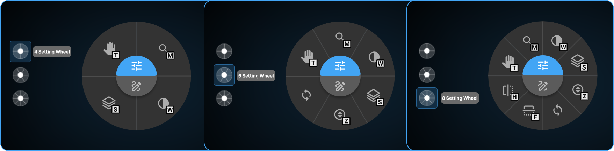

# Image Control Wheel in OmegaAI

The **Image Control Wheel** is a radial shortcut menu that appears when
you right-click on any image in the OmegaAI Image Viewer. It provides
quick, centralized access to commonly used **Adjustment** and **Markup**
tools, allowing users to work efficiently without navigating multiple
menus. Designed for speed and simplicity, the wheel presents tools in a
clear visual layout, helping users interact with images more
intuitively.

## How to Access the Image Control Wheel

1.  Open any study or series in the Image Viewer.

2.  **Right-click on the image**---the Image Control Wheel appears
    instantly.

3.  At the center of the wheel, you will see two primary categories:

    - **Adjustment Tools**

    - **Markup Tools**

4.  Hover over the category you want to preview the available tools.

5.  Each tool icon displays its **assigned hotkey**, allowing users to
    identify the shortcut quickly.

6.  When you **hover over a tool**, its name appears in the center of
    the wheel for easy identification.

7.  Simply hover to highlight a tool and click to activate it.

** in the top toolbar.

3.  Select **Settings \> Customize Wheel**.

4.  The **Wheel Customization drawer** will open on the right side of
    the screen.

    

### Customization Interface and Wheel Settings

**Tabs for Customization**

**1. Adjustment Tab**

Contains tools related to image visualization and display control.
These tools help refine brightness, contrast, orientation, zoom, and
other parameters essential for accurate review and navigation of medical
images.

**2. Markup Tab**

Includes tools for annotation and measurement.
Markup tools enable users to measure anatomical structures, add labels,
document findings, and communicate diagnostic observations directly on
the image.

Learn more about the Adjustment and Markup Tools Guide

## Configuring and Customizing the Wheel

### Select Wheel Type

Choose how many tools should appear on your radial menu:

- **4-setting wheel**

- **6-setting wheel**

- **8-setting wheel**

Click your preferred configuration to begin customizing.

### Tool Arrangement

- All available tools appear in the customization panel.

- Reorder tools by dragging them using the (**⋮⋮**) drag handle on the
  left side that appears on hover.

- Tools placed **above the "Currently Not Assigned"** section will
  appear in the Image Control Wheel.

- If a tool is not applicable to the current image or modality,
  **OmegaAI automatically switches** to the next available tool in your
  list.

  

### Assigning Hotkeys

Most tools come with default hotkeys, but you can modify them:

1.  Click on the tool you want to update.

2.  Select an available hotkey slot.

3.  Press your preferred key or key combination (e.g., *T, Ctrl+W,
    Shift+D)*.

4.  Avoid using shortcuts already used by your browser or OS.

5.  To remove the hot key, click the **delete (trash)** icon.

  

### Saving Your Customizations

1.  After configuring tools and hotkeys, click **Save**.

2.  Your preferences are stored in **your personal user profile** and do
    not affect other users.

### Best Practices

- Choose tools that fit your modality types and daily workflow.

- Assign intuitive, easy-to-remember hotkeys.

- Review and update your wheel periodically as your workflow evolves.

- Use the hover feature in the wheel to quickly identify tools before
  selection.
