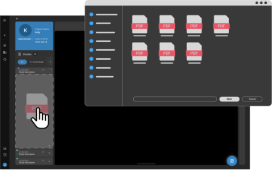
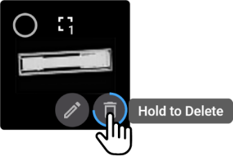
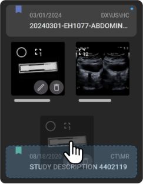
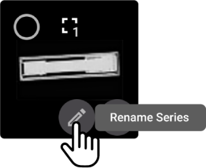

# Study Explorer and Image QC Module

## Overview

The Study Explorer in OmegaAI serves as an essential tool for both
navigating and managing medical imaging studies, as well as performing
detailed quality control checks. This guide provides an in-depth
explanation of the functionalities available in the Study Explorer and
Image QC Module, focusing on patient information handling, study and
series management, and the importation and viewing of various media
types.

## Components and Functionalities

1.  **Patient Banner and Demographic Information**:

    - **Overview**: At the top of the Study Explorer, the patient banner
      displays essential demographic information such as the patient ID,
      confidentiality status, phone number.

    - **Expansion for More Details**: By hovering your mouse over the
      patient banner, it expands to reveal additional information. This
      expanded view is critical for gaining a understanding of the
      patient's background and the specifics of their associated
      studies.

      

2.  **Study Cards and Filtering Options**:

    - **Study Representation**: Each patient's study is represented on a
      study card, which includes the date of the study, the modalities
      used, and a brief description of the study.

    - **Visibility and Filtering**: A blue dot indicates the study
      currently displayed on the screen. Above the study cards, there
      are three filtering options to tailor the view:

      - Filter to show only the current study.

      - Filter to show only prior studies.

      - A view that displays all studies.

      
      
3.  **Thumbnail Navigation and Series Management**:

    - **Thumbnail Details**: Each study card shows thumbnails for series
      and individual images. Thumbnails for multi-frame images display
      the total frame count.

    - **Series Interaction**:

      - Hovering over a thumbnail presents three interactive options:

        - A circular checkbox to select the series, which brings up a
          lower menu for further actions.

        - An **X** icon to deselect the series.

        - A **trash bin** icon allows for series deletion by holding the
          left mouse button until the action completes.

        - A **plus (+)** icon to initiate the creation of a new study
          from the selected series, requiring input for the imaging
          organization and study set.

     - User can easily drag and drop the images to a different study in the Study Explorer to reparent the study.     

4.  **Loading Series to Viewports**:

    - **Drag and Drop**: Series can be loaded into specific viewports by
      dragging and dropping them onto the desired viewport.

    - **Double Clicking**: Alternatively, double-clicking on a series
      thumbnail loads it into the currently active viewport. This method
      provides a quick and efficient way to view series without
      adjusting viewport arrangements manually.
    - Note: When the study is loaded, the first viewport will be automatically selected.

5.  **Advanced Options and Importing New Objects**:

    - **Renaming and Merging**: Additional options include renaming
      series or merging multiple selected studies. An unmerge option is
      also available for studies created by merging different studies.

    - **Import Functionality**: New objects such as JPEG images, DICOM
      objects, PDFs, or RTF documents can be imported by dragging and
      dropping into the Study Explorer. A dialogue box will appear,
      offering different handling options based on the file type,
      enhancing the flexibility in managing study materials.
   - User can click on the delete button on the viewport or within the Study Explorer to delete a frame or a series.

# Image Quality Control (QC)  

OmegaAI Image Viewer provides a robust set of Quality Control (QC)
features that enhance the management and organization of medical imaging
studies. This guide will walk you through accessing and utilizing these
features efficiently.  

### Import Images, Videos and Documents

The QC module also includes a robust image, video and report import
feature. This allows you to import various file types by simply dragging
and dropping them into the destination study within the Image Viewer.

**Supported File Types:**

- **JPEG**

- **PDF**

- **Text**

- **DICOM**

- **MP4**

**Importing Process:**

1.  Follow the mentioned steps to [Access the Image
    Viewer](https://po-us01-help-manual-app-webapp.azurewebsites.net/docs/Image%20Viewer/1%20Accessing%20the%20Image%20Viewer%20in%20OmegaAI#access-methods).

2.  **Drag and Drop:**

    - Drag and drop the supported file types from your file explorer
      into the Image Viewer left side panel.

      

3.  **Processing Based on File Type:**

    - **Text or PDF Files:**

      - You can import these as hard copy DICOM objects into the Image
        Viewer or as study documents into the Document Viewer.

    - **DICOM Files:**

      - The system checks if the same DICOM series or frames exist in
        the study. If additional frames are detected, they are added to
        the existing series. If the DICOM objects belong to a separate
        series, a new series is created.

    - **JPEG Files:**

      - You can import them into the same series or as separate series.

**Processing Time:**

- The time to process and import files depends on their size.

- If you navigate away from the Image Viewer screen during the import
  process, a message will prompt you to confirm whether to cancel or
  continue the import.

- After processing, the imported files will be visible in the Image
  Viewer Study Explorer.

## Accessing the QC Module

To access the QC features in OmegaAI:

1.  Open the **Study Explorer** from the left side panel of the Image Viewer.

## Delete Series

You have two methods to delete a series:

1.  **Hover and Hold:**

    - Hover the mouse over the thumbnail of the series you want to
      delete.

    - Left-click and hold for a few seconds until the series is deleted.

    - A message will appear in the lower-left section of the screen with
      a 10 second counter, allowing you to undo the deletion.

 
2.  **Select and Delete:**

    - Click the checkbox on the top left of the image thumbnail to
      select one or multiple series.

    - In the series menu, left-click and hold the mouse on the delete
      option to delete all selected series.   
      

 
## Move Series between Studies

To move series between studies for the same patient:

1.  **Drag and Drop:**

    - Drag and drop the series from one study to another in the Study
      Explorer.

    - You can drag and drop one or multiple series.

    - To move multiple series, select them using the checkbox method
      mentioned above.

      
     
  

## Create a New Study from Selected Series

To create a new study from selected series:

1.  Select the series you want to move to a new study.

2.  Click the **+** icon in the series menu.

3.  Create a new order for the study, which defaults to the image
    organization of the current study.

4.  Optionally, set a priority, referring physician, and study set for
    the new study.

  
  

 
## Rename Series

To rename a series:

1.  Hover the mouse over the thumbnail of the series.

2.  Click on the **Rename Series** icon.

3.  Enter the new name and press **Enter** to save it.

  

 

 
## Merge Studies

To merge studies that belong to the same patient:

1.  Hover over the study card.

2.  Click on the checkbox to select the study.

3.  Select additional studies you want to merge.

4.  Click the **Merge** option in the study menu. The **Select merge
    destination** panel will appear.

5.  Select the destination for the merged studies from the available
    options and confirm the merge.

 
    
## Unmerge Studies

To unmerge studies:

1.  Click on the study that was merged from the left side Image Viewer
    Study Explorer. An arrow icon will pop-up below the study.

2.  Hover over the arrow to see the **Split Study** option.

3.  Click on **Split Study** to revert the study to its original
    components.

   

## Delete Studies

To delete a study:

1.  Select the study using the checkbox in the Image Viewer Study
    Explorer.

2.  Click on the **Delete** option (garbage can icon) in the study menu.

3.  Alternatively, hover over the collapsed thumbnail icon to see the
    delete option, then click and hold to delete the study.

## Import Files
For information on importing files, see [Import Images, Videos and Documents](../7-Image-Viewer/20_importfiles.md)
