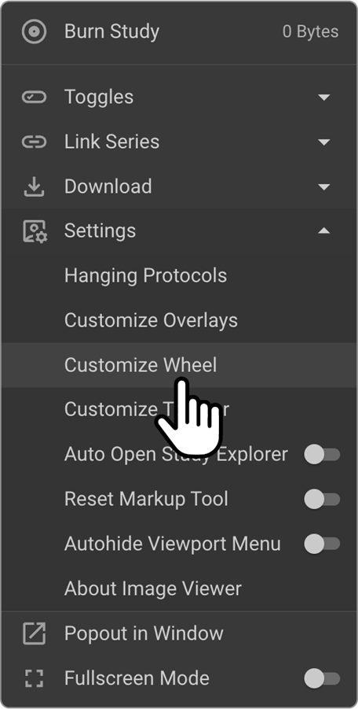
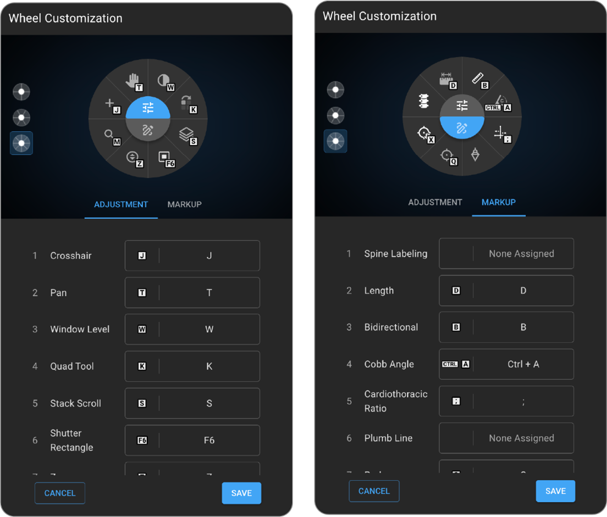
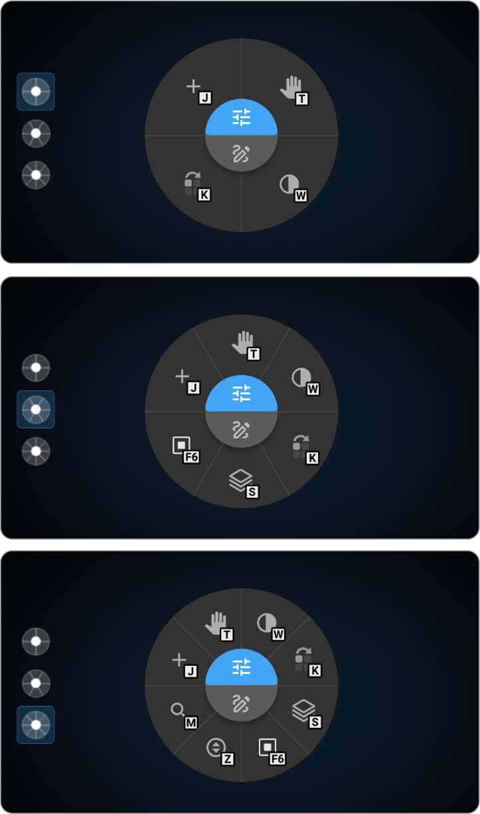
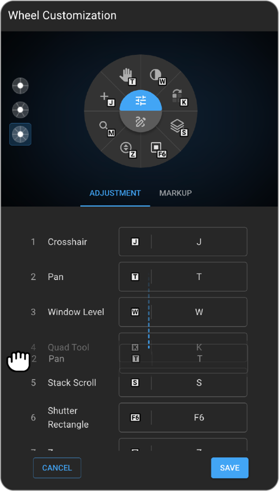
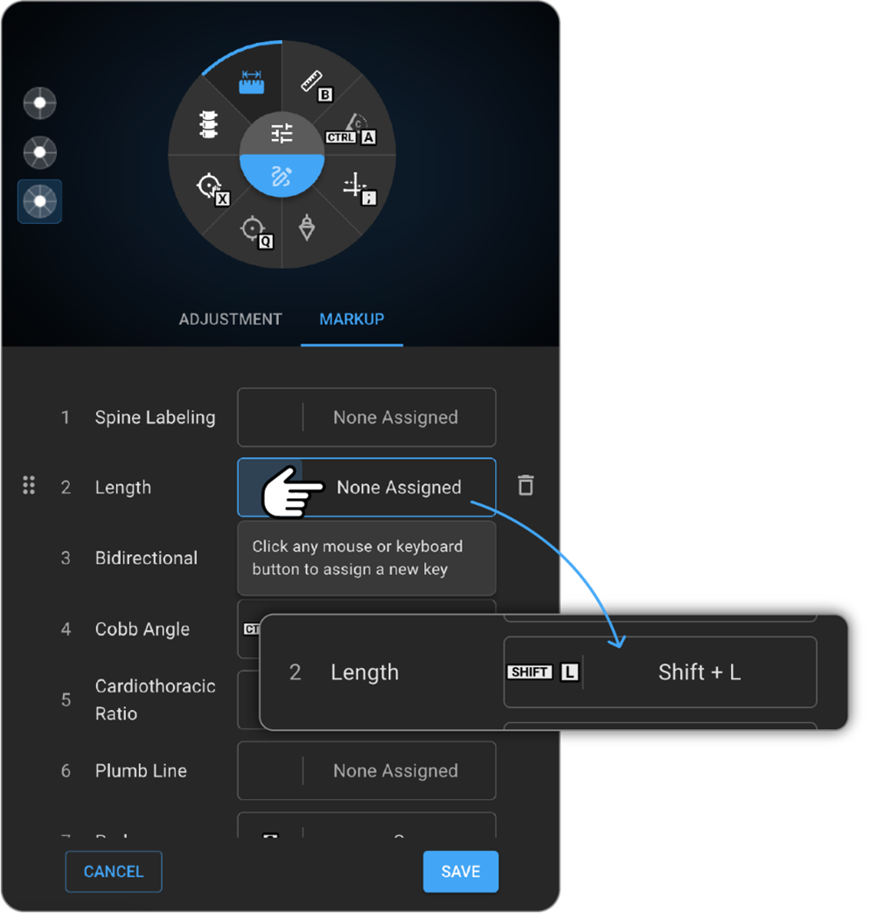

 
# Customizing the Image Control Wheel in OmegaAI

Omega AI’s image viewer includes a powerful “Customized Wheel” feature that lets users streamline their workflow by configuring tool access via a right-click wheel. Users can enhance their workflow by customizing the wheel with 4, 6, or 8 tool slots based on their preferences. This includes selecting tools from the Adjustment and Markup sections, assigning hotkeys, and saving configurations for future use. Customization ensures faster and more intuitive image interaction, tailored to individual workflows.

## Accessing the Customized Wheel in OmegaAI

To begin customizing the Image Control Wheel:

1. Launch the **OmegaAI Image Viewer**.
1. Click the **More Options** (three-dot menu) from the top or side toolbar.
1. Select **Customize Wheel** from the dropdown to open the customization settings.

    

## Customization Interface and Wheel Settings

- **Tabs for Customization:**
  - **Adjustment Tab:** Focuses on image adjustment tools.
  - **Markup Tab:** Contains tools for annotating and marking up images.

- **Select Wheel Type:** Click on one of the three-wheel types:
  - 4-setting wheel
  - 6-setting wheel
  - 8-setting wheel

Tools can be rearranged by dragging them up or down. Hover over the left side of a tool to display its drag handle. If a tool is unavailable due to modality or context, OmegaAI will automatically display the next available tool below.

## Configuring and Customizing the Image Control Wheel in OmegaAI

- **Configuring Tools:**
  0. Tools are listed in the customization drawer and can be reordered by dragging them up or down.

0. Hover over the left side of the tool name to reveal the drag handle.
0. Only tools placed above the “Currently Not Assigned” line will appear on the wheel.
0. If a tool is contextually unavailable, the system will auto-display the next available one below the line.

- **Assigning Hotkeys:**

  0. Default hotkeys are pre-assigned for most tools.
  0. To assign or change a hotkey:
     1. Click the desired tool.
     1. Select the **non-assigned** or current hotkey slot.

     

     1. Press your preferred key combination (e.g., T, Ctrl+W, Shift+D).
  0. Avoid using shortcuts that conflict with browser or OS-level functions.

- **Saving and Accessing Your Customizations**

  0. After setup, click Save to apply your configuration.
  0. Customizations are stored per user profile and do not affect others.
  0. To use the customized wheel, **right-click** within the image viewer.
  0. The wheel displays in two zones:
     1. **Adjustment Zone**
     1. **Markup Zone**
  0. Hovering over a tool displays its name in the radial interface.

## Best Practices

- Choose tools relevant to the modalities and workflows you frequently use.
- Use intuitive, easy-to-remember hotkeys.
- Periodically review and update your wheel to match evolving needs.
- Use the hover feature for quick tool identification.

## Tool Reference

- **Adjustment Tools (for image modification)**
  0. **Pan –** 
     1. Moves the image within the viewport by holding the left mouse button and dragging **(T).** 
     1. Useful for detailed navigation across large or high-resolution images.
  0. **Stack Scroll –** 
     1. Scrolls through multi-frame image series using vertical mouse movement **(S).**
     1. Essential for reviewing sequential images in MRI or CT studies.
  0. **Window Level –** 
     1. Adjusts brightness and contrast using horizontal and vertical mouse movements, respectively **(W).**
     1. Enhances visualization of different tissues and abnormalities**.**
  0. **Crosshair –** 
     1. Aligns identical anatomical points across multiple image planes **(J)**
     1. Supports accurate cross-sectional analysis in multiplanar imaging.
  0. **Free Rotate** – 
     1. Allows free rotation of the image by clicking and dragging; a single click sets preset angles.
     1. Helps align images to standard anatomical orientations
  0. **Zoom –** 
     1. Adjusts image scale using right-click and drag **(Z).**
     1. Crucial for examining fine details like microcalcifications or subtle tissue structures.
  0. **Magnifier –** 
     1. Enlarges a specific region of the image for focused viewing **(M).**
     1. Useful for enhancing small or subtle features.
  0. **Invert—**
     1. Reverses image colors to enhance contrast.
     1. Improves readability for certain image types.
  0. **Shutter –** 
     1. Masks non-essential areas of the image.
     1. Helps focus attention on the region of clinical interest by reducing visual distractions.
  0. **Quad Tour –** 
     1. Sequentially zooms into each image quadrant, primarily for mammography **(K).**
     1. Supports thorough examination of all breast regions.
  0. **Flip Horizontal/Vertical—**
     1. Flips the image vertically **(F)** or horizontally **(H).**
     1. Aids in correcting orientation for accurate anatomical interpretation.

- **Markup Tools (for annotation and measurement)**
  0. **Length Measurement –** 
     1. Measures the distance between two points (D).
     1. Supports anatomical and lesion size assessments.
  0. **Angle Measurement –** 
     1. Calculates angles between intersecting lines (A).
     1. Useful in orthopedic evaluations for angular deformities.
  0. **Plumb Line –** 
     1. Draws a vertical reference line (|).
     1. Helps assess structural alignment, especially in spine imaging.
  0. **ROI (Rectangular, Elliptical, Freehand) –** 
     1. Draws regions of interest for analysis (G, E, ;).
     1. Enables volume or density measurements in targeted areas.
  0. **Bidirectional Tool –** 
     1. Places and measures two perpendicular lines (B).
     1. Helps evaluate dimensions of lesions or anatomical structures.
  0. **Cobb’s Angle –** 
     1. Measures spinal curvature using non-intersecting lines (Ctrl+A).
     1. Essential for scoliosis assessment.
  0. **Cardiothoracic Ratio –** 
     1. Measures the heart-to-chest width ratio (;).
     1. Useful in identifying heart enlargement on chest X-rays.
  0. **Probe –** 
     1. Marks a point to display image data (Q).
     1. Used in CT to show Hounsfield units for tissue density evaluation.
  0. **Drag Probe –** 
     1. Temporarily displays image data without leaving a mark (X).
     1. Ideal for quick checks during review.
  0. **Spine Labelling –** 
     1. Adds vertebral labels in spinal images.
     1. Improves clarity and precision in spine reporting.
  0. **Annotate –** 
     1. Adds text or arrows for marking findings.
     1. Can be used with or without text for visual emphasis.
  0. **Cobb Tool –** Scoliosis angle measurement **(alternative)**
  0. **Circular ROI –** Circular region of interest
  0. **Crosshair Pointer –** Targeting across views

