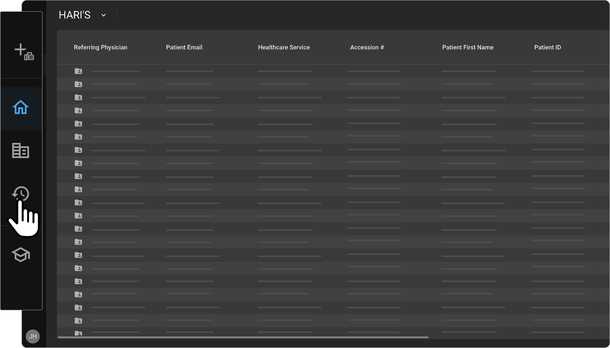
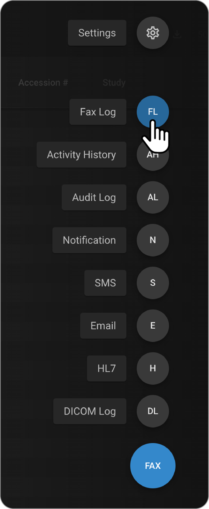
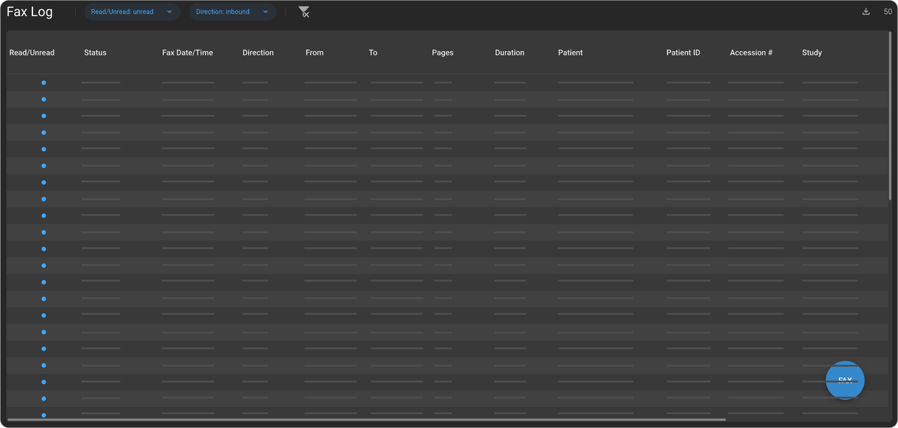
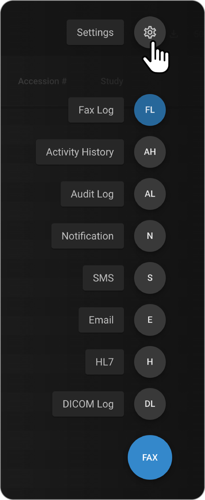
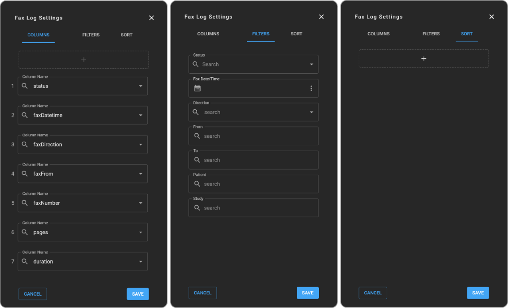
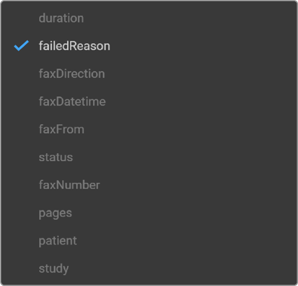
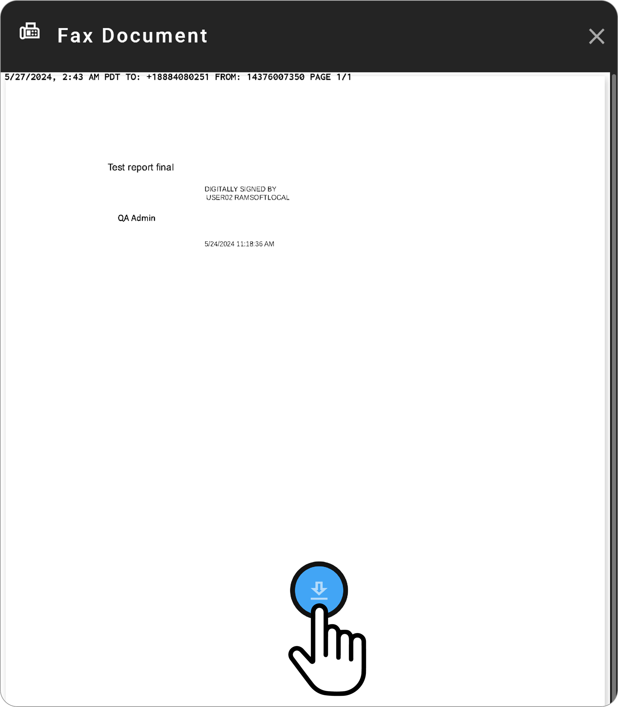
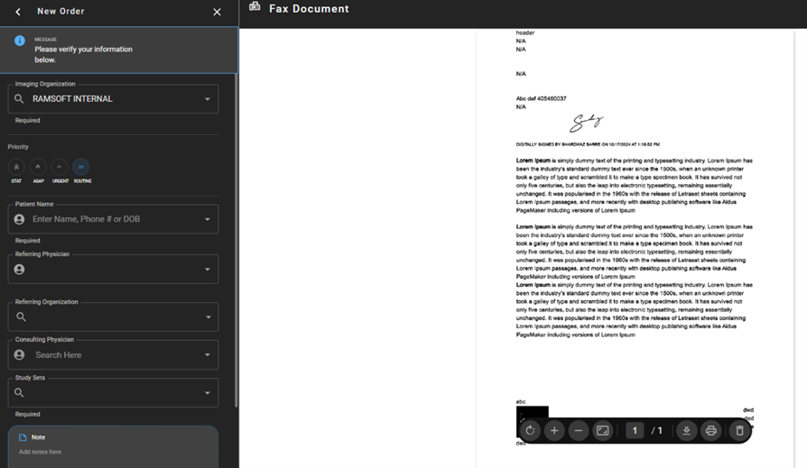

# Fax

## Overview

OmegaAI supports inbound and outbound faxing, allowing users to manage
medical faxes efficiently. This feature is vital for transmitting
patient information and documents securely between different healthcare
providers and facilities.

## Accessing and Navigating the Fax Log

1.  **Accessing Fax Log:**

    - Navigate to **Logs** from the left-hand navigation bar in OmegaAI.

      

    - Click on the log selector, a circular icon (**DICOM**) located at
      the bottom right of the screen.

    - Select **Fax Log** to access the fax log interface.

      

2.  **Understanding Fax Log Interface**

    - The fax log screen displays a comprehensive list of all incoming
      and outgoing faxes.

      

    - **Columns Displayed:**

      - **Status:** Indicates whether the fax was successfully sent or
        received.

      - **Timestamp:** Shows the time when the fax was transmitted.

      - **Direction:** Identifies the fax as either outbound or inbound.

      - **From:** Lists the fax number used to send the fax, useful for
        recipients to identify the sender.

      - **To:** Specifies the fax number to which the report was sent.

      - **Pages:** Indicates the number of pages in the fax.

      - **Duration:** Measures the time taken to complete the fax
        transmission.

      - **Patient:** Displays the patient's name linked with the fax.

      - **Study:** Shows the description of the study associated with
        the fax.

3.  **Customizing the Fax Log**

4.  Click on the **log selector** circle and choose **Settings**.

You can:

- Add or remove columns.

- Apply filters (e.g., by direction, status).

- Change sorting preferences.

  

Optional: Enable the **Failed Reason** column to understand why a
fax transmission failed.

## Reviewing Outbound Faxes

- Click on any row in the fax log to open the fax document on the right
  side of the screen.

- An option to download the fax document is available for offline access
  or archiving.

## Extra Options for Inbound Faxes

### Attach to Documents

- Click **Save as Patient Documents** to link the received fax to
  patient document section.

- You will be prompted to select:

  - Patient Name

  - Study

  - Category

## Creating New Orders from Inbound Faxes

- Navigate to the **New Order** screen. Ensure the imaging organization
  is correctly selected as this will hold the study.

- Select the correct fax from the incoming fax section.

- View the fax in a scrollable display to assist in entering patient
  names or other order details.

## Filter

- Direction Inbound and Outbound filter appears on top of the fax log.

- Read/Unread filter appears with drop down options such as all, read,
  unread.

- The Inbound Fax list appears in the log by default.

- Filter by inbound, to see a new column called Read and Unread.

- The Inbound faxes are represented in blue colour.

- Open the fax to see the preview and the blue dot becomes red
  indicating read.

- Filter the log by read and unread options which are indicated by blue
  and red respectively.
