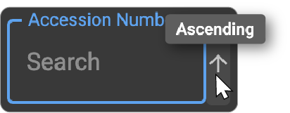

# Logs

## Overview

The **Logs** section in OmegaAI provides a centralized workspace for
monitoring, reviewing, and managing all system activities and
communication tasks. This includes DICOM, HL7, email, SMS,
notifications, faxes, and audit-related events.

Using Logs, you can:

- Track workflow events in real time

- Identify issues quickly

- Troubleshoot communication failures

- Maintain operational transparency

- View and manage outgoing DICOM/FHIR tasks (based on permissions)

This manual explains how to access, customize, and interpret each log
type in OmegaAI.

## Accessing and Monitoring Logs in OmegaAI

This section provides detailed instructions on how to access and monitor
different Logs within the OmegaAI system. You will learn how to navigate
the Logs interface, utilize various functionalities like searching,
sorting, and managing task records, and understand the significance of
different columns and statuses associated with tasks.

### Steps to Access Logs

- Open the **OmegaAI** homepage.

- In the **left-side navigation panel**, click the **Logs** icon to open
  the Logs page.
  
  

- The **DICOM Log** appears by default when you open the Logs section.

- To switch to a different log type, click the **blue round DICOM
  selector button** located at the **bottom-right corner** of the Logs
  screen.

- A list of available log types will appear. Select the desired **Log
  type** from the list to change the view.

  The following logs are available:

  - [DICOM Log](#dicom-logs)

  - [HL7 Log](#hl7-log)

  - [Email Log](#email-log)

  - [SMS Log](#sms-log)

  - [Notification Log](#notification-log)

  - [Audit Log](#audit-log)

  - [Activity History](#activity-history)

  - [Fax Log](#fax-log)

    

## Logs Interface Overview

- **Header**:

  - **Portfolio Name**: Displays the name of the currently opened log
    (e.g., *DICOM Log*, *Email Log*, etc.).

  - **Record Count (Numeric Indicator):** Shows the total number of log
    records available in the selected log type.

  - **Download Icon (Export):** Allows you to download the displayed log records in CSV and Excel
    formats.

    

- **Column Operations**:

  - **Search and Filter Records**: Apply filters based on any column
    through search filters.

  - **Sorting Records**: Sort the records either in ascending or
    descending order by clicking the drop-down arrow associated with any
    column and selecting the desired sorting option.
    
    

### Customize Logs

**1. Accessing Log Settings**

- Open the **DICOM Log** page by clicking the **Logs** icon in the
  left-side navigation panel on the OmegaAI homepage.

- Click the **blue log selector button** at the bottom right corner of
  the screen.

- From the list of available log types, choose the log you want to
  customize---such as **DICOM Log**, **Audit Log**, **Activity
  History**, or **Fax Log**.

- After selecting the log type, click **Settings** to open the
  corresponding **Log Settings** drawer.

  

**2. Customizing Columns**

  - **Adding Columns**:

      - Click the **Add (+)** icon to insert an empty column into the
        DICOM Log grid.

      - Select the **dropdown arrow** on the new empty column and choose
        the required column name from the list.
        This lets you add additional data fields that are important for
        your workflow.

- **Clearing Column Values**:

  - To remove specific data from a column while keeping the column
    visible, click on the **Clear text (X)** icon associated with that
    column.

- **Deleting Columns**:

    - If a column is no longer needed, click the **Delete (Trash) icon**
      associated with the column to remove it from the grid entirely.

- **Rearranging Columns**

  To change the order of columns in the log layout:

  - Hover over the column name---a **drag handle** will appear to the
    left of the column.

  - Right-click the drag handle and **drag** the column to your desired
    position.

  This lets you easily customize the column order based on your viewing preferences.

  

**3. Applying Filters**

  - Click on the **Filters** tab to switch to the Filters section and
     view all available filter options for the selected log.

  - Use the search fields or dropdowns under each filter category to
      refine the displayed log records.

  - Apply one or multiple filters simultaneously to narrow down
      results based on your requirements.

  - After selecting the filters, click **Save** to apply them to the
      log view.

    

**4. Applying Sorting Options**

 - Click the **Sort** tab to switch to the sorting section.

 - Click the **Add (+)** icon to insert a new sort rule.

 - Open the **Column Name** dropdown and select the field you want to
   sort by:

 - Use the up/down **arrow** icons to choose the sort order:

    a.  **Up arrow (↑)** for ascending order

    b.  **Down arrow (↓)** for descending order

- If needed, click the **Clear (X)** icon to reset the selected column.

- To remove a sort rule, click the **Delete (Trash)** icon.

- Click **Save** to apply the sorting preferences to the log view.

  

# Types of Logs

## DICOM Logs

The DICOM Log provides a centralized view for monitoring, tracking, and
managing all incoming and outgoing DICOM tasks.

See how to [Navigate to DICOM Logs](#steps-to-access-logs)

1.  **Menu Tab Features**

    - **Action**: Indicates whether DICOM is active and includes
      Retry/Cancel buttons for DCIOM being sent (not applicable to
      received studies).

      - **Retry**: Click to retry a failed transmission, changing the
        DICOM status back to 'In Progress'.

      - **Cancel**: Click to cancel a transmission, changing the DICOM
        status to 'Cancelled'.

    - **Status**: Displays the current status of the task with options
      to filter records by multiple status fields.

    - **Priority and Other Columns**: Additional columns such as
      Priority, Number of Objects, Task Start, Task End, and Duration
      provide detailed information about the DICOM specifics.

    - **Patient and Study Details**: Columns like Patient ID, Patient
      Name, Managing Organization, and others offer details about the
      patient and study associated with the respective DICOM.

2.  **Monitoring DICOM Details**

    - View detailed information for each DICOM, including the start and
      end times, duration, involved parties (like the patient and
      managing organization), and the purpose of the task (study
      reason).

  See how to [Customize DICOM Log Settings](#customize-logs)

### Checking the DICOM Log

- You can check or monitor the DICOM Log by looking at the values in the
  DICOM Log grid. The following table lists the different columns and
  their descriptions.

<table>
    <thead>
        <tr class="header">
            <th>Column</th>
            <th>Description</th>
        </tr>
    </thead>
    <tbody>
        <tr class="odd">
            <td><strong># of Objects</strong></td>
            <td>Number of objects sent and received.</td>
        </tr>
        <tr class="even">
            <td><strong># Failed</strong></td>
            <td>The total number of failed attempts for the task.</td>
        </tr>
        <tr class="odd">
            <td><strong>Accession Number</strong></td>
            <td>Accession number of the study that is associated with the  order.</td>
        </tr>
        <tr class="even">
            <td><strong>Action</strong></td>
            <td>Indicates whether DICOM is active and includes Retry/Cancel buttons for DCIOM being sent (not applicable to received studies).</td>
        </tr>
        <tr class="odd">
            <td><strong>AE Title</strong></td>
            <td>Application Entity Title of the connected device.</td>
        </tr>
        <tr class="even">
            <td><strong>Creation Date Time</strong></td>
            <td>The date and time when the task were created.</td>
        </tr>
        <tr class="odd">
            <td><strong>Delivery Time</strong></td>
            <td>The date and time when the system attempted to deliver the DICOM object.</td>
        </tr>
        <tr class="even">
            <td><strong>Device</strong></td>
            <td>The device shows the name of the system, service, or connector involved in processing the DICOM task. This may include PACS gateways, cloud functions, integration services, or local network devices that handle sending or receiving DICOM files.</td>
        </tr>
        <tr class="odd">
            <td><strong>Device Type</strong></td>
            <td>Type of system or endpoint involved in the DICOM transaction.</td>
        </tr>
        <tr class="even">
            <td><strong>DICOM Station</strong></td>
            <td>DICOM Station displays the name or identifier of the DICOM workstation, gateway, or service that processed the task. It identifies the specific station or endpoint responsible for sending, receiving, or handling the DICOM transaction.</td>
        </tr>
        <tr class="odd">
            <td><strong>Duration</strong></td>
            <td>
                Total duration from when the task started until its completion time. 
                For receive operations, it is calculated only after the task is complete. Until the task is completed, the field is empty.
            </td>
        </tr>
        <tr class="even">
            <td><strong>Execution Time</strong></td>
            <td>Date and time at which the task started executing.[SD2.1]</td>
        </tr>
        <tr class="odd">
            <td><strong>Failure Reason</strong></td>
            <td>Reason for any failure encountered during transmission.</td>
        </tr>
        <tr class="even">
            <td><strong>Intent</strong></td>
            <td>Shows how actionable the task is. For example, if the task is planned, proposed, etc.</td>
        </tr>
        <tr class="odd">
            <td><strong>Issuer</strong></td>
            <td>Displays the Issuer associated with the patient.</td>
        </tr>
        <tr class="even">
            <td><strong>Last Modified</strong></td>
            <td>The time when the record was modified, such as paused, put on hold, or cancelled.</td>
        </tr>
        <tr class="odd">
            <td><strong>Message</strong></td>
            <td>Additional message or system note associated with the task.</td>
        </tr>
        <tr class="even">
            <td><strong>Note</strong></td>
            <td>The description of the event and errors, if any.</td>
        </tr>
        <tr class="odd">
            <td><strong>Notification Type</strong></td>
            <td>Type of DICOM-related event that triggered a system notification, such as Import, DicomReceive, or DicomStorePush.</td>
        </tr>
        <tr class="even">
            <td><strong>Managing Organization</strong></td>
            <td>Displays the Managing Organization of the record.</td>
        </tr>
        <tr class="odd">
            <td><strong>Patient ID</strong></td>
            <td>Unique identifier of the patient involved in the study.</td>
        </tr>
        <tr class="even">
            <td><strong>Patient Name</strong></td>
            <td>Name of the patient related to the DICOM task.</td>
        </tr>
        <tr class="odd">
            <td><strong>Peer Host</strong></td>
            <td>Displays the hostname or IP address of the remote system involved in DICOM communication.</td>
        </tr>
        <tr class="even">
            <td><strong>Reason Code</strong></td>
            <td>Reason Code provides a standardized system-generated code that explains the outcome of a DICOM task</td>
        </tr>
        <tr class="odd">
            <td><strong>Receiver</strong></td>
            <td>Recipient of the DICOM transmission.</td>
        </tr>
        <tr class="even">
            <td><strong>Requester</strong></td>
            <td>
                Name of the device requesting the study. 
                Displays the Imaging or Managing Organization name If it is an automatic routing rule.
            </td>
        </tr>
        <tr class="odd">
            <td><strong>Sender</strong></td>
            <td>Source system or device sending the DICOM data.</td>
        </tr>
        <tr class="even">
            <td><strong>Status</strong></td>
            <td>
                • By default, it displays all the statuses of the studies that are sent or received. 
                • Receive operations have only two statuses: In Progress or Completed. 
                You can choose multiple fields in this filter to search for records.
            </td>
        </tr>
        <tr class="odd">
            <td><strong>Status Reason</strong></td>
            <td>Provides more information on the current status of the task. Note: For received objects, the reason is always DICOM Receive.</td>
        </tr>
        <tr class="even">
            <td><strong>Study Date Time</strong></td>
            <td>Date and time of study.</td>
        </tr>
        <tr class="odd">
            <td><strong>Study Instance UID</strong></td>
            <td>Unique DICOM identifier assigned to an imaging study.</td>
        </tr>
        <tr class="even">
            <td><strong>Study Description</strong></td>
            <td>Provides the DICOM-defined text that describes the imaging exam performed.</td>
        </tr>
        <tr class="odd">
            <td><strong>Task Start</strong></td>
            <td>
                • This field is a date range picker. You can use this to filter studies based on a certain start date. 
                • Displays timestamps, if 
                o A task is started and completed. 
                o A task is started and put on hold. 
                o A task is started, put on hold, and resumed. 
                In this case, the task start time is the time at which the task resumed. 
                • The first object in a receive operation is received. 
                • This field is blank, if: 
                o The task is pending and has not started. 
                o A task is put on hold and has not started. 
                The time is precise to seconds.
            </td>
        </tr>
        <tr class="even">
            <td><strong>Task End</strong></td>
            <td>
                • This field is a date range picker. You can use this to filter studies based on a certain end date. 
                • Displays timestamps, if 
                o A task is started and completed. 
                o A task is started, put on hold, resumed, and then completed. 
                In this case, the task end time is the time at which the task is completed. 
                • In a receive operation, no more objects are received for 30 seconds. After 30 seconds, the task is marked as Complete. 
                • This field is blank, if: 
                o The task is pending and has not started. 
                o A task is put on hold and has not started. 
                o A task is started and put on hold. 
                The time is precise to seconds.
            </td>
        </tr>
        <tr class="odd">
            <td><strong>Transmission Priority</strong></td>
            <td>
                Indicates the urgency level assigned to a DICOM task—such as Low, Medium, High, or Highest. 
                The studies are sorted by priority and then by first-in, first-out (FIFO) if priority values are identical. 
                The priority options are sorted in the following order (from highest to lowest priority): 
                1. Highest 
                2. High 
                3. Medium 
                4. Low 
                If you have edit privileges, you can change the priority of the studies. However, you can do so only for studies that are being sent. 
                Note: For received operations, the priority cannot be changed; it is always determined by the transmission device.
            </td>
        </tr>
        <tr class="even">
            <td><strong>Trigger</strong></td>
            <td>Event or action that initiated the task.</td>
        </tr>
        <tr class="odd">
            <td><strong>Visit #</strong></td>
            <td>Visit number linked to the patient or study.</td>
        </tr>
    </tbody>
</table>

## HL7 Log

The HL7 Log allows you to track all HL7 message transactions within
OmegaAI, displaying key details such as status, status reason, intent,
description, Study Instance UID, patient information, and requester
details to help you monitor and troubleshoot all HL7 communication
processes between connected systems.

See how to [Navigate to HL7 Log](#steps-to-access-logs) earlier in this
guide.

**Monitoring HL7 Details**

- View detailed information for each HL7 initiative in respective
  columns: Status, Status Reason, Intent, Description, Study Instance
  UID, Patient Name, Requester, etc.

### Checking the HL7 Log

- You can check or monitor the HL7 Log by looking at the values in the
  HL7 Log grid. The following table lists the different columns and
  their descriptions.

<table>
    <thead>
        <tr class="header">
            <th>Column</th>
            <th>Description</th>
        </tr>
    </thead>
    <tbody>
        <tr class="odd">
            <td><strong>Status</strong></td>
            <td>Shows the current state of the HL7 message, such as Completed, In Progress, Failed, or Cancelled.</td>
        </tr>
        <tr class="even">
            <td><strong>Status Reason</strong></td>
            <td>Provides additional information explaining why the HL7 message reached its current status.</td>
        </tr>
        <tr class="odd">
            <td><strong>Intent</strong></td>
            <td>Shows how actionable the task is. For example, if the task is planned, proposed, etc.</td>
        </tr>
        <tr class="even">
            <td><strong>Description</strong></td>
            <td>A brief statement summarizing the action or update associated with the HL7 message.</td>
        </tr>
        <tr class="odd">
            <td><strong>Study Instance UID</strong></td>
            <td>The unique DICOM identifier linking the HL7 message to a specific imaging study.</td>
        </tr>
        <tr class="even">
            <td><strong>Patient Name</strong></td>
            <td>Displays the name of the patient associated with the HL7 message.</td>
        </tr>
        <tr class="odd">
            <td><strong>Requester</strong></td>
            <td>
                Name of the device or system that initiated the HL7 message or requested the study. 
                If the message was triggered by an automatic routing rule, this field displays the name of the corresponding Imaging Organization or Managing Organization instead.
            </td>
        </tr>
    </tbody>
</table>

## Email Log

The Email Log displays all email activities within OmegaAI, allowing you
to monitor each message\'s status, sender, receiver, trigger, and
content for better tracking and troubleshooting of email communications.

See how to [Navigate to Email Log](#steps-to-access-logs) earlier in
this guide.

**Monitoring Email Log Details**

- View detailed information for each Email initiative in respective
  columns: Status, Sender, Receiver, Trigger, Message, etc.

## SMS Log

The SMS Log allows you to track all SMS notifications sent through
OmegaAI, displaying important details such as status, sender, receiver,
trigger, and message content to help you monitor and troubleshoot SMS
communication activities.

See how to [Navigate to SMS Log](#steps-to-access-logs) earlier in this
guide.

**Monitoring SMS Log Details**

- View detailed information for each SMS initiative in respective
  columns: Status, Sender, Receiver, Trigger, Message, etc.

## Notification Log 

The Notification Log provides a detailed record of all system-generated
notifications in OmegaAI, allowing you to track each notification's
status, sender, receiver, trigger, and message content for effective
monitoring and troubleshooting.

See how to [Navigate to Notification Logs](#steps-to-access-logs)
earlier in this guide.

**Monitoring Notification Log Details**

- View detailed information for each Notification initiative in
  respective columns: Status, Sender, Receiver, Trigger, Message, etc.

### Checking the Communication Logs

- You can check or monitor the Email, SMS and Notification Log by
  looking at the values in the grid. The following table lists the
  different columns and their descriptions.

<table>
    <thead>
        <tr class="header">
            <th>Column</th>
            <th>Description</th>
        </tr>
    </thead>
    <tbody>
        <tr class="odd">
            <td><strong>Status</strong></td>
            <td>Indicates the current state of the message, such as Completed, Failed, In Progress, or Cancelled.</td>
        </tr>
        <tr class="even">
            <td><strong>Sender</strong></td>
            <td>Shows the email address, phone number, or system that initiated the message.</td>
        </tr>
        <tr class="odd">
            <td><strong>Receiver</strong></td>
            <td>Displays the recipient’s email address, phone number, or user account.</td>
        </tr>
        <tr class="even">
            <td><strong>Trigger</strong></td>
            <td>Identifies the event or action that caused the message to be sent, for example, an appointment confirmation, workflow automation, or order update.</td>
        </tr>
        <tr class="odd">
            <td><strong>Message</strong></td>
            <td>Contains the content or body of the notification, email, or SMS sent to the recipient.</td>
        </tr>
        <tr class="even">
            <td><strong>Execution Time</strong></td>
            <td>The exact date and time when the system initiated the message-sending process.</td>
        </tr>
        <tr class="odd">
            <td><strong>Delivery Time</strong></td>
            <td>The date and time when the message were delivered or attempted to be delivered, regardless of the outcome.</td>
        </tr>
        <tr class="even">
            <td><strong>Failure Reason</strong></td>
            <td>Displays details explaining why a message failed, if applicable (e.g., invalid address, network error, missing template).</td>
        </tr>
        <tr class="odd">
            <td><strong>Notification Type</strong></td>
            <td>Identifies the category or source of the notification sent by the system, such as OAINotification or BlumeNotification. It helps to distinguish which system module or workflow generated the notification.</td>
        </tr>
    </tbody>
</table>

## Audit Log

This section provides a detailed record of all system-level activities
performed by users, services, and internal processes. It helps you
monitor access, track changes, and review events for security,
compliance, and operational oversight.

See how to [Navigate to Audit Log](#steps-to-access-logs) and [Customize
Audit Log Settings](#customize-logs) earlier in this guide.

### Searching Patient-Related Audit Events

When reviewing audit activity related to a **patient**, use the
following identifiers:

- **Patient ID**
- **Patient Name**

These identifiers are commonly logged for actions such as patient record
creation, updates, access, or viewing patient-related data.

### Searching Study-Related Audit Events

For audit events associated with **imaging studies**, search using:

- **Accession #**
- **Study Instance UID**
- **Study Status**
- **Patient ID or Patient Name**

Study-related audit entries typically include events such as study
access, viewing, printing, export, or status changes.

### Searching Order-Related Audit Events

When tracking activity related to **orders**, use:

- **Accession #**
- **Visit #**
- **Patient ID**
- **Managing Organization**

Order-related audit logs capture events such as order creation,
modification, execution, or cancellation.

### Searching Document-Related Audit Events

For **documents** (reports, attachments, or clinical files), search
using:

- **Entity Type = Document**
- **Patient ID or Patient Name**
- **Associated Accession # or Visit #** (if applicable)
- **Action or Subtype** (e.g., Create, Read/View, Update)

These events record actions such as document upload, download,
modification, or deletion.

## Activity History 

This section provides a personal record of all actions performed by the
currently logged-in user. It helps you track your own changes, updates,
and interactions within the system for better transparency and workflow
monitoring.

See how to [Navigate to Activity History](#steps-to-access-logs) and
[Customize Activity Log Settings](#customize-logs) earlier in this guide.

## Checking the Audit Log and Activity History 

- You can check or monitor the Audit Log and Activity History by looking
  at the values in the Log grid. The following table lists the different
  columns and their descriptions.

<table>
    <thead>
        <tr class="header">
            <th>Column</th>
            <th>Description</th>
        </tr>
    </thead>
    <tbody>
        <tr class="odd">
            <td><strong>Access Datetime</strong></td>
            <td>The exact date and time when the event or action occurred.</td>
        </tr>
        <tr class="even">
            <td><strong>Accession #</strong></td>
            <td>The unique identifier assigned to the imaging study involved in the event.</td>
        </tr>
        <tr class="odd">
            <td><strong>Action</strong></td>
            <td>
                Indicates the type of operation performed on the system or patient data. Common actions include: 
                • Create—A new record or item was added to the system (e.g., creating a study, user, or configuration). 
                • Read/View/Print—The user accessed data for viewing or printing without making any changes. 
                • Execute—A system- or user-initiated function was performed (e.g., load, search, process, or other background operations). 
                • Update – An existing record or item was modified (e.g., editing patient details, updating study information). 
                • Delete—A record or item was removed from the system.
            </td>
        </tr>
        <tr class="even">
            <td><strong>Entity Type</strong></td>
            <td>Indicates the type of resource or data entity involved in the logged action. This helps you identify which category of system object the user or process interacted with during the event.</td>
        </tr>
        <tr class="odd">
            <td><strong>Entity Role</strong></td>
            <td>Indicates the function or role of the entity in the logged action. This helps you understand how the entity participated in the event.</td>
        </tr>
        <tr class="even">
            <td><strong>Imaging Organization</strong></td>
            <td>Displays the Imaging Organization of the record.</td>
        </tr>
        <tr class="odd">
            <td><strong>IP Address</strong></td>
            <td>Shows the network address from which the action was performed. This helps identify the source location or device involved in the event.</td>
        </tr>
        <tr class="even">
            <td><strong>Login Email</strong></td>
            <td>Displays the email address of the user who performed the action. This helps identify which user account initiated the event.</td>
        </tr>
        <tr class="odd">
            <td><strong>Managing Organization</strong></td>
            <td>Displays the Managing Organization of the record.</td>
        </tr>
        <tr class="even">
            <td><strong>Outcome</strong></td>
            <td>Indicates the result of the action performed. It shows whether the event was successful or if it resulted in a failure, helping you evaluate the status and integrity of each logged operation.</td>
        </tr>
        <tr class="odd">
            <td><strong>Outcome Description</strong></td>
            <td>Provides detailed information about the result of the action. It describes what happened during the event, including success messages, system responses, or error details when an issue occurs.</td>
        </tr>
        <tr class="even">
            <td><strong>Patient ID</strong></td>
            <td>Displays the unique identifier assigned to the patient. This helps track which patient records are associated with each logged event.</td>
        </tr>
        <tr class="odd">
            <td><strong>Patient Name</strong></td>
            <td>Displays the name of the patient associated with the logged action. This helps identify which patient record was involved in the event.</td>
        </tr>
        <tr class="even">
            <td><strong>Purpose of Event</strong></td>
            <td>Indicates the reason the action was performed. This helps identify the purpose behind the event, such as system use, patient care activity, or operational workflow.</td>
        </tr>
        <tr class="odd">
            <td><strong>Recorded</strong></td>
            <td>The timestamp when the event was logged in the system.</td>
        </tr>
        <tr class="even">
            <td><strong>Request Query</strong></td>
            <td>Displays the full request URL or query parameters sent to the server during the action. This shows the exact data request made by the system or user and helps trace how the event was triggered.</td>
        </tr>
        <tr class="odd">
            <td><strong>Study Status</strong></td>
            <td>Indicates the current state of the imaging study at the time of the event. This shows where the study is in the clinical or workflow process.</td>
        </tr>
        <tr class="even">
            <td><strong>Subtype</strong></td>
            <td>Specifies the detailed category of the action performed, indicating whether the event involved reading, creating, or updating a resource.</td>
        </tr>
        <tr class="odd">
            <td><strong>Type</strong></td>
            <td>Indicates the general category of the action performed. This shows the overall operation type, such as system-level or API-based interactions.</td>
        </tr>
        <tr class="even">
            <td><strong>Username</strong></td>
            <td>The username of the person who performed the action.</td>
        </tr>
        <tr class="odd">
            <td><strong>Visit #</strong></td>
            <td>Displays the unique identifier for the patient’s visit or encounter related to the logged action.</td>
        </tr>
    </tbody>
</table>

## Fax Log

The Fax Log provides a complete record of all incoming and outgoing
faxes sent through OmegaAI, displaying details such as fax status, date
and time, direction, sender, recipient, pages, duration, and patient or
study information. It helps you monitor fax activity, verify successful
transmissions, and troubleshoot failed attempts.

See how to [Navigate to Fax Logs](#steps-to-access-logs) and [Customize
Fax Log Settings](#customize-logs) earlier in this guide.

### Checking the Fax Log

- You can check or monitor the Fax Log by looking at the values in the
  Fax Log grid. The following table lists the different columns and
  their descriptions.

<table>
    <thead>
        <tr class="header">
            <th>Column</th>
            <th>Description</th>
        </tr>
    </thead>
    <tbody>
        <tr class="odd">
            <td><strong>Accession Number</strong></td>
            <td>Shows the accession number associated with the study linked to the fax.</td>
        </tr>
        <tr class="even">
            <td><strong>Direction</strong></td>
            <td>Indicates whether the fax is inbound (received) or outbound (sent).</td>
        </tr>
        <tr class="odd">
            <td><strong>Duration</strong></td>
            <td>Total time taken to send or receive the fax.</td>
        </tr>
        <tr class="even">
            <td><strong>Failed Reason</strong></td>
            <td>Indicates the specific cause of a fax transmission failure. This helps identify why the fax did not go through and assists in troubleshooting issues related to connectivity, telephony, or recipient availability.</td>
        </tr>
        <tr class="odd">
            <td><strong>Fax Date/Time</strong></td>
            <td>Shows the exact date and time the fax was processed.</td>
        </tr>
        <tr class="even">
            <td><strong>From</strong></td>
            <td>Indicates the sender’s fax number or source.</td>
        </tr>
        <tr class="odd">
            <td><strong>Managing Organization</strong></td>
            <td>Displays the Managing Organization of the record.</td>
        </tr>
        <tr class="even">
            <td><strong>Pages</strong></td>
            <td>Displays the total number of pages included in the fax.</td>
        </tr>
        <tr class="odd">
            <td><strong>Patient</strong></td>
            <td>Shows the name of the patient associated with the faxed study.</td>
        </tr>
        <tr class="even">
            <td><strong>Patient ID</strong></td>
            <td>Displays the unique patient identifier linked to the fax event.</td>
        </tr>
        <tr class="odd">
            <td><strong>Status</strong></td>
            <td>Indicates the current state of the fax transmission or workflow. This helps you understand whether the fax is completed, in progress, failed, or linked to a specific action within the system.</td>
        </tr>
        <tr class="even">
            <td><strong>To</strong></td>
            <td>Indicates the recipient’s fax number or destination.</td>
        </tr>
        <tr class="odd">
            <td><strong>Study</strong></td>
            <td>Displays the name of the imaging study associated with the fax. This helps identify which procedure or exam the faxed information relates to.</td>
        </tr>
    </tbody>
</table>
