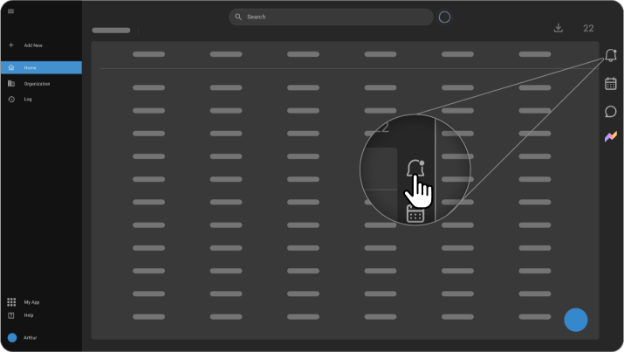
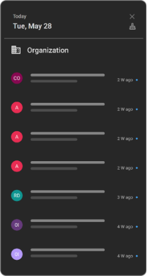
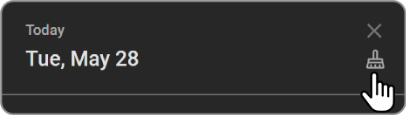
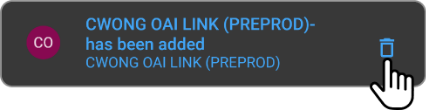
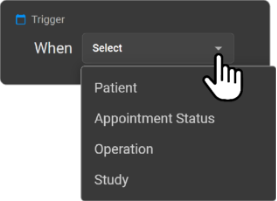
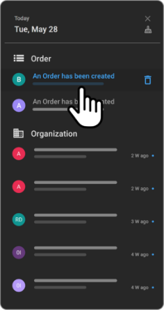

# Notifications

## Overview

Notifications in OmegaAI provide users with timely updates and alerts
about various activities and statuses within the software. The
notifications system is designed to keep users informed about events
relevant to their role and tasks. This section details accessing and
managing notifications, understanding notification categories, and the
specific triggers for workflow automation notifications.

## Accessing Notifications

1.  **Locate the Notifications Icon**: Find the bell icon on the right
    side of the navigation bar. A blue icon indicates that there are
    unread notifications.

2.  **Open Notifications Drawer**: Click the bell icon to open the
    notifications side drawer.

3.  **Review Notifications**: The drawer will display the current date
    and list all received notifications. Unread notifications are marked
    with a blue dot.

4.  **Navigate to Related Page**: Clicking on a notification will
    redirect you to the corresponding page related to the notification.

    

5.  **Manage Notifications**:

    - Close the drawer by clicking the bell icon again or the "X"
      button.

    - Clear all notifications by clicking the "Brush" button.

        

- Delete specific notifications by hovering over a notification and

  clicking the "Delete" button that appears.

    

## Notification Categories

Notifications are categorized to reflect relevant information for
different user roles within OmegaAI:

1.  **Organization Devices**: Alerts all organization users about
    device-related updates:

    - Device added

    - Device status changes to active/inactive

    - Device goes online/offline

2.  **Study**: Specific to radiologists for updates on file or study
    sharing.

3.  **Scheduler**: For front desk users, notifications include:

    - Patient booking, cancellation, or arrival at appointments

    - Patient no-shows

    - Radiologist sets a busy/blocked reminder

    - Additions or updates to resources

4.  **Worklist**:

    - Notifications about new worklists created for users

    - Alerts for radiologists about studies marked for critical findings

## Workflow Automation Notifications

These notifications are triggered by specific events within the workflow
automation system if they have been set up:

1.  **Patient Updates**:

    - Patient record creation in OmegaAI

    - Updates to patient information

2.  **Report Status**:

    - Report signing

    - Reports flagged for critical findings

3.  **Appointment Updates**: Notification when the status of an
    appointment changes.

    

- **Accessing Notifications**: A screenshot of the navigation bar
  highlighting the bell icon.

- **Review Notifications**: An image of the notification drawer showing
  the list of notifications.

- **Manage Notifications**: Visuals showing the hover effect on
  notifications and the appearance of the delete button.
