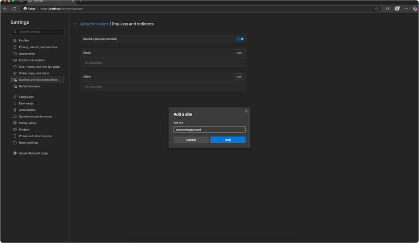

# Multi-Monitor Setup Guide

This guide will walk users through enabling and disabling the multi-monitor setup in **OmegaAI** ensuring optimal use of Image Viewer, Document Viewer, and Scheduler functionalities across multiple displays.

## **Pre-Requisite**

Ensure you’re using a compatible browser such as **Google Chrome** or **Microsoft Edge**, and that pop-ups are properly configured for [www.omegaai.com](https://www.omegaai.com) (see Section 5).

## **Enabling Multi-Monitor Setup**

###  *Login and Navigation*

1. Log in to your **OmegaAI account**.

2. Click the **My Profile** icon at the bottom-left corner.

 3. In the sidebar, select **User Settings**.

###  *Access Display Settings*

1. On the User Profile page, under the left panel, click the **Display Settings** icon (monitor symbol below “Organization and Roles”).

2. First-time users will see a pop-up:

\
  **www.omegaai.com wants to manage windows on all your displays**.

\
  3. Click **Allow** to continue.

  

### *Configure Each Monitor*

1. Once detected, OmegaAI will show all connected screens.
2. Click the **Edit (pencil icon)** on the top-right to enter edit mode.

3. Each monitor will show a **dotted square icon** in the center.

4. Click this icon to assign a view from the following options:
  - **Image Viewer**
  - **Document Viewer**
  - **Scheduler**
  - **Reset Selection** (resets to default)

Note:

*Only “Image Viewer” can be applied to multiple screens simultaneously.*\
*Document Viewer or Scheduler can only be assigned to one monitor at a time; selecting it on a second monitor will unassign it from the first.*

5. After assigning views, click **Save** to finalize your layout.
  

### *Using Multi-Monitor in Action*

- When you open a study from the **Worklist**, OmegaAI auto-triggers the multi-monitor layout:
  - Document Viewer opens on its assigned screen.
  - Image Viewer and Scheduler populate their designated monitors.

- In the **Image Viewer**, you can:
  - Select different **layouts** to view multiple image sections.
  - Exit full-screen via the **three-dot menu** > scroll down > toggle off **Full Screen Mode** to see navigation panels on the main screen.
- The **main monitor** allows access to:
  - Worklist
  - Home
  - Organizations
  - Back button (top-left corner)
  - Left and right menu panels (when not in full screen)

### *Navigating Away and Refreshing*

- When you click **Back** from the main screen, the secondary screens go **black**.
- Selecting a new study from the Worklist will re-populate the assigned displays as per the saved configuration.

## **Disabling Multi-Monitor Setup**

You can disable the multi-monitor setup in either of the following ways:

### *Disable from Display Settings*

1. Go to **Profile** > **User Settings** > **Display Settings**.
2. Use the **Toggle Button** on the top-right to **disable multi-monitor** functionality.

### *Reset Individual Screens* 

1. Click the **Edit (pencil icon)** on Display Settings.
2. On each monitor, click the **dotted square icon**.
3. Choose the **Reset Selection** to revert to the default and remove any assigned views.

**Note**:

*Manual disabling of the multi-monitor setup is not required when using a single monitor. The system will automatically operate in single-monitor mode if only one display is detected and will switch to multi-monitor mode when multiple displays are available.*

4. Save changes to complete.

## **Browser Configuration for Multi-Monitor Setup**

### ***For Google Chrome***

#### *Enable Pop-ups:*

1. Click the **three-dot menu** (top-right corner) > **Settings**.

2. Go to **Privacy and Security** > **Site Settings** > **Pop-ups and redirects**.

3. Under **Allowed to send pop-ups and use redirects**, add:\
   [www.omegaai.com](http://www.omegaai.com)

#### *Disable Pop-ups (if needed):* 

1. Follow the steps above to **Pop-ups and redirects**.
2. Under “**Allowed to send pop-ups and use redirects**,” click the **three-dot menu** next to [www.omegaai.com](http://www.omegaai.com) and choose **Block**.

### ***For Microsoft Edge*** 

#### *Enable Pop-ups:* 

1. Open **Edge** > click the **three-dot menu** > **Settings**.

2. Navigate to **Cookies and Site Permissions** > **Pop-ups and redirects**.

3. Add [www.omegaai.com](https://www.omegaai.com) under **Allow**.

#### *Disable Pop-ups (if needed):*

1. In the same **Pop-ups and redirects** section, find [www.omegaai.com](https://www.omegaai.com) under the **Allow** list.
2. Click the **trash icon** or switch it to **Block** to prevent pop-ups.

## **Summary Table**

|Task|Action|
| :- | :- |
|Enable multi-monitor|Profile > User Settings > Display Settings > Assign screens > Save|
|Disable multi-monitor|Use the Toggle Button OR reset screens individually|
|Supported Views|Image Viewer (multiple), Document Viewer, Scheduler (only one screen at a time)|
|Browser Setup|Allow pop-ups for [www.omegaai.com](https://www.omegaai.com) in Chrome/Edge|
