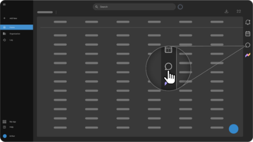
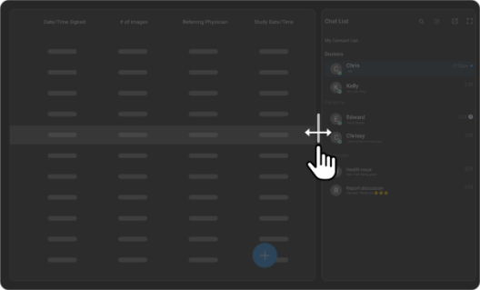
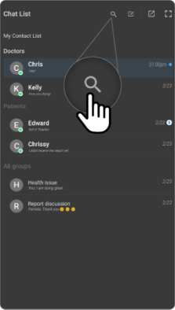
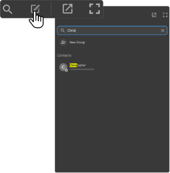
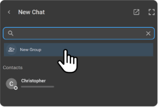
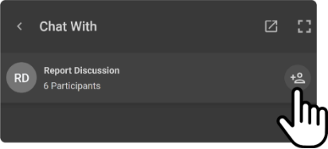
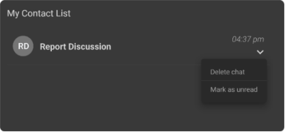
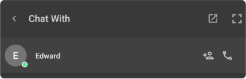

# Using Chat

## Overview

OmegaAI includes a versatile chat feature accessible from the right side
navigation bar on all pages except Root. This functionality allows
users to communicate seamlessly with patients, doctors, and other
contacts directly within the platform.

## Accessing and Navigating Chat

1.  **Opening Chat:**

    - Click the Chat icon; it's the third icon from the right on the
      side navigation bar.

    - A Chat List panel will appear on the right side of the screen.

    - If no chats are available, a message "No chat in the list Start a
      new chat" will be displayed.

      

2.  **Adjusting Chat View:**

    - Drag the grey bar on the left side of the chat to expand it midway
      across the page.

    - For full screen, click the last icon; for a smaller screen, click
      the second last icon.

    - Reposition the chat by clicking and dragging it left or right as
      desired.

      

3.  **Searching for Contacts:**

    - Click the magnifying glass icon to activate the search function.

    - A search bar with a type field and a microphone icon will appear.

    - Type the contact name and press enter, or use the microphone icon
      to voice search the contact.

      

## Creating and Managing Chats

1.  **Create an Individual Chat:**

    - Click the pencil icon at the top right to start a new chat.

    - Type a name in the Search Contacts field, or use the microphone to
      voice over the contact's name.

    - Click on the contact's name to initiate the chat.

      

2.  **Create a New Group Chat:**

    - Follow the same initial steps as creating an individual chat by
      clicking the pencil icon.

    - Select 'New Group' to form a group chat.

      

- In the **Add Group Participants** panel, select contacts by clicking
  beside their names or search for them.

- Click **Next**, type the group name, and note the number of
  participants.

- Click Create to finalize the group chat.

3.  **Adding Participants to an Existing Group:**

    - Within an existing group chat, click the + icon with the person to
      add more contacts.

    - Follow the earlier steps for adding participants.

      

## Chat Additional Functionalities

1.  **Managing Chat Interactions:**

    - Click the down arrow on each contact in the My Contact list for
      options:

      - **Delete Chat:** Removes the entire chat thread.

      - **Mark as Unread:** Marks the conversation as unread, indicated
        by a blue icon.

        

2.  **Interaction Options in an Open Chat:**

    - **Call:** Click the Call button to initiate a voice call with
      the contact.

    - **Add Group Participant:** Add more contacts to the chat if
      needed.

      