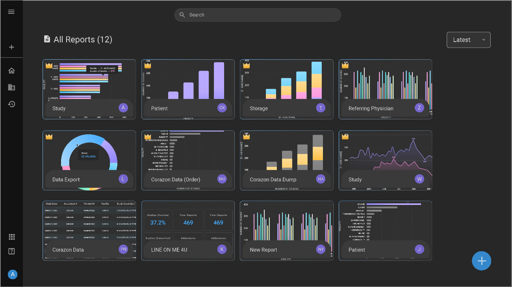

# Root Homepage

## Overview

The Root Homepage is the central hub of Root Analytics, designed to
provide an overview and easy access to various reports within the
platform. This page is crucial for users aiming to navigate through and
utilize analytics effectively, helping you to make informed, data-driven
decisions.

Root is a data visualization tool designed for easy user management of reports and data.

Users can enjoy the following features:

- Real time data

- Report creation

- Graph/chart creation

- Share information with others

----

## Components

> **Report Access**: View all the reports you are authorized to access,
> each displayed with its title and interactive icons for added
> functionality.
>
> **Premium Reports**: These reports, marked with a gold crown icon, are
> curated by RamSoft and are standard for all users. They cannot be
> modified or deleted by users.
>
> **Custom Reports**: Identified without the gold crown icon, these are
> user-generated reports that can be created, edited, or deleted by the
> owner.
>
> **Favorite Icon**: The star-shaped icon allows you to mark a report as
> a favorite for quick access.
>
> **Copy Icon**: Duplicate a report using this two-page icon. The copy
> will be named as the original followed by "copy."
>
> **Delete Icon**: The trash bin icon lets you permanently remove a
> report. Only the report owner or authorized users can perform this
> action.
>
> **Share Button**: This feature enables you to share reports with
> colleagues within your organization.
>
> **Sorting Functionality**: Sort reports alphabetically, in reverse
> order, or by newest first using the sorting button at the top right of
> the page.
>
> **Create New Report**: The plus icon at the bottom right allows you to
> initiate the creation of a new report.

## Step-by-Step Usage Guide

1.  **Navigating Reports**:

    1. Open the Root Homepage on Root Analytics.

    2. Browse through the list of available reports.

2.  **Managing Favorites**:

    1. Locate the favorite icon next to the report title you wish to
      save.

    2. Click the star-shaped icon to add the report to your favorites
      list.

3. **Creating a New Report**:

    1.  Click on + icon located at bottom right of the Root interface.

    2.  Provide a name for the Report under New Report (NR).

    3.  Click on Click here to add new window.

    4.  List of visuals appear.

    5.  Select the type of visual such as Pie chart, Line chart, Bar chart,
    Visual cards or Table view.

    6.  Drag and drop the required fields.

    7.  Save the results.

2.  **Copying a Report**:

    1. Find the copy icon next to the desired report.

    2. Click the icon, and a new copy will be added to your list as
      "Report Name - copy."

3.  **Editing a Report**:

    1.  Open the created report.

    2.  Click on Reading drop down on the top right of the screen.

    3.  Select Edit from Reading drop down menu.

    4.  Resize the graphs, rename the report, or change the fields.

4.  **Deleting a Report**:

    1. Click the delete icon next to the report you want to remove.

    2. Confirm the deletion to permanently remove the report, affecting
      all users with access.

5.  **Sharing a Report**:

    1. Select the share button next to the report.

    2. Follow the prompts to share the report with your colleagues.

6.  **Sorting Reports**:

    1. Use the sorting button found at the top right, to organize your reports
      according to your preference.

7.  **View Reports:**

    1. Click on the report to view the details.

    2. The view can be sorted based on Facility, Issuer, Status, and Priority for Premium Reports.

